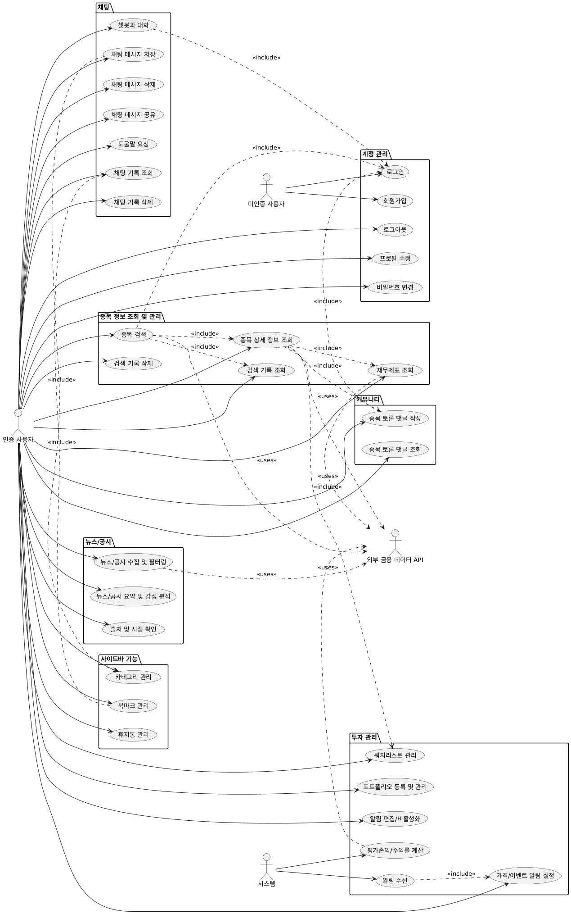

### Use Case #N : <제목>

**Summary**  
: 

**Scope / Level**  
: <Scope>, <Level>

**Author / Last Updated**  
: <Author>, <Last Updated>

**Actors**  
: Primary – <>, Secondary – <>

**Status**  
: <Analysis / Draft / …>

**Preconditions**  
: 

**Trigger**  
: 

**Post Conditions**  
: Success – <> / Failed – <>

**Main Flow**
1. 
2. 
3. 

**Extensions**
- 2a. <조건> → 2a1. <동작>
- 3b. <조건> → 3b1. <동작>

**Related**
- Performance: ≤ n s / Frequency: / Concurrency: / Due Date:

### Use Case #0 : Log-in

**Summary**  
: 사용자가 시스템에 자신의 계정으로 접근하기 위해 아이디와 비밀번호를 입력하여 인증받는 기능

**Scope / Level**  
: 주식 챗봇 시스템 (AlphaBot), User level

**Author / Last Updated**  
: 문정환, 2025. 10. 31.

**Actors**  
: Primary – 계정을 보유한 비인증 사용자

**Status**  
: Analysis (Finalize)

**Preconditions**  
: 1. 사용자가 시스템에 회원가입을 완료한 상태여야 한다.
  2. 사용자가 로그아웃 상태여야 한다.

**Trigger**  
: 사용자가 로그인 페이지에서 아이디와 비밀번호를 입력하고 로그인 버튼을 클릭하는 경우

**Post Conditions**  
: Success – 시스템이 사용자의 신원을 확인하고 인증 세션을 생성하고 메인 서비스 화면으로 이동한다. / Failed – 시스템이 사용자 인증에 실패하고 오류 메시지를 표시한다.

**Main Flow**
s. 비인증 사용자가 시스템에 접속하여 로그인을 시도한다.
1. 사용자가 로그인 페이지에서 자신의 아이디와 비밀번호를 입력한다.
2. 사용자가 로그인 버튼을 클릭한다.
3. 시스템은 입력된 아이디와 비밀번호가 데이터베이스에 저장된 정보와 일치하는지 검증한다.
4. 인증이 성공하면 시스템은 사용자 세션을 생성하고 로그인 상태로 전환한다.
5. 시스템은 사용자를 메인 서비스 화면으로 리디렉션한다.
6. 이 Use case는 사용자가 성공적으로 로그인되면 종료된다.

**Extensions**
- 3a. 입력된 아이디 또는 비밀번호가 일치하지 않는 경우 → 3a1. 시스템이 '아이디 또는 비밀번호가 올바르지 않습니다'라는 오류 메시지를 표시하고 Step 1로 돌아간다.

**Related**
- Performance: ≤ 2 seconds
- Frequency: 회원당 하루에 평균 3번
- Concurrency: 제한 없음
- Due Date: 2025.11.03.

### Use Case #1 : sign up

**Summary**  
: 새로운 사용자가 시스템을 이용하기 위해 자신의 정보를 등록하고 계정을 생성하는 기능

**Scope / Level**  
: 주식 챗봇 시스템 (AlphaBot), User level

**Author / Last Updated**  
: 문정환, 2025. 10. 31.

**Actors**  
: Primary – 계정이 없는 비인증 사용자

**Status**  
: Analysis (Finalize)

**Preconditions**  
: 사용자가 로그아웃 상태여야 한다.

**Trigger**  
: 사용자가 로그인 페이지 또는 초기 화면에서 '회원가입' 버튼을 클릭하는 경우

**Post Conditions**  
: Success – 사용자가 입력한 정보로 새로운 계정이 시스템에 생성 및 저장되고 로그인 페이지로 이동한다. / Failed – 입력 정보의 유효성 검증 실패로 계정이 생성되지 않고 오류메세지를 표시한다.

**Main Flow**
s. 비인증 사용자가 시스템 계정을 생성하고자 한다.
1. 사용자가 '회원가입' 버튼을 클릭하여 회원가입 페이지로 이동한다.
2. 사용자가 회원가입 폼에 아이디, 비밀번호, 비밀번호 확인, 이름 등 필수 정보를 입력한다.
3. 사용자가 '가입하기' 버튼을 클릭한다.
4. 시스템은 입력된 정보의 유효성(아이디 중복, 비밀번호 일치 여부 등)을 검증한다.
5. 유효성 검증이 통과되면, 시스템은 사용자 정보를 데이터베이스에 저장하여 새 계정을 생성한다.
6. 시스템은 "회원가입이 완료되었습니다."라는 메시지와 함께 로그인 페이지로 이동시킨다.
7. 이 Use case는 계정이 성공적으로 생성되면 종료된다.

**Extensions**
- 4a. 이미 사용 중인 아이디를 입력한 경우 → 4a1. 시스템은 "이미 사용 중인 아이디입니다."라는 메시지를 표시하고 Step 2로 돌아간다.
- 4b. 비밀번호와 비밀번호 확인이 일치하지 않는 경우 → 4b1. 시스템은 "비밀번호가 일치하지 않습니다."라는 메시지를 표시하고 Step 2로 돌아간다.
- 4c. 필수 입력 항목을 누락한 경우 → 4c1. 시스템은 누락된 항목에 대해 "필수 입력 항목입니다."라는 메시지를 표시하고 Step 2로 돌아간다.

**Related**
- Performance: ≤ 2 seconds
- Frequency: 신규 회원당 1번
- Concurrency: 제한 없음
- Due Date: 2025.11.03.

### Use Case #2 : log out

**Summary**  
: 로그인된 사용자가 시스템 사용을 종료하고 자신의 계정 접속을 안전하게 끊는 기능

**Scope / Level**  
: 주식 챗봇 시스템 (AlphaBot), User level

**Author / Last Updated**  
: 문정환, 2025. 10. 31.

**Actors**  
: Primary – 인증 사용자

**Status**  
: Analysis (Finalize)

**Preconditions**  
: 사용자가 시스템에 로그인된 상태여야 한다.

**Trigger**  
: 사용자가 시스템 내의 '로그아웃' 버튼을 클릭하는 경우

**Post Conditions**  
: Success – 사용자의 현재 세션이 파기되고, 사용자는 로그아웃 상태가 되며 로그인 페이지 또는 시스템 초기 화면으로 이동한다. / Failed – 시스템 오류로 인해 로그아웃 처리가 실패하고 사용자는 로그인 상태를 유지한다.

**Main Flow**
s. 인증 사용자가 시스템 사용을 마치고 로그아웃하고자 한다.
1. 사용자가 화면에 있는 '로그아웃' 버튼을 클릭한다.
2. 시스템은 해당 사용자의 인증 세션을 종료시킨다.
3. 시스템은 사용자를 로그인 페이지로 리디렉션한다.
4. 이 Use case는 성공적으로 로그아웃 처리가 완료되면 종료된다.

**Extensions**
- 2a. 일시적인 서버 오류로 세션 종료에 실패하는 경우 → 2a1. 시스템은 "로그아웃에 실패했습니다. 잠시 후 다시 시도해주세요."라는 오류 메시지를 표시한다.

**Related**
- Performance: ≤ 2 seconds
- Frequency: 일 평균 1~3회
- Concurrency: 제한 없음
- Due Date: 2025.11.03.

### Use Case #3 : profile edit

**Summary**  
: 사용자가 자신의 계정 정보(이름, 닉네임 등)를 변경하는 기능

**Scope / Level**  
: 주식 챗봇 시스템 (AlphaBot), User level

**Author / Last Updated**  
: 문정환, 2025. 10. 31.

**Actors**  
: Primary – 인증 사용자

**Status**  
: Analysis (Finalize)

**Preconditions**  
: 사용자가 시스템에 로그인된 상태여야 한다.

**Trigger**  
: 사용자가 '마이페이지'에서 '프로필 수정' 버튼을 클릭하는 경우

**Post Conditions**  
: Success – 사용자가 변경한 프로필 정보가 시스템 데이터베이스에 성공적으로 업데이트된다. / Failed – 프로필 정보가 업데이트되지 않고, 시스템이 오류 메시지를 표시한다.

**Main Flow**
s. 인증 사용자가 자신의 프로필 정보를 수정하고자 한다.
1. 사용자가 '마이페이지' 또는 '프로필' 화면으로 이동한다.
2. 사용자가 '수정하기' 버튼을 클릭하여 정보 수정 폼을 활성화한다.
3. 사용자가 변경하고자 하는 정보(예: 이름)를 입력/수정한다.
4. 사용자가 '저장' 또는 '확인' 버튼을 클릭한다.
5. 시스템은 변경된 정보를 데이터베이스에 업데이트한다.
6. 시스템은 "프로필 정보가 성공적으로 변경되었습니다."라는 알림을 표시한다.
7. 이 Use case는 프로필 정보가 성공적으로 저장되면 종료된다.

**Extensions**
- 4a. 사용자가 수정을 취소하고 '취소' 버튼을 클릭하는 경우 → 4a1. 시스템은 입력된 변경 사항을 무시하고 정보 수정 폼을 비활성화한다. Use case는 종료된다.
- 5b. 시스템 오류로 인해 데이터베이스 업데이트에 실패하는 경우 → 5b1. 시스템은 "정보 수정에 실패했습니다. 다시 시도해주세요."라는 오류 메시지를 표시한다.

**Related**
- Performance: ≤ 2 seconds
- Frequency: 월 평균 0~1회
- Concurrency: 제한 없음
- Due Date: 2025.11.03.

### Use Case #4 : pw change

**Summary**  
: 사용자가 계정 보안을 위해 현재 사용 중인 비밀번호를 새로운 비밀번호로 변경하는 기능

**Scope / Level**  
: 주식 챗봇 시스템 (AlphaBot), User level

**Author / Last Updated**  
: 문정환, 2025. 10. 31.

**Actors**  
: Primary – 인증 사용자

**Status**  
: Analysis (Finalize)

**Preconditions**  
: 사용자가 시스템에 로그인된 상태여야 한다.

**Trigger**  
: 사용자가 '마이페이지'에서 '비밀번호 변경' 버튼을 클릭하는 경우

**Post Conditions**  
: Success – 사용자의 계정 비밀번호가 새로운 비밀번호로 성공적으로 업데이트된다. / Failed – 사용자의 비밀번호가 변경되지 않고 시스템이 비밀번호 변경 페이지에 오류 메시지를 표시한다.

**Main Flow**
s. 인증 사용자가 자신의 계정 비밀번호를 변경하고자 한다.
1. 사용자가 '비밀번호 변경' 페이지로 이동한다.
2. 사용자가 '현재 비밀번호', '새 비밀번호', '새 비밀번호 확인' 입력란에 각각 정보를 입력한다.
3. 사용자가 '변경하기' 버튼을 클릭한다.
4. 시스템은 '현재 비밀번호'가 사용자의 실제 비밀번호와 일치하는지 확인한다.
5. 시스템은 '새 비밀번호'와 '새 비밀번호 확인'이 일치하는지 확인한다.
6. 모든 검증이 통과되면, 시스템은 데이터베이스의 사용자 비밀번호를 '새 비밀번호'로 업데이트한다.
7. 이 Use case는 비밀번호가 성공적으로 변경되면 종료된다.

**Extensions**
- 4a. '현재 비밀번호'가 일치하지 않는 경우 → 4a1. 시스템은 "현재 비밀번호가 일치하지 않습니다."라는 오류 메시지를 표시하고 Step 2로 돌아간다.
- 5b. '새 비밀번호'와 '새 비밀번호 확인'이 일치하지 않는 경우 → 5b1. 시스템은 "새 비밀번호가 일치하지 않습니다."라는 오류 메시지를 표시하고 Step 2로 돌아간다.

**Related**
- Performance: ≤ 2 seconds
- Frequency: -
- Concurrency: 제한 없음
- Due Date: 2025.11.03.

### Use Case #예제 : 종목 검색

**Summary**  
: 사용자가 티커/종목명을 입력해 관련 종목 목록과 핵심 메타데이터를 조회한다.

**Scope / Level**  
: 종목 정보 조회 및 관리, User level

**Author / Last Updated**  
: 김지광(예제), 2025-10-29

**Actors**  
: Primary – 인증 사용자  
: Secondary – 외부 금융 데이터 API, 시스템(검색 캐시/로그)

**Status**  
: Analysis

**Preconditions**  
: 로그인 상태, 네트워크 연결 가능, 외부 API 자격 정보 유효

**Trigger**  
: 검색창에 티커/종목명 입력 후 Enter 또는 검색 아이콘 클릭

**Post Conditions**  
: Success – 결과 목록 표시 및 검색어가 검색 기록에 저장됨 / Failed – 오류 또는 결과 없음 안내, 검색 기록 미저장

**Main Flow**
1. 사용자가 검색어(티커/종목명)를 입력한다.
2. 시스템이 입력을 검증 및 정규화한다.
3. (선택) 자동완성 후보를 제시한다.
4. 사용자가 검색을 확정한다.
5. 시스템이 캐시를 조회하고, 미적중 시 외부 금융 데이터 API를 호출한다.
6. 시스템이 결과를 정렬·정규화하여 목록을 구성한다.
7. 시스템이 결과 목록(티커, 종목명, 거래소, 현재가 요약 등)을 표시한다.
8. 시스템이 검색어와 시각을 사용자 검색 기록에 저장한다.

**Extensions**
- 2a. 입력 공백/최소 글자수 미달 → “검색어를 입력하세요” 메시지, 종료
- 5a. API 타임아웃/오류 → 1회 재시도, 캐시 있으면 캐시 사용·없으면 오류 안내
- 6a. 결과 0건 → “일치하는 종목이 없습니다”와 검색 도움말 노출
- 8a. 비인증 사용자 → 결과는 표시, 검색 기록 저장은 생략
- 5b. 호출 제한 초과 → 지수 백오프 적용 후 실패 시 안내 배너

**Related**
- Performance: 캐시 ≤ 0.5 s, API ≤ 2 s
- Frequency: 상시
- Concurrency: 제한 없음(서버에서 레이트 리밋)
- Due Date: N/A

### Use Case #1 : 종목 상세 정보 조회

**Summary**  
: 사용자가 별도 분석 영역의 검색창에서 주식 종목을 선택하면, 해당 종목의 실시간 시세 및 상세 정보를 '상세 정보' 탭에 표시하는 기능이다.

**Scope / Level**  
: 주식 챗봇 시스템, User level

**Author / Last Updated**  
: 이초은, 2025.10.29

**Actors**  
: Primary – 챗봇 인증 사용자

**Status**  
: Analysis 

**Preconditions**  
: 종목 분석 영역이 활성화되어 있어야 한다.

**Trigger**  
: 사용자가 종목 분석 영역 내 검색창에 종목명을 입력하고 검색을 확정했을 때

**Post Conditions**  
: Success – 종목 분석 영역이 활성화되고, 기본으로 '상세 정보' 탭에 실시간 시세 정보가 출력된다. / Failed – 검색된 종목이 없거나, 실시간 시세 조회에 실패하여 오류 메시지가 표시된다.

**Main Flow**
1. 사용자가 종목 분석 영역을 통해 정보 조회를 시작한다.
2. 사용자는 종목 분석 영역의 상단 검색창에 종목명 또는 코드를 입력하고 검색한다.
3. 시스템은 검색 결과 목록을 표시하고, 사용자는 원하는 종목을 선택한다.
4. 시스템은 선택된 종목의 실시간 시세 데이터를 조회하고, 상세 정보 탭에 현재가, 등락률, 거래량 등 상세 시세 정보를 출력한다.
5. 이 Use case는 사용자가 재무제표 탭을 선택하거나 영역을 닫으면 종료된다.

**Extensions**
- 3a. 입력된 정보와 일치하는 종목이 없어 검색 결과가 표시되지 않는다. → 3a1. "검색 결과가 없습니다." 메시지를 검색창 아래에 출력한다.
- 4a. 선택된 종목의 실시간 시세 조회에 실패한다. → 4a1. "실시간 시세 정보를 불러올 수 없습니다." 메시지를 해당 탭에 출력한다.

**Related**
- Performance: 종목 선택 후 기본 정보 표시 ≤ 2 s 
- Frequency: 회원당 하루에 평균 10번
- Concurrency: 제한 없음
- Due Date: N/A

### Use Case #2 : 휴지통 관리

**Summary**  
: 사용자가 삭제한 챗봇 대화 기록이나 저장된 답변 목록을 조회하고, 선택된 항목을 복원하거나 영구 삭제하는 기능이다.

**Scope / Level**  
: 주식 챗봇 시스템, User level

**Author / Last Updated**  
: 이초은, 2025.10.29

**Actors**  
: Primary – 챗봇 인증 사용자

**Status**  
: Analysis 

**Preconditions**  
: 사용자가 이전에 챗봇 대화 기록 또는 저장된 답변을 삭제하여 휴지통에 보관된 항목이 최소 1개 이상 존재해야 한다.

**Trigger**  
: 사용자가 챗봇 사이드바에서 휴지통 메뉴를 클릭했을 때

**Post Conditions**  
: Success – 사용자는 휴지통 목록을 조회하며, 선택한 항목을 성공적으로 복원되거나 영구 삭제한다. / Failed – 휴지통 목록 조회 또는 복원/삭제 과정에서 오류가 발생하여 작업에 실패한다.

**Main Flow**
1. 사용자가 휴지통 관리 기능을 시작한다. 
2. 사용자는 사이드바에서 휴지통 메뉴를 클릭한다.
3. 시스템은 휴지통에 보관된 모든 항목(대화 기록, 저장된 답변)의 목록을 사용자에게 출력한다.
4. 사용자는 목록에서 원하는 항목을 선택하고 복원 또는 영구 삭제 버튼을 클릭한다.
5. 시스템은 선택된 항목에 대한 요청된 작업을 성공적으로 수행하고 목록을 갱신한다.
6. 이 Use cae는 사용자가 휴지통 화면을 벗어나면 끝난다.

**Extensions**
- 4a. 사용자가 ‘영구 삭제’를 선택한다.
 → 4a1. 시스템은 사용자에게 최종 확인 경고 메시지를 출력한다.
 → 4a2. 사용자가 ‘확인’을 누르면 시스템은 해당 항목을 영구 삭제한다.
- 5a.서버 통신 오류로 인해 복원/삭제 작업에 실패한다. → 4a1. “작업에 실패했습니다.” 메시지를 출력하고, Step 3로 돌아간다.

**Related**
- Performance: ≤ 1 s
- Frequency: 회원당 주 평균 3회
- Concurrency: 제한 없음
- Due Date: N/A

### Use Case #3 : 재무제표 조회

**Summary**  
: 종목 상세 정보 조회 Use Case를 통해 종목이 선택된 상태에서, 사용자가 별도 분석 영역의 탭 전환을 통해 해당 종목의 재무제표 데이터를 조회하고 핵심 지표를 확인하는 기능이다.

**Scope / Level**  
: 주식 챗봇 시스템, User level

**Author / Last Updated**  
: 이초은, 2025.10.29

**Actors**  
: Primary – 챗봇 인증 사용자

**Status**  
: Analysis

**Preconditions**  
: 1. 종목 분석 영역이 활성화되어 있어야 한다. 
  2. 해당 영역에서 조회할 종목이 이미 선택되어 있어야 한다. 
  3. 현재 상세 정보 탭에 있거나, 재무제표 탭에 진입하기 직전 상태여야 한다.

**Trigger**  
: 사용자가 종목 분석 영역 내에서 재무제표 탭을 클릭했을 때

**Post Conditions**  
: Success – 종목 분석 영역이 재무제표 탭으로 전환되며, 재무제표 데이터가 표 및 그래프 형태로 출력된다. / Failed – 해당 종목의 재무 데이터가 존재하지 않거나, 조회에 실패하여 오류 메시지가 표시된다.

**Main Flow**
1. 사용자가 재무제표 조회 기능을 시작한다.
2. 사용자는 종목 분석 영역 내 탭 메뉴에서 재무제표 탭을 클릭한다.
3. 시스템은 선택된 종목에 대한 재무제표 데이터를 조회한다.
4. 시스템은 조회된 데이터를 바탕으로 재무 상태표, 손익계산서, 현금흐름표 등을 재무제표 탭에 기간별/시각화 형태로 출력한다.
5. 이 Use case는 사용자가 다른 탭을 선택하거나 종목 분석 영역을 닫으면 종료된다.

**Extensions**
- 3a. 해당 종목에 대한 재무 데이터가 존재하지 않거나, 조회에 실패한다. → 3a1. "재무 데이터가 존재하지 않거나, 조회에 실패했습니다." 메시지를 해당 탭에 출력한다.

**Related**
- Performance: 탭 전환 후 데이터 표시 ≤ 3 s
- Frequency: 회원당 하루 평균 5회
- Concurrency: 제한 없음
- Due Date: N/A

  
### Use Case #4 : 채팅 메시지 저장

**Summary**  
: 인증된 사용자가 대화방 내의 특정 채팅 메시지를 저장(북마크)하고 카테고리를 설정하여 나중에 다시 볼 수 있도록 하는 기능

**Scope / Level**  
: 주식 챗봇 시스템 (Alpha Bot), User level

**Author / Last Updated**  
: 박현서, 2025. 10. 30

**Actors**  
: Primary – 인증 사용자

**Status**  
: Analysis (Finalize)

**Preconditions**  
: 1. 사용자가 시스템에 로그인 되어 있어야 한다.(인증 사용자여야 한다)
  2. 사용자가 생성한 채팅방이 최소 하나 이상 존재해야한다.
  3. 채팅방 내에 북마크(저장)할 채팅 메시지가 존재해야한다.

**Trigger**  
: 사용자가 채팅방에서 저장하려는 메세지의 북마크 버튼을 클릭할 경우

**Post Conditions**  
: Success – 선택된 메시지가 사용자의 카테고리에 저장된다. 시스템이 메시지 저장이 성공했다는 알림을 표시한다.
  Failed – 선택된 메시지가 사용자의 카테고리에 저장되지 않는다. 시스템이 메시지 저장이 실패했다는 알림을 표시한다.

**Main Flow**

s. 사용자가 채팅방의 특정 메시지를 저장하려고 한다.
1. 사용자가 채팅방을 연다.
2. 사용자가 저장하려는 특정 메시지로 이동한다.
3. 사용자가 메시지의 저장(북마크) 버튼을 클릭한다.
4. 시스템이 ‘카테고리 선택’ 팝업을 표시한다.
5. 사용자가 기존 카테고리중 하나를 선택하거나 새 카테고리를 생성하여 선택한다.
6. 시스템은 해당 메시지를 카테고리 목록에 저장한다.
7. 시스템은 해당 메시지가 성공적으로 저장되었다는 알림을 표시한다.
8. 시스템이 저장 완료 알림을 표시하면 이 use case는 종료된다.

**Extensions**
- 3a. 이미 저장된 메시지를 다시 저장하려고 한다.
  → 3a1. 시스템은 이미 저장된 메시지 이므로 북마크에 다시 저장하지 않는다.
  → 3a2. 시스템이 “이미 저장된 메시지입니다”라는 알림을 표시한다.
- 5a 사용자가 새 카테고리를 생성하여 선택하려고 한다.
  → 5a1. 사용자가 새 카테고리 생성을 선택한다.
  → 5a2. 시스템이 새 카테고리명 입력 필드를 표시한다.
  → 5a3. 사용자가 새 카테고리명을 입력하고 '저장'을 클릭한다.
  → 5a4. 시스템이 새 카테고리를 생성하고 해당 카테고리에 메시지를 저장한다.
  → 5a5. 시스템이 "메시지가 성공적으로 저장되었습니다"라는 알림을 표시한다.
- 5b 사용자가 메시지 저장을 취소하고자 한다.
  → 5b1. 사용자가 “취소” 버튼을 클릭한다.
  → 5b2. 시스템은 “저장이 취소되었습니다”라는 알림을 표시한다.
- 6a. 네트워크, DB 및 여러 이유로 인해 메시지 저장이 실패한다.
  → 6a1. 시스템이 사용자에게 "저장에 실패했습니다. 나중에 다시 시도해주세요."라는 오류 알림을 표시한다.

**Related**
- Performance: ≤ 2 s 
- Frequency: 사용자당 하루에 평균 3 번
- Concurrency: 제한 없음
- Due Date: 2025. 11. 20

### Use Case #5 : 채팅방 삭제

**Summary**  
: 인증된 사용자가 채팅목록 중에서 특정한 채팅방을 삭제하여 휴지통으로 이동시키는 기능

**Scope / Level**  
: 주식 챗봇 시스템 (Alpha Bot), User level

**Author / Last Updated**  
: 박현서, 2025. 10. 30

**Actors**  
: Primary – 인증 사용자

**Status**  
: Analysis (Finalize)

**Preconditions**  
: 1. 사용자가 시스템에 로그인 되어 있어야 한다.(인증 사용자여야 한다)
  2. 사용자가 생성한 채팅방이 최소 하나 이상 존재해야한다.

**Trigger**  
: 사용자가 채팅목록에서 특정 채팅방을 선택해 삭제 버튼을 클릭한 경우

**Post Conditions**  
: Success – 선택된 채팅방이 사용자의 채팅목록에서 삭제되고 휴지통으로 이동한다. 시스템이 채팅방 삭제에 성공했다는 알림을 표시한다.
  Failed – 선택된 채팅방이 사용자의 채팅목록에서 삭제되지 않는다. 시스템이 채팅방 삭제에 실패했다는 알림을 표시한다.

**Main Flow**
s. 사용자가 채팅목록의 특정 채팅방을 삭제하여 휴지통으로 보내려고 한다.
1. 사용자가 채팅목록 칸에서 삭제하고자 하는 채팅방이 보이도록 이동한다.
2. 사용자는 해당 채팅방 옵션버튼 혹은 우클릭을 통해서 옵션 메뉴를 연다.
3. 사용자는 옵션 메뉴 중 “삭제” 버튼을 클릭한다.
4. 시스템이 "이 채팅방을 삭제하시겠습니까?"라는 확인 팝업을 띄운다. (삭제와 취소버튼이 존재한다.)
5. 사용자가 “삭제” 버튼을 클릭한다.
6. 시스템은 해당 채팅방을 채팅목록에서 삭제하고 휴지통으로 이동시킨한다.
7. 시스템이 “채팅방이 휴지통으로 이동되었습니다”라는 알림을 표시한다.
8. 시스템이 휴지통 이동 알림을 표시하면 이 usecase는 종료된다.

**Extensions**

- 5a. 사용자가 “취소” 버튼을 클릭한다.
  → 5a1. 시스템이 해당 팝업을 닫고 채팅방이 삭제되지 않는다.
  → 5a2. 시스템이 사용자에게 “채팅방 삭제가 취소되었습니다”라는 알림를 표시한다.

- 6a 시스템 오류 등의 이유로 채팅목록이 삭제되지 않거나 휴지통으로 이동이 실패한다.
  → 6a1. 시스템이 사용자에게 “채팅방 삭제에 실패했습니다”라는 오류알림를 표시한다.

**Related**
- Performance: ≤ 2 s 
- Frequency: 사용자당 하루에 평균 2 번
- Concurrency: 제한 없음
- Due Date: 2025. 11. 20
  
  
### Use Case #6 : 뉴스/공시 수집 및 필터링

**Summary**  
: 종목 또는 키워드로 최신 뉴스·공시를 수집하고, 기간/유형/출처/감성 필터를 적용해 원하는 결과만 카드로 확인한다.

**Scope / Level**  
: Market Intelligence (News & Disclosures), User Goal

**Author / Last Updated**  
: 김지광, 2025-10-31

**Actors**  
: Primary – 인증 사용자, Secondary – 시스템

**Status**  
: Draft

**Preconditions**  
: (a) 로그인 상태 (b) 종목 식별자 또는 키워드 입력 가능 (c) 네트워크 연결 정상

**Trigger**  
: 사용자가 "뉴스/공시" 탭을 열고 기간·유형·출처·감성 등 필터를 설정한 뒤 "조회"를 실행

**Post Conditions**  
: Success – 필터가 적용된 뉴스/공시 카드 리스트 생성(매체/시간[KST]/링크 표기), 정렬·필터 재적용 가능 / Failed – "관련 소식이 없습니다" 또는 오류 안내 표시

**Main Flow**
1. 인증 사용자가 종목/키워드와 기간·유형·출처·감성 필터를 설정한다.
2. 시스템이 외부 뉴스/공시 소스에서 문서를 수집하고 표준 스키마로 정규화한다.
3. 시스템이 중복/유사 문서를 정리하고 대표 문서를 선택한다.
4. 시스템이 필터와 정렬 기준(최신/관련도)을 적용한다.
5. 시스템이 카드 리스트를 표시하고, 사용자의 정렬/필터 변경에 따라 갱신한다.

**Extensions**
- 2a. 외부 API 실패/지연 → 2a1. 부분 결과 우선 표시, 재시도 버튼 제공
- 3a. 정규화 실패/다국어 → 3a1. 원문 카드로 대체(요약/감성 숨김)
- 4a. 결과 0건 → 4a1. "관련 소식이 없습니다"와 필터 초기화/완화 제안
- 5a. 링크 오류/접근 불가 → 5a1. 캐시 썸네일·대체 출처 제공

**Related**
- Performance: ≤ 3 s
- Frequency: 수시(사용자 요청 시)
- Concurrency: 동시 다중 조회
- Due Date: M3

### Use Case #6 : 뉴스/공시 요약 및 감성 분석

**Summary**  
: 뉴스/공시 원문을 자동으로 3~5문장으로 요약하고, 긍/부/중립 감성과 신뢰도를 산출해 카드에 표시한다.

**Scope / Level**  
: NLP Analytics (Summarization & Sentiment), User Goal

**Author / Last Updated**  
: 김지광, 2025-10-31

**Actors**  
: Primary – 인증 사용자, Secondary – 시스템

**Status**  
: Draft

**Preconditions**  
: (a) 뉴스/공시 수집 결과가 존재 (b) 모델 리소스 및 네트워크 가용 (c) 문서 본문 텍스트 추출 가능

**Trigger**  
: 사용자가 '요약 보기' 또는 '감성 표시' 기능을 활성화하거나, 기사 카드를 열람

**Post Conditions**  
: Success – 각 카드에 요약, 감성 라벨/신뢰도, 핵심 키워드가 표시됨 / Failed – 요약·감성 비표시 및 안내 메시지 제공

**Main Flow**
1. 인증 사용자가 카드에서 '요약 보기' 또는 '감성 표시'를 활성화한다.
2. 시스템이 본문을 정제·토큰화하고 입력 크기를 점검한다.
3. 시스템이 요약을 생성하고 길이/정책을 적용한다.
4. 시스템이 감성 분석을 수행해 라벨과 신뢰도를 산출한다.
5. 시스템이 결과를 카드에 표시하고, 옵션 변경 시 재생성한다.

**Extensions**
- 2a. 입력 길이 초과 → 2a1. 분할 요약 후 병합 결과 제공
- 3a. 요약 실패/타임아웃 → 3a1. 원문 발췌로 대체, '재시도' 제공
- 4a. 신뢰도 낮음 → 4a1. '중립(신뢰도 낮음)'으로 표시
- 5a. 다국어 문서 → 5a1. 번역 후 처리, '원문/번역' 토글 제공

**Related**
- Performance: 요약 ≤ 1.2 s(캐시 미스)
- 감성 ≤ 0.4 s
- Frequency: 사용자 액션 기반 수시
- Concurrency: 동시 200요청
- Due Date: M3

### Use Case #7 : 출처 및 시점 확인

**Summary**  
: 수집된 뉴스/공시의 출처 신뢰도와 게시/배포 시점을 검증·정규화(KST 표준)하여 카드에 정확히 표기하고, 불일치·오류를 탐지해 정정한다.

**Scope / Level**  
: Source & Timestamp Verification, User Goal

**Author / Last Updated**  
: 김지광, 2025-10-31

**Actors**  
: Primary – 인증 사용자, Secondary – 시스템

**Status**  
: Draft

**Preconditions**  
: (a) 뉴스/공시 문서 메타데이터(제목/링크/게시시각/매체)가 존재 (b) 네트워크 연결 (c) 타임존/도메인 룩업 가능

**Trigger**  
: 사용자가 기사/공시 카드를 열람하거나, "출처/시점 자세히 보기"를 선택

**Post Conditions**  
: Success – 카드에 신뢰 가능한 출처명, 정규화된 시각(예: `2025-10-31 09:20 KST`), 원문/대체 링크, 시각 산출 근거가 표시됨 / Failed – 검증 불가 안내 및 대체 정보(아카이브/스크린샷 시각) 제공

**Main Flow**
1. 인증 사용자가 카드의 출처/시점 세부를 연다.
2. 시스템이 도메인/타임존 규칙으로 출처와 게시 시각을 검증·정규화한다.
3. 시스템이 결과(매체명, 정규화된 시각, 링크)를 표시한다.
4. 인증 사용자가 산출 근거와 재게시/수정 여부를 확인한다.

**Extensions**
- 2a. 시각 누락/형식 오류 → 2a1. 본문/메타 패턴 추출 또는 크롤링 시각 대체  
- 2b. 서머타임/오프셋 오인식 → 2b1. IANA TZ DB로 재산출, 불확실성 배지 부착  
- 3a. 링크 죽음/페이월 → 3a1. 아카이브/대체 링크 제공, 발췌 표시  
- 4a. 미등록/의심 출처 → 4a1. '검증되지 않음' 배지와 신뢰도 낮음 처리

**Related**
- Performance: 출처/시각 검증 ≤ 600 ms/문서, 링크 점검 ≤ 800 ms(병렬)
- Frequency: 수집·열람 시
- Concurrency: 동시 500문서
- Due Date: M3

### Use Case #8 : 워치리스트 관리

**Summary**  
: 사용자가 관심 종목을 워치리스트에 추가/삭제/정렬/그룹화하고, 메모·정렬·중복 방지 및 일괄 가져오기를 통해 효율적으로 관리한다.

**Scope / Level**  
: Watchlist Management, User Goal

**Author / Last Updated**  
: 김지광, 2025-10-31

**Actors**  
: Primary – 인증 사용자, Secondary – 시스템

**Status**  
: Draft

**Preconditions**  
: (a) 로그인 상태 (b) 종목 검색 또는 종목 코드 인식 가능 (c) 네트워크 연결 정상

**Trigger**  
: 사용자가 종목 상세의 "관심종목 추가" 버튼을 누르거나, 워치리스트 화면에서 "새로 추가/CSV 가져오기"를 선택

**Post Conditions**  
: Success – 워치리스트 항목/순서/그룹/메모가 저장·동기화되고 UI에 즉시 반영됨 / Failed – 오류 메시지 표시, 기존 상태 보존, 재시도 안내

**Main Flow**
1. 인증 사용자가 종목을 추가/삭제/정렬/그룹화하고 메모를 입력한다.  
2. 시스템이 유효성/중복을 검사한다.  
3. 시스템이 저장·동기화하고 UI를 갱신한다.  
4. (옵션) 인증 사용자가 필터/정렬을 적용해 목록을 탐색한다.

**Extensions**
- 2a. 중복 종목 → 2a1. "이미 추가됨" 안내, 상태 변경 없음  
- 2b. 코드 유효성 실패 → 2b1. "유효하지 않은 코드" 안내 및 근접 매칭 제안  
- 3a. 저장 실패(네트워크/서버) → 3a1. 임시 저장 후 재시도 버튼 제공  
- 4a. CSV 가져오기 실패/헤더 상이 → 4a1. 매핑 UI 제공, 실패 라인 로그 다운로드

**Related**  
- Performance: 추가/삭제/정렬 반영 ≤ 1 s, CSV 1k행 처리 ≤ 3 s
- Frequency: 수시
- Concurrency: 사용자별 격리, 다중 기기 동시 편집 허용
- Due Date: M2

### Use Case #9 : 포트폴리오 등록 및 관리

**Summary**  
: 사용자가 보유 종목과 거래(매수/매도/입금/출금/배당/수수료)를 등록·수정·삭제하고, 평균단가·보유수량·평가손익·수익률을 자동 산출하며, CSV/브로커 연동을 통한 일괄 업로드와 통화를 포함한 포트폴리오를 관리한다.

**Scope / Level**  
: Portfolio Management, User Goal

**Author / Last Updated**  
: 김지광, 2025-10-31

**Actors**  
: Primary – 인증 사용자, Secondary – 시스템

**Status**  
: Draft

**Preconditions**  
: (a) 로그인 상태 (b) 종목 코드 확인 가능 (c) 시세/환율 조회 가능 (d) 포트폴리오가 없을 수도 있음(최초 생성)

**Trigger**  
: 사용자가 "포트폴리오" 화면에서 "추가"를 클릭하거나, CSV/브로커 연동을 통해 거래를 업로드

**Post Conditions**  
: Success – 포트폴리오가 저장/동기화되고 지표(평가금액, 손익, MWR/TWR 등)가 갱신됨 / Failed – 오류 메시지 및 문제 행(라인) 안내, 기존 데이터 보존

**Main Flow**
1. 인증 사용자가 포트폴리오를 생성하고 거래를 입력/업로드한다.  
2. 시스템이 유효성 검사 후 거래를 저장한다.  
3. 시스템이 보유수량·평균단가·지표를 계산한다.  
4. 시스템이 화면에 결과를 반영한다.  
5. 인증 사용자가 수정/삭제/필터를 수행하면 시스템이 동기화한다.

**Extensions**
- 2a. 잘못된 수량/단가 → 2a1. 오류 메시지, 저장 차단  
- 3a. 미지원 종목 코드 → 3a1. 추천/확인 요청  
- 3b. 매도 수량 초과 → 3b1. 경고 및 처리 옵션 안내  
- 4a. 시세/환율 조회 실패 → 4a1. 마지막 정상값 사용, 재시도 제공  
- 5a. CSV/연동 오류 → 5a1. 매핑/재인증 유도, 실패 로그 표시

**Related**  
- Performance: 거래 저장 ≤ 800 ms, 재계산 ≤ 1.5 s(1만 건 기준), 대시보드 렌더 ≤ 1 s
- Frequency: 수시
- Concurrency: 사용자별 격리, 다중 기기 동시 편집 허용
- Due Date: M2

### Use Case #10 : 알람 편집/비활성화

**Summary**  
: 사용자가 기존 알람(가격/변동률/거래대금/맞춤 조건)을 편집(조건/임계값/유효기간/채널)하거나 비활성화/일시중지하여 알림 동작을 제어한다.

**Scope / Level**  
: Alert Management, User Goal

**Author / Last Updated**  
: 김지광, 2025-10-31

**Actors**  
: Primary – 인증 사용자, Secondary – 시스템

**Status**  
: Draft

**Preconditions**  
: (a) 로그인 상태 (b) 최소 1개 이상의 알람 규칙이 존재 (c) 알림 엔진과의 연결 정상

**Trigger**  
: 사용자가 '알람 관리' 화면에서 특정 알람의 '편집' 또는 '비활성화/일시중지'(토글/메뉴)를 선택

**Post Conditions**  
: Success – 선택한 알람의 변경사항이 저장되고 즉시 반영(평가 스케줄/상태 갱신) / Failed – 오류 메시지 표시, 기존 규칙/상태 유지

**Main Flow**
1. 인증 사용자가 편집할 규칙을 선택해 값 변경 또는 비활성화를 수행한다.  
2. 시스템이 입력을 검증하고 저장한다.  
3. 시스템이 알림 엔진 상태/스케줄을 갱신한다.  
4. 시스템이 결과를 알리고 목록/상세 상태를 업데이트한다.

**Extensions**
- 2a. 유효성 실패 → 2a1. 오류 표시, 저장 차단  
- 2b. 동일 조건 중복 → 2b1. 병합/취소 선택 제공  
- 3a. 저장/엔진 동기화 실패 → 3a1. 재시도, 기존 상태 유지  
- 4a. 일시중지 기간 부적합 → 4a1. 기본값으로 대체 안내

**Related**  
- Performance: 조회 ≤ 500 ms, 저장/상태 전파 ≤ 800 ms
- Frequency: 수시
- Concurrency: 사용자별 격리(동시 편집 허용, 충돌 해결)
- Due Date: M3

### Use Case #11 : 평가손익/수익률 계산

**Summary**  
: 거래·보유 데이터와 시세·환율·수수료·배당을 반영하여 종목/포트폴리오 단위의 평가손익(실현/미실현)과 수익률(TWR/MWR, 기간/연율화)을 계산·표시한다.

**Scope / Level**  
: Portfolio Analytics (P&L & Return Calculation), User Goal

**Author / Last Updated**  
: 김지광, 2025-10-31

**Actors**  
: Primary – 인증 사용자, Secondary – 시스템

**Status**  
: Draft

**Preconditions**  
: (a) 포트폴리오와 거래 이력 존재 (b) 종목별 현재가/환율 조회 가능 (c) 수수료·세금 정책 설정 완료

**Trigger**  
: 사용자가 포트폴리오 대시보드 또는 종목 상세에서 "평가손익"/"수익률"을 조회

**Post Conditions**  
: Success – 종목·포트폴리오의 실현/미실현 손익, TWR/MWR, 기간별 수익률 및 기여도(Contribution)가 계산되어 표시됨 / Failed – 일부 지표 미계산 시 대체 표시와 안내

**Main Flow**
1. 인증 사용자가 대시보드/상세 화면에서 지표 조회를 요청한다.  
2. 시스템이 보유/거래, 시세/환율 등의 데이터를 수집한다.  
3. 시스템이 손익과 수익률(TWR/MWR 등)을 계산한다.  
4. 시스템이 위젯/표/차트에 결과를 표시한다.  
5. 인증 사용자가 기준을 변경하면 시스템이 재계산한다.

**Extensions**
- 2a. 시세/환율 조회 실패 → 2a1. 마지막 정상값 사용 및 재시도 제공  
- 3a. 기업행동 반영 누락 → 3a1. 시뮬레이션 미리보기 후 재계산  
- 4a. 대용량 데이터 → 4a1. 증분/배치 계산과 진행률 표시  
- 5a. 기준/통화 변경 → 5a1. 재계산과 기준 표시, 미지원 항목 경고

**Related**  
- Performance: 종목 1천개/체결 5만 건 기준 재계산 ≤ 2.5 s, 위젯 렌더 ≤ 1 s
- Frequency: 화면 진입·필터 변경·스케줄(일 1회)
- Concurrency: 사용자별 격리, 백그라운드 증분 집계
- Due Date: M3

### Use Case #12 : 알람 수신

**Summary**  
: 사전에 설정된 알람(가격/변동률/거래대금/맞춤 조건)이 충족될 때, 사용자에게 웹/푸시/이메일 등 선택 채널로 알림을 전달하고, 클릭 시 관련 화면(종목 상세/알람 상세)으로 진입한다.

**Scope / Level**  
: Alert Delivery, User Goal

**Author / Last Updated**  
: 김지광, 2025-10-31

**Actors**  
: Primary – 인증 사용자, Secondary – 시스템

**Status**  
: Draft

**Preconditions**  
: (a) 활성화된 알람 규칙 존재 (b) 채널 권한·주소(푸시 토큰/이메일) 유효 (c) 알림 엔진이 실시간/주기 평가 중

**Trigger**  
: 알람 조건 충족(가격 도달/변동률 초과/사용자 정의 조건 등) 또는 스케줄 평가 시 트리거 발생

**Post Conditions**  
: Success – 사용자에게 선택 채널로 알림이 도착하고, 앱/웹에서 배지·토스트와 알람함에 기록됨 / Failed – 전송 실패 로그 기록, 대체 채널/재시도 수행 및 사용자 안내

**Main Flow**
1. 시스템이 규칙 조건 충족을 감지한다.  
2. 시스템이 알림을 구성하여 사용자 설정 채널로 전송한다.  
3. 인증 사용자가 알림을 열어 관련 화면으로 이동한다.  
4. 시스템이 알림 기록과 상태(읽음/삭제/고정)를 갱신한다.

**Extensions**
- 2a. 다중 트리거 → 2a1. 묶음 전송 및 알람함 배지  
- 2b. 채널 전송 실패 → 2b1. 대체 채널 폴백, 사유 로그  
- 3a. 딥링크 불가/만료 → 3a1. 기본 라우트로 대체 안내  
- 4a. 다량 전송 → 4a1. 레이트 리밋·요약 알람 적용

**Related**  
- Performance: 조건 충족 후 전송 개시 ≤ 1 s, 게이트웨이 왕복 ≤ 800 ms
- Frequency: 시장 이벤트 기반
- Concurrency: 동시 다중 전송(수만 건/분)
- Due Date: M3

### Use Case #13 : 가격/이벤트 알림 설정

**Summary**  
: 사용자가 종목별로 가격(이상/이하), 변동률, 거래대금, 캔들 패턴, 공시/뉴스 키워드 등 이벤트 조건을 정의하고, 채널·유효기간·쿨다운과 함께 알람 규칙을 생성한다.

**Scope / Level**  
: Alert Rule Creation, User Goal

**Author / Last Updated**  
: 김지광, 2025-10-31

**Actors**  
: Primary – 인증 사용자, Secondary – 시스템

**Status**  
: Draft

**Preconditions**  
: (a) 로그인 상태 (b) 대상 종목 식별 가능 (c) 시세/이벤트 소스 연결 정상 (d) 푸시/이메일 권한(선택) 확보

**Trigger**  
: 사용자가 종목 상세 또는 '알림 만들기' 화면을 열고 조건/임계값/채널/유효기간을 입력 후 "저장"을 선택

**Post Conditions**  
: Success – 알람 규칙이 저장되고 즉시 활성화(엔진 스케줄 반영), 규칙 카드가 알람 목록에 표시됨 / Failed – 유효성 오류 또는 중복 규칙 안내, 저장 취소

**Main Flow**
1. 인증 사용자가 조건/임계값/채널/유효기간을 입력한다.  
2. 시스템이 유효성·중복 여부를 검사한다.  
3. 시스템이 규칙을 저장하고 엔진에 등록한다.  
4. 시스템이 결과를 표시하고 목록을 갱신한다.

**Extensions**
- 2a. 임계값 형식 오류 → 2a1. 오류 표시, 저장 차단  
- 2b. 중복 규칙 → 2b1. 병합 또는 채널만 추가 선택  
- 3a. 엔진 등록 실패/타임아웃 → 3a1. 롤백·재시도 버튼 표시  
- 4a. 유효기간 과거/충돌 → 4a1. 자동 보정 또는 재입력 요청

**Related**  
- Performance: 검증·저장 ≤ 700 ms, 엔진 반영 ≤ 1 s
- Frequency: 수시
- Concurrency: 사용자별 격리(동시에 수십 규칙 생성 허용)
- Due Date: M3

### Use Case #14 : 종목 검색

**Summary**  
: 사용자가 종목명/티커/ISIN으로 검색하여 일치 또는 유사 결과를 확인하고, 선택 시 종목 상세 화면으로 이동한다. 자동완성, 최근 검색, 오타 보정/근접 매칭을 지원한다.

**Scope / Level**  
: Equity Information Retrieval, User Goal

**Author / Last Updated**  
: 김지광, 2025-10-31

**Actors**  
: Primary – 인증 사용자, Secondary – 시스템

**Status**  
: Draft

**Preconditions**  
: (a) 로그인 상태(정책에 따라 비로그인 제한 가능) (b) 네트워크 연결 정상 (c) 종목 메타데이터 인덱스 최신화

**Trigger**  
: 인증 사용자가 상단 검색창에 검색어(종목명/티커/ISIN)를 입력하고 Enter 또는 검색/결과 선택을 수행

**Post Conditions**  
: Success – 결과 리스트 또는 바로가기(Top Hit)가 표시되고, 선택 시 종목 상세 화면으로 이동하며 검색 기록이 저장됨 / Failed – "검색 결과가 없습니다" 표시 및 대체 제안

**Main Flow**
1. 인증 사용자가 검색창에 키워드를 입력한다.  
2. 시스템이 자동완성/검색을 수행하고 결과를 정렬한다.  
3. 시스템이 결과 리스트를 표시한다.  
4. 인증 사용자가 결과를 선택하면 해당 상세 화면으로 이동한다.

**Extensions**
- 2a. 입력이 짧음 → 2a1. 인기/최근 검색 프롬프트 노출  
- 3a. API 지연/오류 → 3a1. 캐시 결과 제공, 재시도 버튼  
- 4a. 오타/동명이인 → 4a1. 보정 후보·거래소 배지로 구분  
- 4b. 결과 0건 → 4b1. 필터 완화·언어 전환 제안

**Related**  
- Performance: 자동완성 ≤ 300 ms, 전체 검색 ≤ 2.0 s
- Frequency: 매우 빈번
- Concurrency: 다수 동시 조회
- Due Date: M2

### Use Case #15 : 종목 토론 댓글 작성

**Summary**  
: 사용자가 종목 토론 게시글에 댓글을 작성(텍스트/이모지/멘션/이미지 첨부)하여 의견을 공유하고, 실시간으로 스레드에 반영된다.

**Scope / Level**  
: Community (Comments), User Goal

**Author / Last Updated**  
: 김지광, 2025-10-31

**Actors**  
: Primary – 인증 사용자, Secondary – 시스템

**Status**  
: Draft

**Preconditions**  
: (a) 로그인 상태 (b) 유효한 종목 토론 게시글 존재 (c) 네트워크 연결 정상

**Trigger**  
: 인증 사용자가 게시글 하단 입력창에 내용을 작성하고 "등록"(또는 ⏎)

**Post Conditions**  
: Success – 댓글이 게시글 스레드에 추가되고, 작성자/멘션 대상에게 알림이 전송됨 / Failed – 오류 메시지 표시(내용 보존), 재시도 가능

**Main Flow**
1. 인증 사용자가 댓글을 작성하고 등록한다.  
2. 시스템이 입력을 검증하고 저장한다.  
3. 시스템이 스레드에 반영하고 필요한 알림을 전송한다.  
4. (옵션) 인증 사용자가 제한 시간 내 수정/삭제를 수행한다.

**Extensions**
- 2a. 형식/용량 초과 → 2a1. 문제 필드 강조, 저장 차단  
- 2b. 필터 위반 → 2b1. 등록 차단/가이드 표시  
- 3a. 서버/네트워크 오류 → 3a1. 임시 저장·재시도 제공  
- 4a. 수정 가능 시간 초과 → 4a1. 버튼 비활성화·안내

**Related**  
- Performance: 입력→게시 ≤ 600 ms, 실시간 반영 지연 ≤ 300 ms
- Frequency: 수시
- Concurrency: 다중 사용자 동시 댓글
- Due Date: M2

### Use Case #16 : 종목 토론 댓글 조회

**Summary**  
: 사용자가 특정 종목의 토론 게시글에서 댓글 목록을 조회하고, 최신순/추천순/작성자/멘션/내 댓글 등으로 필터·정렬하여 스레드 형태로 탐색한다.

**Scope / Level**  
: Community (Comments), User Goal

**Author / Last Updated**  
: 김지광, 2025-10-31

**Actors**  
: Primary – 인증 사용자, Secondary – 시스템

**Status**  
: Draft

**Preconditions**  
: (a) 유효한 종목 토론 게시글 존재 (b) 네트워크 연결 정상 (c) 사용자 권한/차단 목록 적용 가능

**Trigger**  
: 인증 사용자가 종목 토론 게시글을 열람하거나, 댓글 영역으로 스크롤/"댓글 더보기" 클릭

**Post Conditions**  
: Success – 댓글 리스트가 조건에 맞춰 페이지네이션/스레드 구조로 표시되고, 실시간 신규 댓글이 반영됨 / Failed – 오류 메시지 및 재시도/새로고침 안내

**Main Flow**
1. 인증 사용자가 댓글 영역을 열람한다.  
2. 시스템이 댓글을 조회·렌더링하고 페이지네이션을 적용한다.  
3. 인증 사용자가 정렬/필터/더보기를 수행하면 시스템이 추가 로드를 제공한다.  
4. 시스템이 실시간 변경 사항을 반영한다.

**Extensions**
- 2a. 서버/네트워크 오류 → 2a1. 재시도 버튼·부분 결과 유지  
- 3a. 스레드 깊이 과다 → 3a1. '더보기'로 축약  
- 3b. 결과 0건 → 3b1. '조건에 맞는 댓글이 없습니다' 표시  
- 4a. 삭제/블라인드 댓글 → 4a1. 플레이스홀더와 사유 배지

**Related**  
- Performance: 첫 페이지 조회 ≤ 500 ms, 추가 페이지 ≤ 400 ms, 실시간 반영 ≤ 300 ms
- Frequency: 수시
- Concurrency: 다중 사용자 동시 열람
- Due Date: M2

### Use Case #17 : 카테고리 관리

**Summary**  
: 사용자가 개인화 카테고리를 생성/이름변경/삭제하고, 색상/아이콘/정렬을 지정하여 종목·알림·노트(게시글) 등을 분류한다. 항목은 드래그앤드롭으로 카테고리 간 이동된다.

**Scope / Level**  
: Personal Organization (Categories), User Goal

**Author / Last Updated**  
: 김지광, 2025-10-31

**Actors**  
: Primary – 인증 사용자, Secondary – 시스템

**Status**  
: Draft

**Preconditions**  
: (a) 로그인 상태 (b) 기본 카테고리(예: 기본/미분류) 존재 (c) 네트워크 연결 정상

**Trigger**  
: 인증 사용자가 "카테고리 관리" 화면을 열고 "새로 만들기/이름변경/삭제/정렬/색상 변경" 중 하나를 선택

**Post Conditions**  
: Success – 카테고리 및 속성(이름/색상/아이콘/순서)과 항목의 소속이 저장·동기화됨 / Failed – 오류 메시지 표시, 기존 상태 보존

**Main Flow**
1. 인증 사용자가 카테고리를 생성/수정/삭제/정렬한다.  
2. 시스템이 검증 후 저장하고 동기화한다.  
3. 시스템이 UI에 변경 사항을 반영한다.

**Extensions**
- 2a. 이름 중복/금칙어 → 2a1. 경고·저장 차단  
- 2b. 시스템 기본 카테고리 수정/삭제 시도 → 2b1. 허용 범위로 제한·안내  
- 3a. 저장/동기화 실패 → 3a1. 임시 저장·재시도 제공  
- 3b. 되돌리기 요청 → 3b1. 제한 시간 내 복원

**Related**  
- Performance: 생성/수정/이동/삭제 ≤ 600 ms, 동기화 ≤ 1 s / Frequency: 수시 / Concurrency: 사용자별 격리(다중 기기 동시 편집 허용) / Due Date: M2

### Use Case #18 : 도움말 요청

**Summary**  
: 사용자가 화면 내 '도움말'에서 검색/가이드/FAQ/문의 생성(티켓)을 통해 문제 해결을 시도하고, 필요 시 실시간 상담으로 연결된다.

**Scope / Level**  
: Support & Help Center, User Goal

**Author / Last Updated**  
: 김지광, 2025-10-31

**Actors**  
: Primary – 인증 사용자, Secondary – 시스템

**Status**  
: Draft

**Preconditions**  
: (a) 로그인 선택사항(티켓 작성은 로그인 권장) (b) 네트워크 연결 정상 (c) 지식베이스/FAQ 인덱스 최신화

**Trigger**  
: 인증 사용자가 헤더/푸터/우측 플로팅 버튼의 '도움말'을 클릭하거나, 오류 메시지의 "도움 받기" 링크를 선택

**Post Conditions**  
: Success – 관련 도움말 문서/가이드가 표시되거나, 문의 티켓/채팅이 생성됨(추적번호 제공) / Failed – 검색/문의 실패 안내 및 대체 채널(이메일) 제시

**Main Flow**
1. 인증 사용자가 도움말을 열고 검색/추천 문서를 확인한다.  
2. 시스템이 관련 문서를 표시한다.  
3. (옵션) 인증 사용자가 문의를 생성하면 시스템이 티켓을 발급한다.

**Extensions**
- 1a. 키워드 모호/오타 → 1a1. 교정·연관 검색어 제안  
- 2a. 결과 0건 → 2a1. 범위 확장·문의하기 강조  
- 3a. 티켓 생성 실패 → 3a1. 임시 저장·대체 채널 안내  
- 3b. 상담 대기 길음 → 3b1. 콜백/이메일 전환 옵션

**Related**  
- Performance: 검색 ≤ 500 ms, 문서 로드 ≤ 800 ms, 티켓 생성 ≤ 1 s
- Frequency: 수시
- Concurrency: 다수 동시 문의 처리(큐·우선순위)
- Due Date: M2

### Use Case #19 : 채팅 기록 조회

**Summary**  
:: 사용자가 과거 채팅 세션과 메시지를 날짜/대화상대/키워드/태그로 검색·필터링하고, 스레드/타임라인 형태로 열람한다. 필요한 경우 북마크/복구/내보내기를 수행한다.

**Scope / Level**  
:: Chat History, User Goal

**Author / Last Updated**  
:: 김지광, 2025-10-31

**Actors**  
:: Primary – 인증 사용자, Secondary – 시스템

**Status**  
:: Draft

**Preconditions**  
:: (a) 로그인 상태 (b) 최소 1개 이상의 채팅 세션/메시지 존재 (c) 검색 인덱스 최신화(백필 완료)

**Trigger**  
:: 인증 사용자가 "채팅 기록" 화면을 열거나, 상단 검색창에서 "채팅" 범주를 선택해 조회

**Post Conditions**  
:: Success – 조건에 맞는 채팅 세션/메시지가 페이지네이션으로 표시되고, 세부(스레드/미디어/메타)가 열람됨 / Failed – 결과 없음 또는 오류 안내

**Main Flow**
1. 인증 사용자가 기간/상대/태그/키워드로 조회를 수행한다.  
2. 시스템이 세션/메시지를 조회해 표시한다.  
3. 인증 사용자가 상세·필터·내보내기 등을 수행하면 시스템이 결과를 반영한다.  
4. 시스템이 긴 세션에 대해 페이지네이션/실시간 반영을 제공한다.

**Extensions**
- 1a. 키워드 오타/모호 → 1a1. 교정·연관 검색어 제안  
- 2a. 서버/네트워크 지연 → 2a1. 스켈레톤·재시도, 부분 결과 유지  
- 3a. 민감 정보 포함 → 3a1. 마스킹 및 권한에 따른 원문 토글  
- 4a. 결과 0건 → 4a1. 조건 완화/기간 초기화 제안

**Related**  
- Performance: 첫 페이지 조회 ≤ 500 ms, 추가 로드 ≤ 400 ms, 내보내기 생성 ≤ 5 s
- Frequency: 수시
- Concurrency: 다중 사용자 동시 열람(세션 격리)
- Due Date: M2

### Use Case #20 : 채팅 기록 삭제

**Summary**  
:: 인증 사용자가 채팅 세션 또는 개별 메시지를 삭제(단건/다건/전체)하여 기록을 정리한다. 보관함(휴지통)으로 이동하는 소프트 삭제와 영구 삭제를 지원한다.

**Scope / Level**  
:: Chat History (Deletion), User Goal

**Author / Last Updated**  
:: 김지광, 2025-10-31

**Actors**  
:: Primary – 인증 사용자, Secondary – 시스템

**Status**  
:: Draft

**Preconditions**  
:: (a) 로그인 상태 (b) 삭제 권한 보유(본인 대화/본인 메시지) (c) 세션/메시지 존재 (d) 보존 정책(법적 홀드) 위반 없음

**Trigger**  
:: 인증 사용자가 채팅 목록/세션 화면에서 "삭제(🗑️)" 또는 "선택 → 삭제"를 수행

**Post Conditions**  
:: Success – 선택 항목이 휴지통으로 이동(소프트 삭제)되거나 영구 삭제됨(옵션), 검색 인덱스/카운트가 갱신됨 / Failed – 권한/정책 위반 또는 시스템 오류로 삭제 불가 안내

**Main Flow**
1. 인증 사용자가 삭제 대상을 선택하고 삭제를 확정한다.  
2. 시스템이 권한/정책을 점검하고 휴지통 이동 또는 영구 삭제를 적용한다.  
3. 시스템이 UI와 기록을 갱신한다(되돌리기/보관 기간 정책은 시스템이 관리).

**Extensions**
- 2a. 권한 부족/정책 위반 → 2a1. 삭제 차단 및 사유 안내  
- 2b. 대용량 다건 삭제 → 2b1. 배치 처리·진행률 표시  
- 3a. 인덱스 업데이트 실패 → 3a1. 재시도·비동기 동기화  
- 3b. 되돌리기 시간 초과 → 3b1. 휴지통에서 복구 안내

**Related**  
- Performance: 단건 삭제 ≤ 300 ms, 다건(1k) ≤ 1.2 s, 인덱스 동기화 ≤ 2 s
- Frequency: 수시
- Concurrency: 다중 사용자 동시 삭제 허용(세션 락 최소화)
- Due Date: M2
