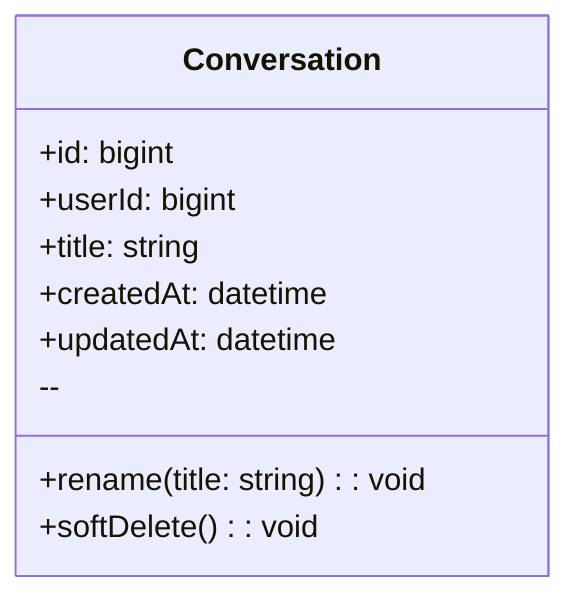
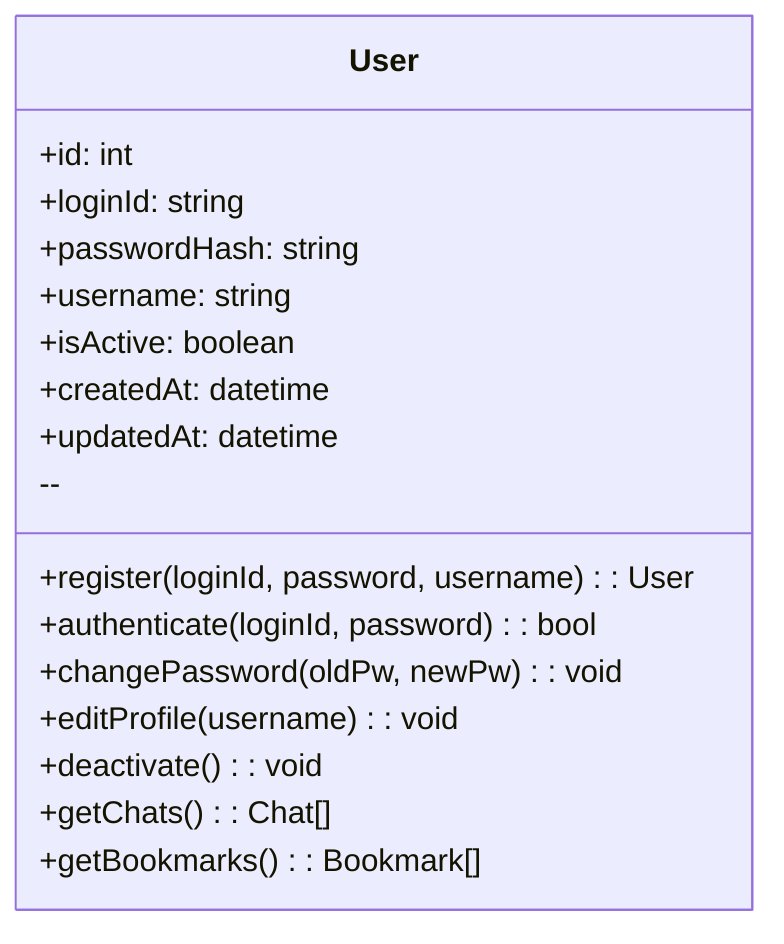
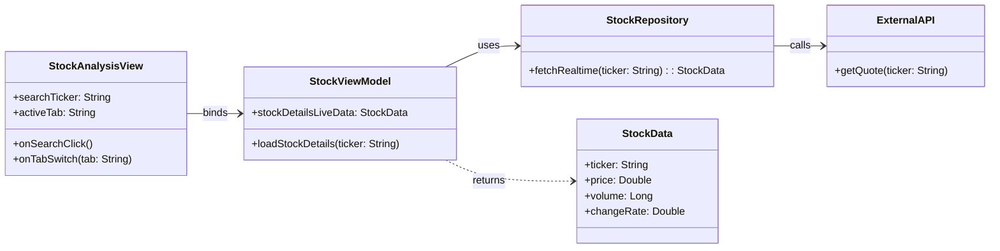
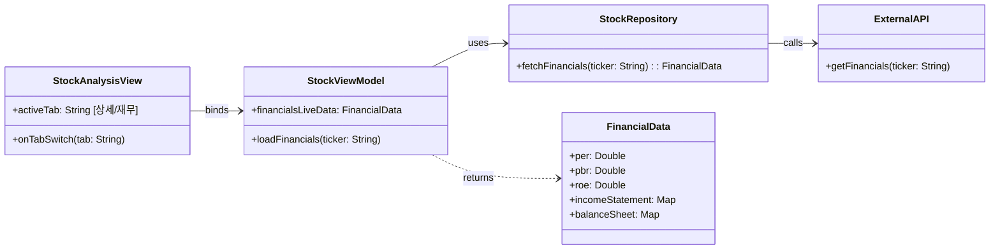
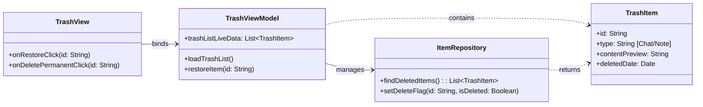

#예제 : classDiagram

## User
**Class Description**  
: 서비스 이용자 계정 및 식별 정보를 보관합니다.

### Attributes
- **id** *(bigint, public)*  
  : 사용자 PK.
- **username** *(string, public)*  
  : 로그인/표시용 사용자명(고유).
- **email** *(string, public)*  
  : 계정 이메일(로그인/알림 발송에 사용).
- **passwordHash** *(string, public)*  
  : 비밀번호 해시(평문 저장 금지).
- **createdAt** *(datetime, public)*  
  : 계정 생성 시각.
- **updatedAt** *(datetime, public)*  
  : 계정 정보 마지막 갱신 시각.

### Operations
- **register** *(username, email, password → User, public)*  
  : 신규 사용자 등록.
- **authenticate** *(usernameOrEmail, password → bool, public)*  
  : 인증 검사.
- **changePassword** *(oldPw, newPw → void, public)*  
  : 비밀번호 변경.
- **getSessions** *(→ Session[], public)*  
  : 사용자 세션 목록 조회.
- **getConversations** *(→ Conversation[], public)*  
  : 대화 목록 조회.

---

#클래스 다이어그램: User

## User
**Class Description**  
: 이용자의 계정 정보와 핵심 데이터를 관리합니다.

### Attributes
- **id** *(int, public)*  
  : 사용자의 고유 식별자(PK).
- **loginId** *(string, public)*  
  : 로그인 시 사용하는 아이디(고유).
- **passwordHash** *(string, public)*  
  : 해시 처리된 비밀번호.
- **username** *(string, public)*  
  : 서비스 내에서 표시될 사용자명.
- **isActive** *(boolean, public)*  
  : 계정 활성화 여부.
- **createdAt** *(datetime, public)*  
  : 계정 생성 시각.
- **updatedAt** *(datetime, public)*  
  : 계정 정보 마지막 갱신 시각.

### Operations
- **register** *(loginId, password, username → User, public)*  
  : 신규 계정을 생성합니다.
- **authenticate** *(loginId, password → bool, public)*  
  : 로그인 정보를 검증합니다.
- **changePassword** *(oldPw, newPw → void, public)*  
  : 비밀번호를 변경합니다.
- **editProfile** *(username → void, public)*  
  : 사용자 프로필(이름)을 수정합니다.
- **deactivate** *(→ void, public)*  
  : 사용자 계정을 비활성화합니다.
- **getChats** *(→ Chat[], public)*  
  : 사용자의 모든 채팅 목록을 조회합니다.
- **getBookmarks** *(→ Bookmark[], public)*  
  : 사용자의 모든 북마크 목록을 조회합니다.

---

---

#채팅 메시지와 저장과 채팅방 삭제를 위한 class diagram

## ChatApiClient
**Class Description**  
: 북마크·채팅 관련 HTTP 호출을 캡슐화합니다.

### Attributes
- **baseUrl** *(string, private)*  
  : 백엔드 API 기본 경로.
- **http** *(HttpClient, private)*  
  : 실제 네트워크 요청을 수행하는 클라이언트.

### Operations
- **checkBookmark** *(messageId → Promise<ApiResult<bool>>, public)*  
  : 메시지 북마크 여부 조회.
- **saveBookmark** *(messageId, categoryId?, newCategoryName? → Promise<ApiResult<void>>, public)*  
  : 북마크 저장 요청.
- **deleteRoom** *(chatRoomId → Promise<ApiResult<void>>, public)*  
  : 채팅방 휴지통 이동 요청.
- **fetchCategories** *(→ Promise<ApiResult<CategorySummary[]>>, public)*  
  : 카테고리 목록 조회.

---

## BookmarkRouter
**Class Description**  
: FastAPI에서 북마크 관련 엔드포인트를 제공하는 라우터입니다.

### Attributes
- **service** *(BookmarkService, private)*  
  : 북마크 로직 담당 서비스.

### Operations
- **checkBookmark** *(messageId, currentUser → Response<bool>, public)*  
  : 메시지 북마크 여부 확인.
- **saveBookmark** *(dto, currentUser → Response<void>, public)*  
  : 북마크 저장 처리.

---

## ChatRouter
**Class Description**  
: 채팅 메시지·채팅방 요청을 처리하는 FastAPI 라우터입니다.

### Attributes
- **service** *(ChatService, private)*  
  : 채팅 로직 담당 서비스.

### Operations
- **createMessage** *(roomId, messageDto, currentUser → Response<Message>, public)*  
  : 채팅방에 메시지 추가.
- **getMessages** *(roomId, lastMessageId?, currentUser → Response<Message[]>, public)*  
  : 메시지 목록 조회.
- **getRooms** *(currentUser → Response<Chat[]>, public)*  
  : 채팅방 목록 조회.
- **deleteRoom** *(chatRoomId, currentUser → Response<void>, public)*  
  : 채팅방 휴지통 이동.

---

## BookmarkService
**Class Description**  
: 북마크 중복 검사 및 저장 로직을 제공하는 서비스 계층입니다.

### Attributes
- **bookmarkRepo** *(BookmarkRepository, private)*  
  : 북마크 데이터 접근.
- **categoryRepo** *(CategoryRepository, private)*  
  : 카테고리 조회·생성.
- **messageRepo** *(MessageRepository, private)*  
  : 메시지 검증.

### Operations
- **isBookmarked** *(messageId, userId → bool, public)*  
  : 북마크 존재 여부 확인.
- **saveBookmark** *(messageId, userId, categoryParam → void, public)*  
  : 카테고리 결정 후 북마크 저장.

---

## ChatService
**Class Description**  
: 채팅 메시지 처리와 채팅방 상태 변경을 담당하는 서비스입니다.

### Attributes
- **chatRepo** *(ChatRepository, private)*  
  : 채팅방 데이터 접근.
- **messageRepo** *(MessageRepository, private)*  
  : 메시지 데이터 접근.

### Operations
- **appendMessage** *(roomId, userId, content → Message, public)*  
  : 새 메시지 저장.
- **loadMessages** *(roomId, lastMessageId? → Message[], public)*  
  : 메시지 목록 조회.
- **moveToTrash** *(chatRoomId, userId → void, public)*  
  : `Chat.trash_can` 값을 휴지통으로 변경.

---

## BookmarkRepository
**Class Description**  
: SQLAlchemy 세션으로 북마크 테이블을 조작합니다.

### Attributes
- **db** *(Session, private)*  
  : DB 트랜잭션용 세션.

### Operations
- **exists** *(messageId, userId → bool, public)*  
  : 북마크 중복 여부 확인.
- **save** *(bookmark → Bookmark, public)*  
  : 새 북마크 저장.

---

## CategoryRepository
**Class Description**  
: 카테고리 조회 및 생성을 담당합니다.

### Attributes
- **db** *(Session, private)*

### Operations
- **findById** *(categoryId, userId → Category?, public)*  
  : 특정 카테고리 조회.
- **findByName** *(name, userId → Category?, public)*  
  : 이름 중복 확인.
- **listAll** *(userId → Category[], public)*  
  : 사용자의 모든 카테고리 반환.
- **save** *(category → Category, public)*  
  : 카테고리 저장.

---

## ChatRepository
**Class Description**  
: 채팅방 엔티티를 조회·갱신합니다.

### Attributes
- **db** *(Session, private)*

### Operations
- **findOwned** *(chatRoomId, userId → Chat?, public)*  
  : 소유자 검증을 겸한 채팅방 조회.
- **save** *(chat → Chat, public)*  
  : 채팅방 상태 갱신.

---

## MessageRepository
**Class Description**  
: 채팅 메시지를 조회하고 저장합니다.

### Attributes
- **db** *(Session, private)*

### Operations
- **findById** *(messageId, userId → Message?, public)*  
  : 메시지 존재 및 권한 확인.
- **list** *(roomId, lastMessageId? → Message[], public)*  
  : 메시지 목록 조회.
- **save** *(message → Message, public)*  
  : 새 메시지 저장.

---

## 1. 종목 상세 정보 조회 : classDiagram

## StockAnalysisView
**Class Description**  
: 별도 분석 영역의 UI, 사용자 입력 및 탭 전환 이벤트를 수신합니다.

### Attributes
- **searchTicker** *(string, public)*  
  : 검색 입력 값.
- **activeTab** *(string, public)*  
  : 현재 활성화된 탭 (상세 정보).

### Operations
- **onSearchClick()** *(void, public)*  
  : 검색 버튼 클릭 처리.
- **onTabSwitch(tab: string)** *(void, public)*  
  : 탭 전환 이벤트 처리.

---

## StockViewModel
**Class Description**
: UI에 표시될 데이터 상태를 관리하고, View의 요청에 따라 데이터를 Repository에 요청합니다.

### Attributes
- **stockDetailsLiveData** *(StockData, public)*
  : 시세 데이터 상태.

### Operations
- **loadStockDetails(ticker: string)** *(void, public)*
  : 실시간 시세 로드 요청.

---

## StockRepository
**Class Description**
: 실시간 시세 및 재무 데이터를 외부 API로부터 효율적으로 가져와 데이터 모델로 변환합니다.

### Operations
- **fetchRealtime(ticker: string)** → **StockData (public)**
  : 실시간 데이터 조회 및 반환.

---

## ExternalAPI
**Class Description**
: 실제 증권사나 금융 데이터 제공업체의 API 호출을 담당하는 가상 클래스입니다.

---

## StockData
**Class Description**
: 특정 종목의 현재가, 거래량, 등락률 등 실시간 상세 시세 정보를 담는 데이터 구조입니다.

### Attributes
- **price** *(double, public)*
  : 현재 가격.
- **changeRate** *(double, public)*
  : 등락률.   
- **volume** *(long, public)*
  : 거래량.

---

## 2. 재무제표 조회 : classDiagram

## FinancialData
**Class Description**  
: 특정 종목의 재무 상태표, 손익계산서, 현금흐름표 및 PER, PBR, ROE 등 핵심 재무 지표를 담는 데이터 구조입니다.

### Attributes
- **per** *(double, public)*
  : 주가수익비율   
- **roe** *(double, public)*
  : 자기자본이익률   
- **incomeStatement** *(Map, public)*
  : 손익계산서 데이터

나머지 클래스 종목 상세 정보 조회와 동일

---

## 3. 휴지통 관리 : classDiagram

## TrashView
**Class Description**  
: 휴지통 목록을 출력하고, 항목 복원 또는 영구 삭제와 같은 사용자 입력을 처리합니다.

### Attributes
- **trashListDisplay** *(List, public)*
  : 화면에 표시되는 목록
  
### Operations
- **onRestoreClick(id: string)** *(void, public)*
  : 복원 버튼 클릭 처리
- **onDeletePermanentClick(id: string)** *(void, public)*
  : 영구 삭제 버튼 클릭 처리

---

## TrashViewModel
**Class Description**  
: 휴지통 목록의 상태를 관리하며, 사용자의 복원/삭제 요청에 따라 Repository에 데이터 변경합니다.

### Attributes
- **trashListLiveData** *(List, public)*
  : 휴지통 항목 상태

### Operations
- **loadTrashList()** *(void, public)*
  : 목록 조회 요청
- **restoreItem(id: string)** *(void, public)*
  : 항목 복원 로직 실행

---

## ItemRepository
**Class Description**  
: 로컬 DB에서 삭제 플래그가 설정된 항목을 조회하고, 사용자의 요청에 따라 플래그를 변경하거나 영구 삭제합니다.

### Operations
- **findDeletedItems()** → **TrashItem[] (public)**
  : 삭제 플래그 항목 조회
- **setDeleteFlag(id: string, isDeleted: bool)** *(public)*
  : 복원/삭제 플래그 변경

---

## TrashItem
**Class Description**  
: 삭제된 채팅 기록 또는 저장된 답변의 식별 정보, 유형, 내용 미리보기, 삭제 시각 등을 담는 데이터 구조입니다.
### Attributes
- **id** *(string, public)*
  : 항목 고유 ID   
- **deletedDate** *(datetime, public)*
  : 삭제된 시각   
- **contentPreview** *(string, public)*
  : 내용 미리보기

---

## LocalDB
**Class Description**  
: 실제 챗봇의 대화 기록 및 항목 저장 데이터를 보관하는 로컬 데이터베이스입니다.

---

