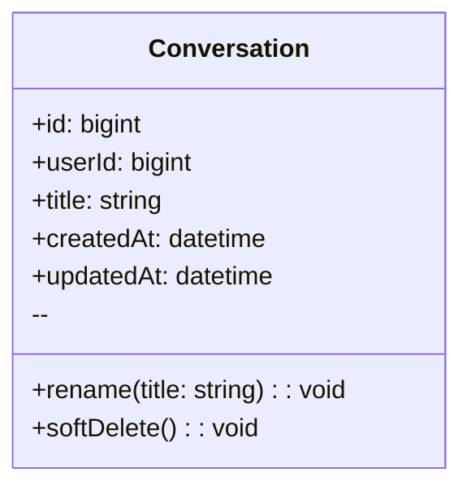
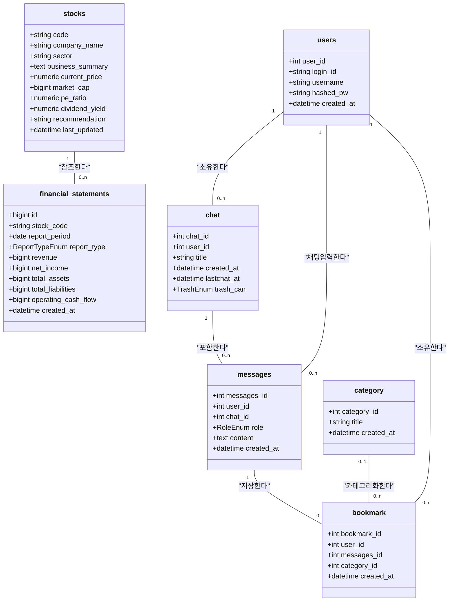
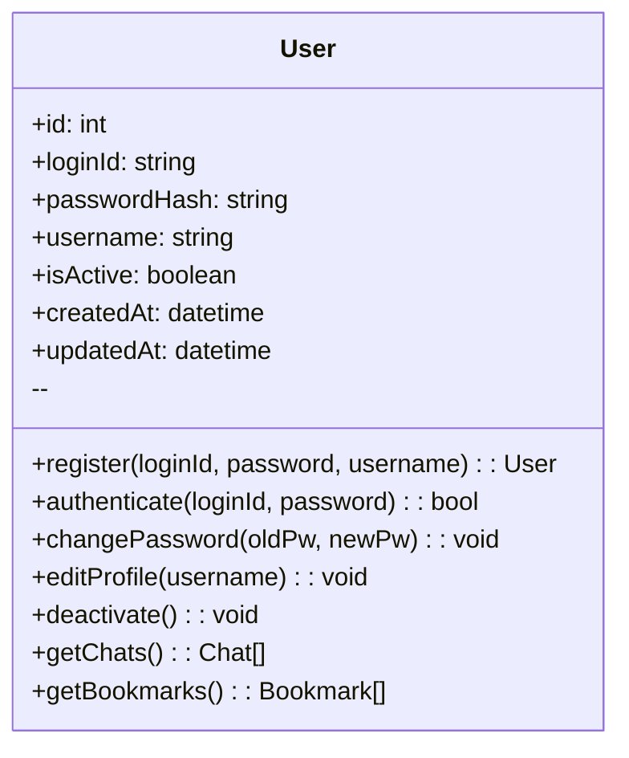
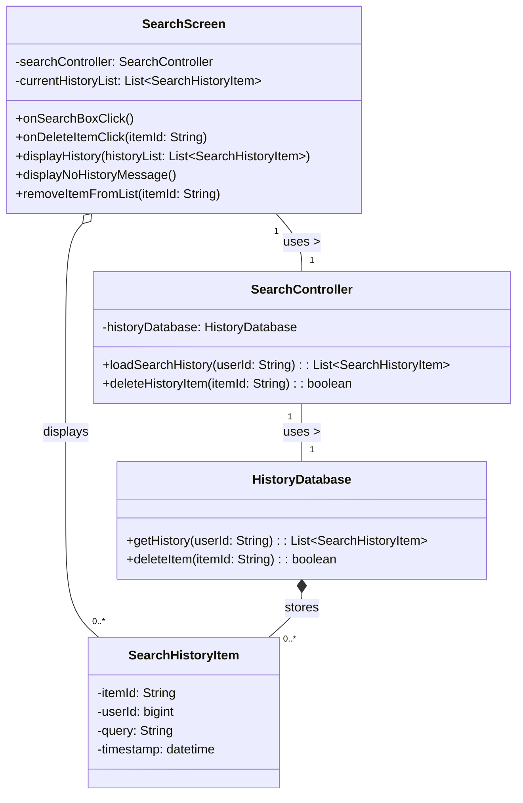
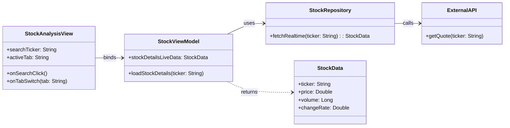

#예제 : classDiagram

## User
**Class Description**  
: 서비스 이용자 계정 및 식별 정보를 보관합니다.

### Attributes
- **id** *(bigint, public)*  
  : 사용자 PK.
- **username** *(string, public)*  
  : 로그인/표시용 사용자명(고유).
- **email** *(string, public)*  
  : 계정 이메일(로그인/알림 발송에 사용).
- **passwordHash** *(string, public)*  
  : 비밀번호 해시(평문 저장 금지).
- **createdAt** *(datetime, public)*  
  : 계정 생성 시각.
- **updatedAt** *(datetime, public)*  
  : 계정 정보 마지막 갱신 시각.

### Operations
- **register** *(username, email, password → User, public)*  
  : 신규 사용자 등록.
- **authenticate** *(usernameOrEmail, password → bool, public)*  
  : 인증 검사.
- **changePassword** *(oldPw, newPw → void, public)*  
  : 비밀번호 변경.
- **getSessions** *(→ Session[], public)*  
  : 사용자 세션 목록 조회.
- **getConversations** *(→ Conversation[], public)*  
  : 대화 목록 조회.

---
#클래스 다이어그램: User

## users
**Class Description**
: 서비스 이용자 계정 및 식별 정보를 보관합니다.

### Attributes
-   **user_id** *(int, public)*
    : 사용자 PK.
-   **login_id** *(string, public)*
    : 로그인 ID (고유).
-   **username** *(string, public)*
    : 사용자 표시명.
-   **hashed_pw** *(string, public)*
    : 해시 처리된 비밀번호.
-   **created_at** *(datetime, public)*
    : 계정 생성 시각.

---

## chat
**Class Description**
: 사용자와 어시스턴트 간의 개별 대화(세션)를 정의합니다.

### Attributes
-   **chat_id** *(int, public)*
    : 채팅방 PK.
-   **user_id** *(int, public)*
    : 채팅방 소유자 (users.user_id FK).
-   **title** *(string, public)*
    : 채팅방 제목.
-   **created_at** *(datetime, public)*
    : 채팅방 생성 시각.
-   **lastchat_at** *(datetime, public)*
    : 마지막 메시지 전송 시각 (NULL 가능).
-   **trash_can** *(TrashEnum, public)*
    : 휴지통 상태 (in/out).

---

## messages
**Class Description**
: 채팅방 내에서 사용자와 어시스턴트가 주고받은 개별 메시지를 저장합니다.

### Attributes
-   **messages_id** *(int, public)*
    : 메시지 PK.
-   **user_id** *(int, public)*
    : 메시지 작성자 (users.user_id FK).
-   **chat_id** *(int, public)*
    : 메시지가 속한 채팅방 (chat.chat_id FK).
-   **role** *(RoleEnum, public)*
    : 메시지 작성 주체 (user/assistant).
-   **content** *(text, public)*
    : 메시지 본문 내용.
-   **created_at** *(datetime, public)*
    : 메시지 생성 시각.

---

## category
**Class Description**
: 북마크를 분류하기 위한 사용자 정의 카테고리입니다.

### Attributes
-   **category_id** *(int, public)*
    : 카테고리 PK.
-   **title** *(string, public)*
    : 카테고리 이름.
-   **created_at** *(datetime, public)*
    : 카테고리 생성 시각.

---

## bookmark
**Class Description**
: 사용자가 특정 메시지(`messages`)를 저장(북마크)한 정보를 관리합니다. `users`와 `messages` 간의 연결 테이블 역할을 합니다.

### Attributes
-   **bookmark_id** *(int, public)*
    : 북마크 PK.
-   **user_id** *(int, public)*
    : 북마크 소유자 (users.user_id FK).
-   **messages_id** *(int, public)*
    : 북마크된 메시지 (messages.messages_id FK).
-   **category_id** *(int, public)*
    : 북마크가 속한 카테고리 (category.category_id FK, NULL 가능).
-   **created_at** *(datetime, public)*
    : 북마크 생성 시각.

---

## stocks
**Class Description**
: 주식 종목의 기본 정보, 현재가, 밸류에이션 등 요약 정보를 저장합니다.

### Attributes
-   **code** *(string, public)*
    : 종목 코드 (PK).
-   **company_name** *(string, public)*
    : 회사명.
-   **sector** *(string, public)*
    : 섹터.
-   **business_summary** *(text, public)*
    : 비즈니스 요약.
-   **current_price** *(numeric, public)*
    : 현재 주가.
-   **market_cap** *(bigint, public)*
    : 시가 총액.
-   **pe_ratio** *(numeric, public)*
    : 주가수익비율 (TTM).
-   **dividend_yield** *(numeric, public)*
    : 배당 수익률.
-   **recommendation** *(string, public)*
    : 애널리스트 투자의견.
-   **last_updated** *(datetime, public)*
    : 정보 마지막 갱신 시각.

---

## financial_statements
**Class Description**
: 개별 주식(`stocks`)의 분기별/연간 재무제표 데이터를 저장합니다.

### Attributes
-   **id** *(bigint, public)*
    : 재무제표 데이터 PK.
-   **stock_code** *(string, public)*
    : 대상 종목 코드 (stocks.code FK).
-   **report_period** *(date, public)*
    : 보고서 기준일 (결산일).
-   **report_type** *(ReportTypeEnum, public)*
    : 보고서 유형 (Annual/Quarterly).
-   **revenue** *(bigint, public)*
    : 매출액.
-   **net_income** *(bigint, public)*
    : 당기순이익.
-   **total_assets** *(bigint, public)*
    : 자산 총계.
-   **total_liabilities** *(bigint, public)*
    : 부채 총계.
-   **operating_cash_flow** *(bigint, public)*
    : 영업 활동 현금 흐름.
-   **created_at** *(datetime, public)*
    : 데이터 생성 시각.

---

---

#클래스 다이어그램: User

## User
**Class Description**  
: 이용자의 계정 정보와 핵심 데이터를 관리합니다.

### Attributes
- **id** *(int, public)*  
  : 사용자의 고유 식별자(PK).
- **loginId** *(string, public)*  
  : 로그인 시 사용하는 아이디(고유).
- **passwordHash** *(string, public)*  
  : 해시 처리된 비밀번호.
- **username** *(string, public)*  
  : 서비스 내에서 표시될 사용자명.
- **isActive** *(boolean, public)*  
  : 계정 활성화 여부.
- **createdAt** *(datetime, public)*  
  : 계정 생성 시각.
- **updatedAt** *(datetime, public)*  
  : 계정 정보 마지막 갱신 시각.

### Operations
- **register** *(loginId, password, username → User, public)*  
  : 신규 계정을 생성합니다.
- **authenticate** *(loginId, password → bool, public)*  
  : 로그인 정보를 검증합니다.
- **changePassword** *(oldPw, newPw → void, public)*  
  : 비밀번호를 변경합니다.
- **editProfile** *(username → void, public)*  
  : 사용자 프로필(이름)을 수정합니다.
- **deactivate** *(→ void, public)*  
  : 사용자 계정을 비활성화합니다.
- **getChats** *(→ Chat[], public)*  
  : 사용자의 모든 채팅 목록을 조회합니다.
- **getBookmarks** *(→ Bookmark[], public)*  
  : 사용자의 모든 북마크 목록을 조회합니다.

---

---

#채팅 메시지와 저장과 채팅방 삭제를 위한 class diagram

## ChatApiClient
**Class Description**  
: 북마크·채팅 관련 HTTP 호출을 캡슐화합니다.

### Attributes
- **baseUrl** *(string, private)*  
  : 백엔드 API 기본 경로.
- **http** *(HttpClient, private)*  
  : 실제 네트워크 요청을 수행하는 클라이언트.

### Operations
- **checkBookmark** *(messageId → Promise<ApiResult<bool>>, public)*  
  : 메시지 북마크 여부 조회.
- **saveBookmark** *(messageId, categoryId?, newCategoryName? → Promise<ApiResult<void>>, public)*  
  : 북마크 저장 요청.
- **deleteRoom** *(chatRoomId → Promise<ApiResult<void>>, public)*  
  : 채팅방 휴지통 이동 요청.
- **fetchCategories** *(→ Promise<ApiResult<CategorySummary[]>>, public)*  
  : 카테고리 목록 조회.

---

## BookmarkRouter
**Class Description**  
: FastAPI에서 북마크 관련 엔드포인트를 제공하는 라우터입니다.

### Attributes
- **service** *(BookmarkService, private)*  
  : 북마크 로직 담당 서비스.

### Operations
- **checkBookmark** *(messageId, currentUser → Response<bool>, public)*  
  : 메시지 북마크 여부 확인.
- **saveBookmark** *(dto, currentUser → Response<void>, public)*  
  : 북마크 저장 처리.

---

## ChatRouter
**Class Description**  
: 채팅 메시지·채팅방 요청을 처리하는 FastAPI 라우터입니다.

### Attributes
- **service** *(ChatService, private)*  
  : 채팅 로직 담당 서비스.

### Operations
- **createMessage** *(roomId, messageDto, currentUser → Response<Message>, public)*  
  : 채팅방에 메시지 추가.
- **getMessages** *(roomId, lastMessageId?, currentUser → Response<Message[]>, public)*  
  : 메시지 목록 조회.
- **getRooms** *(currentUser → Response<Chat[]>, public)*  
  : 채팅방 목록 조회.
- **deleteRoom** *(chatRoomId, currentUser → Response<void>, public)*  
  : 채팅방 휴지통 이동.

---

## BookmarkService
**Class Description**  
: 북마크 중복 검사 및 저장 로직을 제공하는 서비스 계층입니다.

### Attributes
- **bookmarkRepo** *(BookmarkRepository, private)*  
  : 북마크 데이터 접근.
- **categoryRepo** *(CategoryRepository, private)*  
  : 카테고리 조회·생성.
- **messageRepo** *(MessageRepository, private)*  
  : 메시지 검증.

### Operations
- **isBookmarked** *(messageId, userId → bool, public)*  
  : 북마크 존재 여부 확인.
- **saveBookmark** *(messageId, userId, categoryParam → void, public)*  
  : 카테고리 결정 후 북마크 저장.

---

## ChatService
**Class Description**  
: 채팅 메시지 처리와 채팅방 상태 변경을 담당하는 서비스입니다.

### Attributes
- **chatRepo** *(ChatRepository, private)*  
  : 채팅방 데이터 접근.
- **messageRepo** *(MessageRepository, private)*  
  : 메시지 데이터 접근.

### Operations
- **appendMessage** *(roomId, userId, content → Message, public)*  
  : 새 메시지 저장.
- **loadMessages** *(roomId, lastMessageId? → Message[], public)*  
  : 메시지 목록 조회.
- **moveToTrash** *(chatRoomId, userId → void, public)*  
  : `Chat.trash_can` 값을 휴지통으로 변경.

---

## BookmarkRepository
**Class Description**  
: SQLAlchemy 세션으로 북마크 테이블을 조작합니다.

### Attributes
- **db** *(Session, private)*  
  : DB 트랜잭션용 세션.

### Operations
- **exists** *(messageId, userId → bool, public)*  
  : 북마크 중복 여부 확인.
- **save** *(bookmark → Bookmark, public)*  
  : 새 북마크 저장.

---

## CategoryRepository
**Class Description**  
: 카테고리 조회 및 생성을 담당합니다.

### Attributes
- **db** *(Session, private)*

### Operations
- **findById** *(categoryId, userId → Category?, public)*  
  : 특정 카테고리 조회.
- **findByName** *(name, userId → Category?, public)*  
  : 이름 중복 확인.
- **listAll** *(userId → Category[], public)*  
  : 사용자의 모든 카테고리 반환.
- **save** *(category → Category, public)*  
  : 카테고리 저장.

---

## ChatRepository
**Class Description**  
: 채팅방 엔티티를 조회·갱신합니다.

### Attributes
- **db** *(Session, private)*

### Operations
- **findOwned** *(chatRoomId, userId → Chat?, public)*  
  : 소유자 검증을 겸한 채팅방 조회.
- **save** *(chat → Chat, public)*  
  : 채팅방 상태 갱신.

---

## MessageRepository
**Class Description**  
: 채팅 메시지를 조회하고 저장합니다.

### Attributes
- **db** *(Session, private)*

### Operations
- **findById** *(messageId, userId → Message?, public)*  
  : 메시지 존재 및 권한 확인.
- **list** *(roomId, lastMessageId? → Message[], public)*  
  : 메시지 목록 조회.
- **save** *(message → Message, public)*  
  : 새 메시지 저장.

---

# 검색 기록: Class Diagram

## SearchScreen
**Class Description**  
: 사용자에게 검색 기록을 보여주고, 사용자 입력을 받아 SearchController에 전달하는 UI(표현) 계층이다.

### Attributes
- **searchController** *(SearchController, private)*  
  : 비즈니스 로직 처리를 요청하기 위한 컨트롤러 인스턴스.
- **currentHistoryList** *(List<SearchHistoryItem>, private)*  
  : 현재 화면에 표시되고 있는 검색 기록 목록.

### Operations
- **onSearchBoxClick** *(→ void, public)*  
  : 사용자가 검색창을 클릭했을 때의 이벤트 핸들러. (내부적으로 SearchController.loadSearchHistory 호출)
- **onDeleteItemClick** *(itemId: string → void, public)*  
  : 사용자가 특정 항목의 삭제 버튼을 클릭했을 때의 이벤트 핸들러. (내부적으로 SearchController.deleteHistoryItem 호출)
- **displayHistory** *(historyList: List<SearchHistoryItem> → void, public)*  
  : 컨트롤러로부터 받은 검색 기록 목록을 화면에 렌더링.
- **displayNoHistoryMessage** *(→ void, public)*  
  : 기록이 없을 경우 "검색 기록 없음" 메시지를 표시.
- **removeItemFromList** *(itemId: string → void, public)*  
  : currentHistoryList와 화면에서 특정 항목을 제거 (삭제 성공 시 호출됨).

---

## SearchController
**Class Description**  
: SearchScreen의 요청을 받아 비즈니스 로직을 수행하고, HistoryDatabase를 통해 데이터 작업을 지시하는 컨트롤러(로직) 계층이다.

### Attributes
- **historyDatabase** *(HistoryDatabase, private)*  
  : 데이터베이스 작업을 수행하기 위한 데이터 접근 객체.

### Operations
- **loadSearchHistory** *(userId: string → List<SearchHistoryItem>, public)*  
  : 사용자의 검색 기록을 HistoryDatabase에서 로드하여 반환.
- **deleteHistoryItem** *(itemId: string → boolean, public)*  
  : 특정 검색 기록 항목의 삭제를 HistoryDatabase에 요청하고 성공 여부를 반환.

---

## HistoryDatabase
**Class Description**  
: 검색 기록 데이터의 영속성(저장, 조회, 삭제)을 실제로 담당하는 데이터 접근(저장소) 계층이다.

### Attributes

### Operations
- **getHistory** *(userId: string → List<SearchHistoryItem>, public)*  
  : 데이터베이스에서 특정 사용자의 모든 검색 기록을 조회하여 반환.
- **deleteItem** *(itemId: string → boolean, public)*  
  : 데이터베이스에서 itemId와 일치하는 항목을 삭제하고 성공 여부를 반환.

## SearchHistoryItem
**Class Description**  
: 개별 검색 기록 항목을 나타내는 데이터 객체(DTO 또는 Entity)이다.

### Attributes
- **itemId** *(string, public)*  
  : 검색 기록 항목의 고유 식별자 (PK).
- **userId** *(bigint, public)*  
  : 해당 기록을 소유한 사용자의 ID (FK).
- **query** *(string, public)*  
  : 사용자가 입력했던 실제 검색어.
- **timestamp** *(datetime, public)*  
  : 해당 검색이 발생한 시각.

### Operations

---

## 1. 종목 상세 정보 조회 : classDiagram

## StockAnalysisView
**Class Description**  
: 별도 분석 영역의 UI, 사용자 입력 및 탭 전환 이벤트를 수신합니다.

### Attributes
- **searchTicker** *(string, public)*  
  : 검색 입력 값.
- **activeTab** *(string, public)*  
  : 현재 활성화된 탭 (상세 정보).

### Operations
- **onSearchClick()** *(void, public)*  
  : 검색 버튼 클릭 처리.
- **onTabSwitch(tab: string)** *(void, public)*  
  : 탭 전환 이벤트 처리.

---

## StockViewModel
**Class Description**
: UI에 표시될 데이터 상태를 관리하고, View의 요청에 따라 데이터를 Repository에 요청합니다.

### Attributes
- **stockDetailsLiveData** *(StockData, public)*
  : 시세 데이터 상태.

### Operations
- **loadStockDetails(ticker: string)** *(void, public)*
  : 실시간 시세 로드 요청.

---

## StockRepository
**Class Description**
: 실시간 시세 및 재무 데이터를 외부 API로부터 효율적으로 가져와 데이터 모델로 변환합니다.

### Operations
- **fetchRealtime(ticker: string)** → **StockData (public)**
  : 실시간 데이터 조회 및 반환.

---

## ExternalAPI
**Class Description**
: 실제 증권사나 금융 데이터 제공업체의 API 호출을 담당하는 가상 클래스입니다.

---

## StockData
**Class Description**
: 특정 종목의 현재가, 거래량, 등락률 등 실시간 상세 시세 정보를 담는 데이터 구조입니다.

### Attributes
- **price** *(double, public)*
  : 현재 가격.
- **changeRate** *(double, public)*
  : 등락률.   
- **volume** *(long, public)*
  : 거래량.

---

## 2. 재무제표 조회 : classDiagram

## FinancialData
**Class Description**  
: 특정 종목의 재무 상태표, 손익계산서, 현금흐름표 및 PER, PBR, ROE 등 핵심 재무 지표를 담는 데이터 구조입니다.

### Attributes
- **per** *(double, public)*
  : 주가수익비율   
- **roe** *(double, public)*
  : 자기자본이익률   
- **incomeStatement** *(Map, public)*
  : 손익계산서 데이터

나머지 클래스 종목 상세 정보 조회와 동일

---

## 3. 휴지통 관리 : classDiagram

## TrashView
**Class Description**  
: 휴지통 목록을 출력하고, 항목 복원 또는 영구 삭제와 같은 사용자 입력을 처리합니다.

### Attributes
- **trashListDisplay** *(List, public)*
  : 화면에 표시되는 목록
  
### Operations
- **onRestoreClick(id: string)** *(void, public)*
  : 복원 버튼 클릭 처리
- **onDeletePermanentClick(id: string)** *(void, public)*
  : 영구 삭제 버튼 클릭 처리

---

## TrashViewModel
**Class Description**  
: 휴지통 목록의 상태를 관리하며, 사용자의 복원/삭제 요청에 따라 Repository에 데이터 변경합니다.

### Attributes
- **trashListLiveData** *(List, public)*
  : 휴지통 항목 상태

### Operations
- **loadTrashList()** *(void, public)*
  : 목록 조회 요청
- **restoreItem(id: string)** *(void, public)*
  : 항목 복원 로직 실행

---

## ItemRepository
**Class Description**  
: 로컬 DB에서 삭제 플래그가 설정된 항목을 조회하고, 사용자의 요청에 따라 플래그를 변경하거나 영구 삭제합니다.

### Operations
- **findDeletedItems()** → **TrashItem[] (public)**
  : 삭제 플래그 항목 조회
- **setDeleteFlag(id: string, isDeleted: bool)** *(public)*
  : 복원/삭제 플래그 변경

---

## TrashItem
**Class Description**  
: 삭제된 채팅 기록 또는 저장된 답변의 식별 정보, 유형, 내용 미리보기, 삭제 시각 등을 담는 데이터 구조입니다.
### Attributes
- **id** *(string, public)*
  : 항목 고유 ID   
- **deletedDate** *(datetime, public)*
  : 삭제된 시각   
- **contentPreview** *(string, public)*
  : 내용 미리보기

---

## LocalDB
**Class Description**  
: 실제 챗봇의 대화 기록 및 항목 저장 데이터를 보관하는 로컬 데이터베이스입니다.

---

