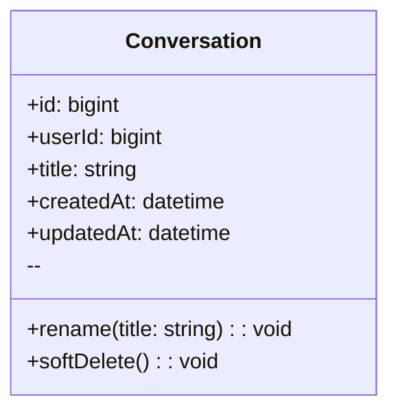
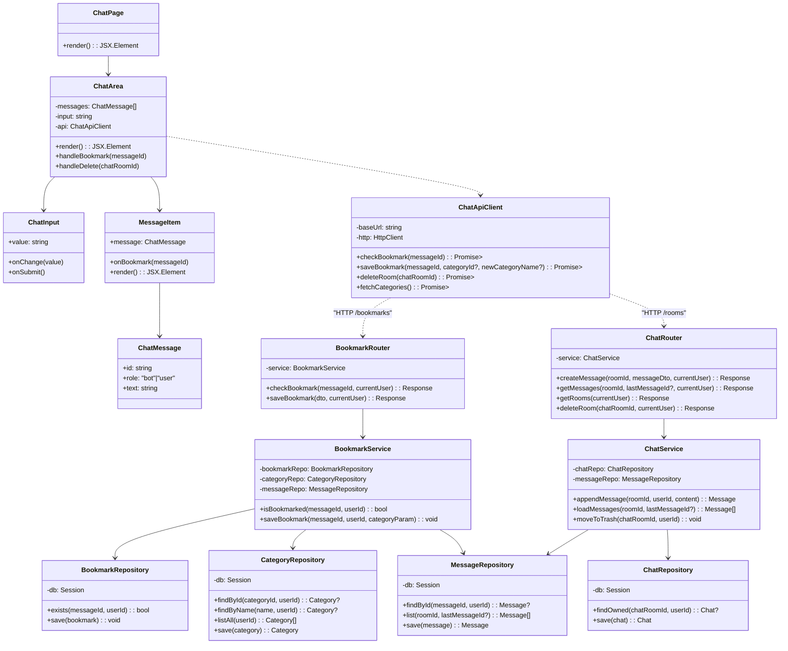

#예제 : classDiagram

## User
**Class Description**  
: 서비스 이용자 계정 및 식별 정보를 보관합니다.

### Attributes
- **id** *(bigint, public)*  
  : 사용자 PK.
- **username** *(string, public)*  
  : 로그인/표시용 사용자명(고유).
- **email** *(string, public)*  
  : 계정 이메일(로그인/알림 발송에 사용).
- **passwordHash** *(string, public)*  
  : 비밀번호 해시(평문 저장 금지).
- **createdAt** *(datetime, public)*  
  : 계정 생성 시각.
- **updatedAt** *(datetime, public)*  
  : 계정 정보 마지막 갱신 시각.

### Operations
- **register** *(username, email, password → User, public)*  
  : 신규 사용자 등록.
- **authenticate** *(usernameOrEmail, password → bool, public)*  
  : 인증 검사.
- **changePassword** *(oldPw, newPw → void, public)*  
  : 비밀번호 변경.
- **getSessions** *(→ Session[], public)*  
  : 사용자 세션 목록 조회.
- **getConversations** *(→ Conversation[], public)*  
  : 대화 목록 조회.

---

#채팅 메시지와 저장과 채팅방 삭제를 위한 class diagram

## ChatApiClient
**Class Description**  
: 북마크·채팅 관련 HTTP 호출을 캡슐화합니다.

### Attributes
- **baseUrl** *(string, private)*  
  : 백엔드 API 기본 경로.
- **http** *(HttpClient, private)*  
  : 실제 네트워크 요청을 수행하는 클라이언트.

### Operations
- **checkBookmark** *(messageId → Promise<ApiResult<bool>>, public)*  
  : 메시지 북마크 여부 조회.
- **saveBookmark** *(messageId, categoryId?, newCategoryName? → Promise<ApiResult<void>>, public)*  
  : 북마크 저장 요청.
- **deleteRoom** *(chatRoomId → Promise<ApiResult<void>>, public)*  
  : 채팅방 휴지통 이동 요청.
- **fetchCategories** *(→ Promise<ApiResult<CategorySummary[]>>, public)*  
  : 카테고리 목록 조회.

---

## BookmarkRouter
**Class Description**  
: FastAPI에서 북마크 관련 엔드포인트를 제공하는 라우터입니다.

### Attributes
- **service** *(BookmarkService, private)*  
  : 북마크 로직 담당 서비스.

### Operations
- **checkBookmark** *(messageId, currentUser → Response<bool>, public)*  
  : 메시지 북마크 여부 확인.
- **saveBookmark** *(dto, currentUser → Response<void>, public)*  
  : 북마크 저장 처리.

---

## ChatRouter
**Class Description**  
: 채팅 메시지·채팅방 요청을 처리하는 FastAPI 라우터입니다.

### Attributes
- **service** *(ChatService, private)*  
  : 채팅 로직 담당 서비스.

### Operations
- **createMessage** *(roomId, messageDto, currentUser → Response<Message>, public)*  
  : 채팅방에 메시지 추가.
- **getMessages** *(roomId, lastMessageId?, currentUser → Response<Message[]>, public)*  
  : 메시지 목록 조회.
- **getRooms** *(currentUser → Response<Chat[]>, public)*  
  : 채팅방 목록 조회.
- **deleteRoom** *(chatRoomId, currentUser → Response<void>, public)*  
  : 채팅방 휴지통 이동.

---

## BookmarkService
**Class Description**  
: 북마크 중복 검사 및 저장 로직을 제공하는 서비스 계층입니다.

### Attributes
- **bookmarkRepo** *(BookmarkRepository, private)*  
  : 북마크 데이터 접근.
- **categoryRepo** *(CategoryRepository, private)*  
  : 카테고리 조회·생성.
- **messageRepo** *(MessageRepository, private)*  
  : 메시지 검증.

### Operations
- **isBookmarked** *(messageId, userId → bool, public)*  
  : 북마크 존재 여부 확인.
- **saveBookmark** *(messageId, userId, categoryParam → void, public)*  
  : 카테고리 결정 후 북마크 저장.

---

## ChatService
**Class Description**  
: 채팅 메시지 처리와 채팅방 상태 변경을 담당하는 서비스입니다.

### Attributes
- **chatRepo** *(ChatRepository, private)*  
  : 채팅방 데이터 접근.
- **messageRepo** *(MessageRepository, private)*  
  : 메시지 데이터 접근.

### Operations
- **appendMessage** *(roomId, userId, content → Message, public)*  
  : 새 메시지 저장.
- **loadMessages** *(roomId, lastMessageId? → Message[], public)*  
  : 메시지 목록 조회.
- **moveToTrash** *(chatRoomId, userId → void, public)*  
  : `Chat.trash_can` 값을 휴지통으로 변경.

---

## BookmarkRepository
**Class Description**  
: SQLAlchemy 세션으로 북마크 테이블을 조작합니다.

### Attributes
- **db** *(Session, private)*  
  : DB 트랜잭션용 세션.

### Operations
- **exists** *(messageId, userId → bool, public)*  
  : 북마크 중복 여부 확인.
- **save** *(bookmark → Bookmark, public)*  
  : 새 북마크 저장.

---

## CategoryRepository
**Class Description**  
: 카테고리 조회 및 생성을 담당합니다.

### Attributes
- **db** *(Session, private)*

### Operations
- **findById** *(categoryId, userId → Category?, public)*  
  : 특정 카테고리 조회.
- **findByName** *(name, userId → Category?, public)*  
  : 이름 중복 확인.
- **listAll** *(userId → Category[], public)*  
  : 사용자의 모든 카테고리 반환.
- **save** *(category → Category, public)*  
  : 카테고리 저장.

---

## ChatRepository
**Class Description**  
: 채팅방 엔티티를 조회·갱신합니다.

### Attributes
- **db** *(Session, private)*

### Operations
- **findOwned** *(chatRoomId, userId → Chat?, public)*  
  : 소유자 검증을 겸한 채팅방 조회.
- **save** *(chat → Chat, public)*  
  : 채팅방 상태 갱신.

---

## MessageRepository
**Class Description**  
: 채팅 메시지를 조회하고 저장합니다.

### Attributes
- **db** *(Session, private)*

### Operations
- **findById** *(messageId, userId → Message?, public)*  
  : 메시지 존재 및 권한 확인.
- **list** *(roomId, lastMessageId? → Message[], public)*  
  : 메시지 목록 조회.
- **save** *(message → Message, public)*  
  : 새 메시지 저장.

---
