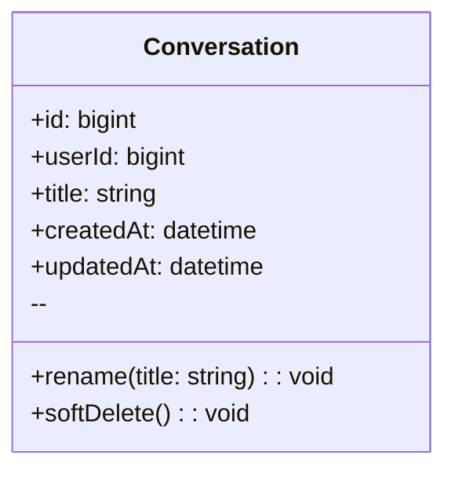
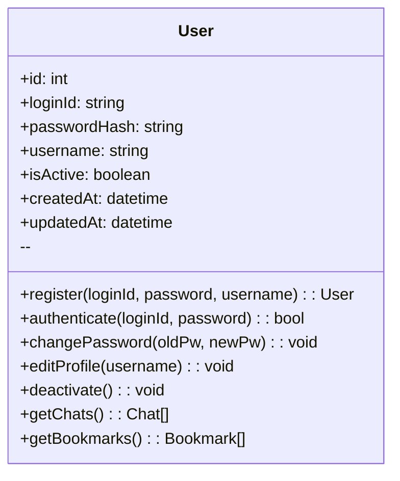

#예제 : classDiagram

## User
**Class Description**  
: 서비스 이용자 계정 및 식별 정보를 보관합니다.

### Attributes
- **id** *(bigint, public)*  
  : 사용자 PK.
- **username** *(string, public)*  
  : 로그인/표시용 사용자명(고유).
- **email** *(string, public)*  
  : 계정 이메일(로그인/알림 발송에 사용).
- **passwordHash** *(string, public)*  
  : 비밀번호 해시(평문 저장 금지).
- **createdAt** *(datetime, public)*  
  : 계정 생성 시각.
- **updatedAt** *(datetime, public)*  
  : 계정 정보 마지막 갱신 시각.

### Operations
- **register** *(username, email, password → User, public)*  
  : 신규 사용자 등록.
- **authenticate** *(usernameOrEmail, password → bool, public)*  
  : 인증 검사.
- **changePassword** *(oldPw, newPw → void, public)*  
  : 비밀번호 변경.
- **getSessions** *(→ Session[], public)*  
  : 사용자 세션 목록 조회.
- **getConversations** *(→ Conversation[], public)*  
  : 대화 목록 조회.

---

#클래스 다이어그램: User

## User
**Class Description**  
: 이용자의 계정 정보와 핵심 데이터를 관리합니다.

### Attributes
- **id** *(int, public)*  
  : 사용자의 고유 식별자(PK).
- **loginId** *(string, public)*  
  : 로그인 시 사용하는 아이디(고유).
- **passwordHash** *(string, public)*  
  : 해시 처리된 비밀번호.
- **username** *(string, public)*  
  : 서비스 내에서 표시될 사용자명.
- **isActive** *(boolean, public)*  
  : 계정 활성화 여부.
- **createdAt** *(datetime, public)*  
  : 계정 생성 시각.
- **updatedAt** *(datetime, public)*  
  : 계정 정보 마지막 갱신 시각.

### Operations
- **register** *(loginId, password, username → User, public)*  
  : 신규 계정을 생성합니다.
- **authenticate** *(loginId, password → bool, public)*  
  : 로그인 정보를 검증합니다.
- **changePassword** *(oldPw, newPw → void, public)*  
  : 비밀번호를 변경합니다.
- **editProfile** *(username → void, public)*  
  : 사용자 프로필(이름)을 수정합니다.
- **deactivate** *(→ void, public)*  
  : 사용자 계정을 비활성화합니다.
- **getChats** *(→ Chat[], public)*  
  : 사용자의 모든 채팅 목록을 조회합니다.
- **getBookmarks** *(→ Bookmark[], public)*  
  : 사용자의 모든 북마크 목록을 조회합니다.

---