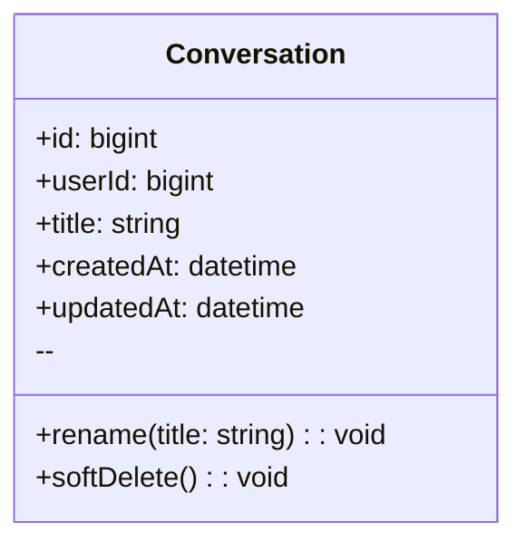

#예제 : classDiagram

## User
**Class Description**  
: 서비스 이용자 계정 및 식별 정보를 보관합니다.

### Attributes
- **id** *(bigint, public)*  
  : 사용자 PK.
- **username** *(string, public)*  
  : 로그인/표시용 사용자명(고유).
- **email** *(string, public)*  
  : 계정 이메일(로그인/알림 발송에 사용).
- **passwordHash** *(string, public)*  
  : 비밀번호 해시(평문 저장 금지).
- **createdAt** *(datetime, public)*  
  : 계정 생성 시각.
- **updatedAt** *(datetime, public)*  
  : 계정 정보 마지막 갱신 시각.

### Operations
- **register** *(username, email, password → User, public)*  
  : 신규 사용자 등록.
- **authenticate** *(usernameOrEmail, password → bool, public)*  
  : 인증 검사.
- **changePassword** *(oldPw, newPw → void, public)*  
  : 비밀번호 변경.
- **getSessions** *(→ Session[], public)*  
  : 사용자 세션 목록 조회.
- **getConversations** *(→ Conversation[], public)*  
  : 대화 목록 조회.

---