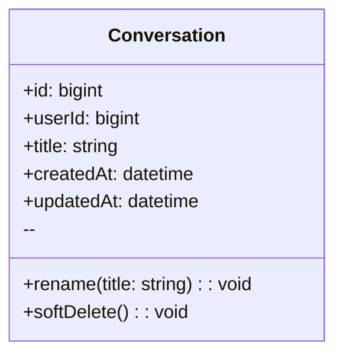
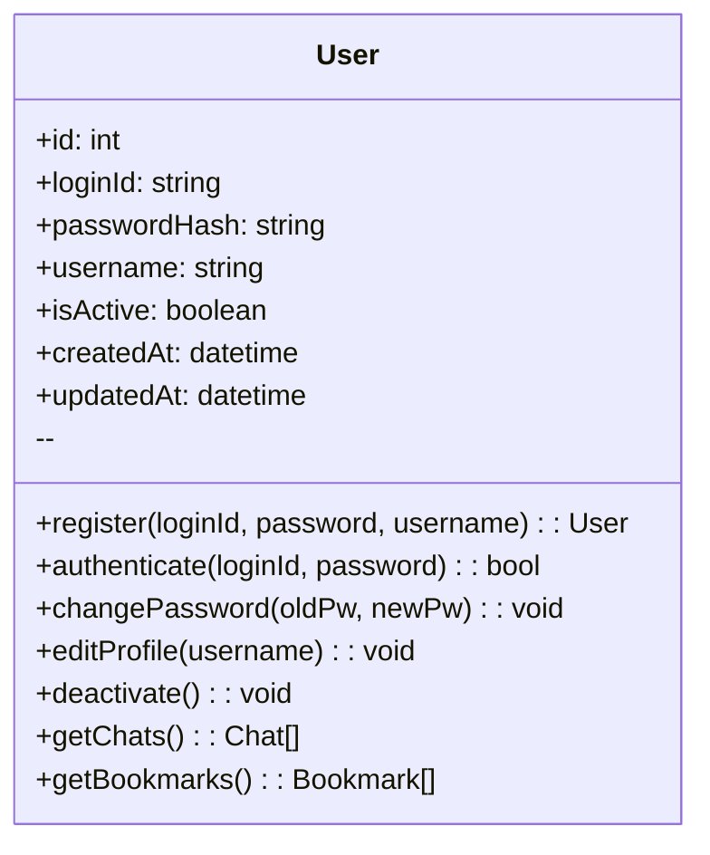
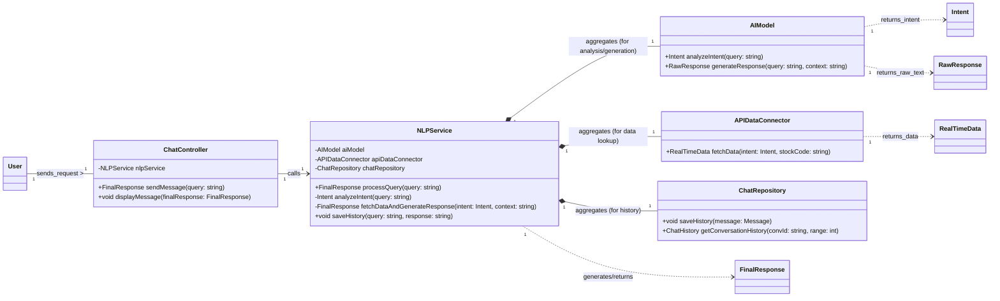
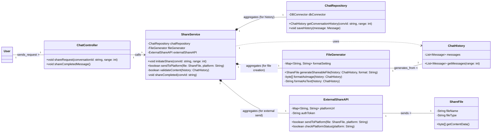
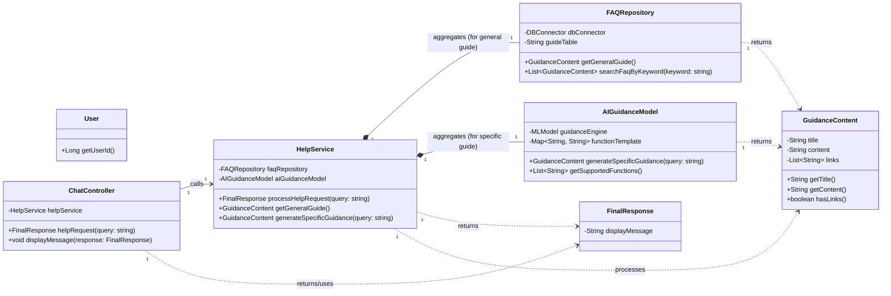

#예제 : classDiagram

## User
**Class Description**  
: 서비스 이용자 계정 및 식별 정보를 보관합니다.

### Attributes
- **id** *(bigint, public)*  
  : 사용자 PK.
- **username** *(string, public)*  
  : 로그인/표시용 사용자명(고유).
- **email** *(string, public)*  
  : 계정 이메일(로그인/알림 발송에 사용).
- **passwordHash** *(string, public)*  
  : 비밀번호 해시(평문 저장 금지).
- **createdAt** *(datetime, public)*  
  : 계정 생성 시각.
- **updatedAt** *(datetime, public)*  
  : 계정 정보 마지막 갱신 시각.

### Operations
- **register** *(username, email, password → User, public)*  
  : 신규 사용자 등록.
- **authenticate** *(usernameOrEmail, password → bool, public)*  
  : 인증 검사.
- **changePassword** *(oldPw, newPw → void, public)*  
  : 비밀번호 변경.
- **getSessions** *(→ Session[], public)*  
  : 사용자 세션 목록 조회.
- **getConversations** *(→ Conversation[], public)*  
  : 대화 목록 조회.

---

#클래스 다이어그램: User

## User
**Class Description**  
: 이용자의 계정 정보와 핵심 데이터를 관리합니다.

### Attributes
- **id** *(int, public)*  
  : 사용자의 고유 식별자(PK).
- **loginId** *(string, public)*  
  : 로그인 시 사용하는 아이디(고유).
- **passwordHash** *(string, public)*  
  : 해시 처리된 비밀번호.
- **username** *(string, public)*  
  : 서비스 내에서 표시될 사용자명.
- **isActive** *(boolean, public)*  
  : 계정 활성화 여부.
- **createdAt** *(datetime, public)*  
  : 계정 생성 시각.
- **updatedAt** *(datetime, public)*  
  : 계정 정보 마지막 갱신 시각.

### Operations
- **register** *(loginId, password, username → User, public)*  
  : 신규 계정을 생성합니다.
- **authenticate** *(loginId, password → bool, public)*  
  : 로그인 정보를 검증합니다.
- **changePassword** *(oldPw, newPw → void, public)*  
  : 비밀번호를 변경합니다.
- **editProfile** *(username → void, public)*  
  : 사용자 프로필(이름)을 수정합니다.
- **deactivate** *(→ void, public)*  
  : 사용자 계정을 비활성화합니다.
- **getChats** *(→ Chat[], public)*  
  : 사용자의 모든 채팅 목록을 조회합니다.
- **getBookmarks** *(→ Bookmark[], public)*  
  : 사용자의 모든 북마크 목록을 조회합니다.

---

---

#채팅 메시지와 저장과 채팅방 삭제를 위한 class diagram

## ChatApiClient
**Class Description**  
: 북마크·채팅 관련 HTTP 호출을 캡슐화합니다.

### Attributes
- **baseUrl** *(string, private)*  
  : 백엔드 API 기본 경로.
- **http** *(HttpClient, private)*  
  : 실제 네트워크 요청을 수행하는 클라이언트.

### Operations
- **checkBookmark** *(messageId → Promise<ApiResult<bool>>, public)*  
  : 메시지 북마크 여부 조회.
- **saveBookmark** *(messageId, categoryId?, newCategoryName? → Promise<ApiResult<void>>, public)*  
  : 북마크 저장 요청.
- **deleteRoom** *(chatRoomId → Promise<ApiResult<void>>, public)*  
  : 채팅방 휴지통 이동 요청.
- **fetchCategories** *(→ Promise<ApiResult<CategorySummary[]>>, public)*  
  : 카테고리 목록 조회.

---

## BookmarkRouter
**Class Description**  
: FastAPI에서 북마크 관련 엔드포인트를 제공하는 라우터입니다.

### Attributes
- **service** *(BookmarkService, private)*  
  : 북마크 로직 담당 서비스.

### Operations
- **checkBookmark** *(messageId, currentUser → Response<bool>, public)*  
  : 메시지 북마크 여부 확인.
- **saveBookmark** *(dto, currentUser → Response<void>, public)*  
  : 북마크 저장 처리.

---

## ChatRouter
**Class Description**  
: 채팅 메시지·채팅방 요청을 처리하는 FastAPI 라우터입니다.

### Attributes
- **service** *(ChatService, private)*  
  : 채팅 로직 담당 서비스.

### Operations
- **createMessage** *(roomId, messageDto, currentUser → Response<Message>, public)*  
  : 채팅방에 메시지 추가.
- **getMessages** *(roomId, lastMessageId?, currentUser → Response<Message[]>, public)*  
  : 메시지 목록 조회.
- **getRooms** *(currentUser → Response<Chat[]>, public)*  
  : 채팅방 목록 조회.
- **deleteRoom** *(chatRoomId, currentUser → Response<void>, public)*  
  : 채팅방 휴지통 이동.

---

## BookmarkService
**Class Description**  
: 북마크 중복 검사 및 저장 로직을 제공하는 서비스 계층입니다.

### Attributes
- **bookmarkRepo** *(BookmarkRepository, private)*  
  : 북마크 데이터 접근.
- **categoryRepo** *(CategoryRepository, private)*  
  : 카테고리 조회·생성.
- **messageRepo** *(MessageRepository, private)*  
  : 메시지 검증.

### Operations
- **isBookmarked** *(messageId, userId → bool, public)*  
  : 북마크 존재 여부 확인.
- **saveBookmark** *(messageId, userId, categoryParam → void, public)*  
  : 카테고리 결정 후 북마크 저장.

---

## ChatService
**Class Description**  
: 채팅 메시지 처리와 채팅방 상태 변경을 담당하는 서비스입니다.

### Attributes
- **chatRepo** *(ChatRepository, private)*  
  : 채팅방 데이터 접근.
- **messageRepo** *(MessageRepository, private)*  
  : 메시지 데이터 접근.

### Operations
- **appendMessage** *(roomId, userId, content → Message, public)*  
  : 새 메시지 저장.
- **loadMessages** *(roomId, lastMessageId? → Message[], public)*  
  : 메시지 목록 조회.
- **moveToTrash** *(chatRoomId, userId → void, public)*  
  : `Chat.trash_can` 값을 휴지통으로 변경.

---

## BookmarkRepository
**Class Description**  
: SQLAlchemy 세션으로 북마크 테이블을 조작합니다.

### Attributes
- **db** *(Session, private)*  
  : DB 트랜잭션용 세션.

### Operations
- **exists** *(messageId, userId → bool, public)*  
  : 북마크 중복 여부 확인.
- **save** *(bookmark → Bookmark, public)*  
  : 새 북마크 저장.

---

## CategoryRepository
**Class Description**  
: 카테고리 조회 및 생성을 담당합니다.

### Attributes
- **db** *(Session, private)*

### Operations
- **findById** *(categoryId, userId → Category?, public)*  
  : 특정 카테고리 조회.
- **findByName** *(name, userId → Category?, public)*  
  : 이름 중복 확인.
- **listAll** *(userId → Category[], public)*  
  : 사용자의 모든 카테고리 반환.
- **save** *(category → Category, public)*  
  : 카테고리 저장.

---

## ChatRepository
**Class Description**  
: 채팅방 엔티티를 조회·갱신합니다.

### Attributes
- **db** *(Session, private)*

### Operations
- **findOwned** *(chatRoomId, userId → Chat?, public)*  
  : 소유자 검증을 겸한 채팅방 조회.
- **save** *(chat → Chat, public)*  
  : 채팅방 상태 갱신.

---

## MessageRepository
**Class Description**  
: 채팅 메시지를 조회하고 저장합니다.

### Attributes
- **db** *(Session, private)*

### Operations
- **findById** *(messageId, userId → Message?, public)*  
  : 메시지 존재 및 권한 확인.
- **list** *(roomId, lastMessageId? → Message[], public)*  
  : 메시지 목록 조회.
- **save** *(message → Message, public)*  
  : 새 메시지 저장.

---
#채팅을 위한 Chat Class diagram

## ChatController
**Class Description**  
: 사용자 입력 메세지를 받아 적절한 서비스(NLP, Help, Share)로 라우팅하는
시스템의 입구

### Attributes
- **db** *(Session, private)*

### Operations
- **sendMessage** *(query:string)*  
  : 메시지 전송
- **displayMessage** *(finalResponse:FinalResponse)*

## NLPService
**Class Description**  
: 사용자 질문의 분석, 데이터 조회, 답변 생성, 기록 저장 등 질의 응답 전 과정을 조정

### Attributes
- **AIModel** 
- **apiDataConnector**
- **chatRepository**

### Operations
- **processQuery** *(query:string)*  
- **analyzeIntent** *(query: string)* 
- **fetchDataAndGenerateResponse** *(intent: Intent, context: string)*
- **saveHistory** *(query: string, response: string)*

## AIModel(의도 분석 및 답변 생성)
**Class Description**  
: 사용자 쿼리의 의도 분류 및 지식/분석 기반 답변을 생성

### Attributes
- **None**

### Operations
- **analyzeIntent** *(query: string)*
- **generateResponse** *(query: string, context: string)*

## APIDataConnector (실시간 데이터 조회)
**Class Description**  
: 실시간 주식 및 금융 데이터를 외부 API와 연동하여 조회.

### Attributes
- **None**

### Operations
- **fetchData** *(intent:Intent, stockCode:string)*

## ChatRepository(기록 저장)
**Class Description**  
: 챗봇의 대화 기록(메시지)을 데이터베이스에 저장

### Attributes
- **None**

### Operations
- **saveHistory** *(message:Message)*

#채팅 공유를 위한 Share Chat Class Diagram

## ShareService(부가 서비스 계층 – 공유)
**Class Description**  
: 대화 기록을 파일로 생성하고, 외부 플랫폼으로 전송하여 공유하는 전체 프로세스를 관리하는 서비스.

### Attributes
- **fileRepository** 
- **fileGenerator**
- **chatRepository**
- **externalShareAPI**

### Operations
- **initiateShare** *(convId: string, range: int)*  
- **sendToPlatform** *(file: ShareFile, platform: String)* 
- **validateContent** *(history: ChatHistory)*
- **shareCompleted** *(convId: string)*

## FileGenerator (데이터 처리 계층 - 파일 생성)
**Class Description**  
: 공유를 목적으로 대화 기록(ChatHistory)을 이미지(스크린샷), 텍스트 등 선택된 형태의 파일(ShareFile)로 변환하여 생성.

### Attributes
- **formatSetting**

### Operations
- **generateShareableFile** *(history: ChatHistory, format: String)*  
- **formatAsImage** *(history: ChatHistory)* 
- **formatAsText** *(history: ChatHistory)*

## ExternalShareAPI (데이터 연동 계층 - 공유)
**Class Description**  
: 생성된 파일을 카카오톡, X, 이메일 등 외부 플랫폼으로 전송하는 인터페이스

### Attributes
- **platformUrl**
- **authToken**

### Operations
- **sendToPlatform** *((file: ShareFile, platform: String))*  
- **checkPlatformStatus** *((platform: String))* 
- **handleNetworkError** *(platform: String)*

## ChatRepository (데이터 접근 계층)
**Class Description**  
: 챗봇의 대화 기록(메시지)을 데이터베이스에 저장하고 조회하는 역할

### Attributes
- **dbConnector**
- **tableName**

### Operations
- **saveHistory** *((message: Message))*  
- **getConversationHistory** *(((convId: string, range: int)))* 
- **findLastMessage** *((convId: string))*

#도움말 기능을 위한 Class Diagram

## 1. FAQRepository (데이터 접근 계층 - FAQ)

| Class | **FAQRepository** |
| :--- | :--- |
| **Description** | 자주 묻는 질문(FAQ)이나 일반적인 사용 가이드라인 데이터를 저장소에서 조회하고 관리 |
| **Attribute** | Name | Type | Visibility | Description |
| | dbConnector | DBConnector | private | 데이터베이스 연결 객체 |
| | guideTable | String | private | 가이드라인 정보가 저장된 테이블 |
| **Operations** | Name | Type | Visibility | Description |
| | getGeneralGuide | (void) | GuidanceContent | public | 일반적인 사용 가이드를 조회 |
| | searchFaqByKeyword | (keyword: string) | List<GuidanceContent> | public | 키워드로 관련 FAQ를 검색 |
| | getLatestUpdateDate | (void) | DateTime | public | FAQ 데이터의 최종 업데이트 시점을 조회 |

---

### 2. AIGuidanceModel (모델/분석 계층 - 안내 생성)

| Class | **AIGuidanceModel** |
| :--- | :--- |
| **Description** | 특정 기능 사용법과 같은 복잡한 안내 요청에 대해 AI 모델을 사용하여 상세 설명 및 사용 예시를 생성. |
| **Attribute** | Name | Type | Visibility | Description |
| | guidanceEngine | MLModel | private | 안내문 생성을 위한 학습된 모델 엔진 |
| | functionTemplate | Map<String, String> | private | 기능별 안내 템플릿 저장소 |
| **Operations** | Name | Type | Visibility | Description |
| | generateSpecificGuidance | (query: string) | GuidanceContent | public | 특정 기능에 대한 맞춤형 안내문을 생성 |
| | getSupportedFunctions | (void) | List<String> | public | 안내 생성이 가능한 기능 목록을 조회 |
| | formatExample | (functionName: String) | String | private | 특정 기능에 대한 사용 예시를 구성 |

---

### 3. GuidanceContent (안내/도움말 콘텐츠)

| Class | **GuidanceContent** |
| :--- | :--- |
| **Description** | HelpService가 사용자에게 전달하는 도움말/가이드의 내용을 담는 데이터 객체 |
| **Attribute** | Name | Type | Visibility | Description |
| | title | String | private | 안내 메시지의 제목 |
| | content | String | private | 안내 메시지의 상세 내용 |
| | links | List<String> | private | 관련 추가 자료 링크 목록 |
| **Operations** | Name | Type | Visibility | Description |
| | getTitle | (void) | String | public | 안내문의 제목을 반환 |
| | getContent | (void) | String | public | 안내문의 상세 내용을 반환 |
| | hasLinks | (void) | boolean | public | 안내문에 링크가 포함되어 있는지 확인 |

## 4. HelpService (부가 서비스 계층 - 도움말)
**Class Description**  
: 사용자 요청을 처리하여 일반 가이드(FAQ) 또는 AI 기반의 특정 기능 안내를 제공하는 서비스.

### Attributes
- **faqRepository**
- **aiGuidanceModel**

### Operations
- **processHelpRequest** *((message: Message))*  
- **getGeneralGuide()** 
- **generateSpecificGuidance** *((query: string))*
- **isSpecificQuery** *(((query: string)))*

