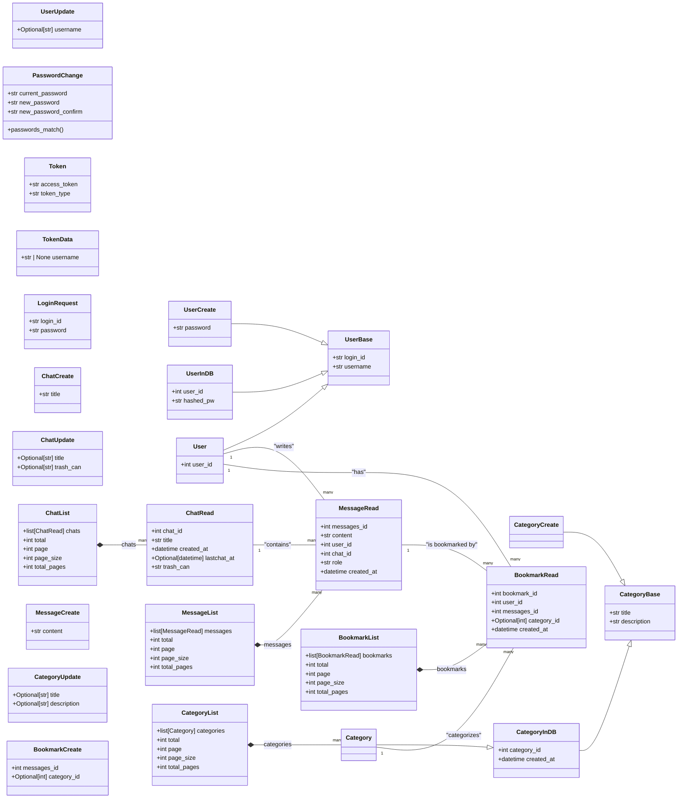
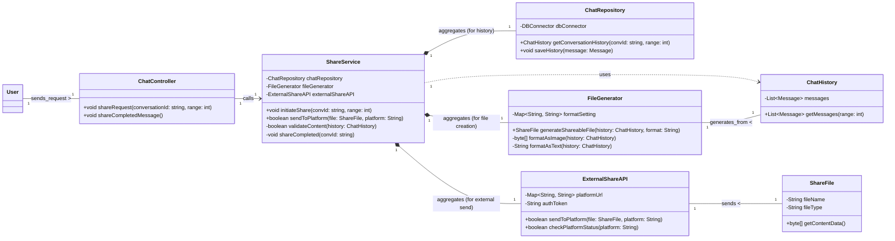

#예제 : classDiagram

## User
**Class Description**  
: 서비스 이용자 계정 및 식별 정보를 보관합니다.

### Attributes
- **id** *(bigint, public)*  
  : 사용자 PK.
- **username** *(string, public)*  
  : 로그인/표시용 사용자명(고유).
- **email** *(string, public)*  
  : 계정 이메일(로그인/알림 발송에 사용).
- **passwordHash** *(string, public)*  
  : 비밀번호 해시(평문 저장 금지).
- **createdAt** *(datetime, public)*  
  : 계정 생성 시각.
- **updatedAt** *(datetime, public)*  
  : 계정 정보 마지막 갱신 시각.

### Operations
- **register** *(username, email, password → User, public)*  
  : 신규 사용자 등록.
- **authenticate** *(usernameOrEmail, password → bool, public)*  
  : 인증 검사.
- **changePassword** *(oldPw, newPw → void, public)*  
  : 비밀번호 변경.
- **getSessions** *(→ Session[], public)*  
  : 사용자 세션 목록 조회.
- **getConversations** *(→ Conversation[], public)*  
  : 대화 목록 조회.

---

##클래스 다이어그램: User

## User
**Class Description**  
: 이용자의 계정 정보와 핵심 데이터를 관리합니다.

### Attributes
- **id** *(int, public)*  
  : 사용자의 고유 식별자(PK).
- **loginId** *(string, public)*  
  : 로그인 시 사용하는 아이디(고유).
- **passwordHash** *(string, public)*  
  : 해시 처리된 비밀번호.
- **username** *(string, public)*  
  : 서비스 내에서 표시될 사용자명.
- **isActive** *(boolean, public)*  
  : 계정 활성화 여부.
- **createdAt** *(datetime, public)*  
  : 계정 생성 시각.
- **updatedAt** *(datetime, public)*  
  : 계정 정보 마지막 갱신 시각.

### Operations
- **register** *(loginId, password, username → User, public)*  
  : 신규 계정을 생성합니다.
- **authenticate** *(loginId, password → bool, public)*  
  : 로그인 정보를 검증합니다.
- **changePassword** *(oldPw, newPw → void, public)*  
  : 비밀번호를 변경합니다.
- **editProfile** *(username → void, public)*  
  : 사용자 프로필(이름)을 수정합니다.
- **deactivate** *(→ void, public)*  
  : 사용자 계정을 비활성화합니다.
- **getChats** *(→ Chat[], public)*  
  : 사용자의 모든 채팅 목록을 조회합니다.
- **getBookmarks** *(→ Bookmark[], public)*  
  : 사용자의 모든 북마크 목록을 조회합니다.

---

## 데이터 타입: Class Diagram

---

## User (사용자) 스키마

### UserBase
**Class Description** : 사용자의 기본 공통 속성을 위한 Base 스키마입니다.

**Attributes**
* **login_id** *(str)*: 로그인 아이디 (min 4, max 50).
* **username** *(str)*: 사용자 이름 (min 2, max 50).

---

### UserCreate
**Class Description** : 회원가입 시 요청에 사용할 스키마입니다. (UserBase 상속)

**Attributes**
* *(Inherited)* **login_id**, **username**
* **password** *(str)*: 비밀번호 (min 8).

---

### UserUpdate
**Class Description** : 프로필 수정 시 요청에 사용할 스키마입니다.

**Attributes**
* **username** *(Optional[str])*: 사용자 이름 (min 2, max 50).

---

### PasswordChange
**Class Description** : 비밀번호 변경 시 요청에 사용할 스키마입니다.

**Attributes**
* **current_password** *(str)*: 현재 비밀번호 (min 8).
* **new_password** *(str)*: 새 비밀번호 (min 8).
* **new_password_confirm** *(str)*: 새 비밀번호 확인 (min 8).

**Operations**
* **passwords_match** *(validator)*: `new_password`와 `new_password_confirm` 필드가 일치하는지 검증합니다.

---

### UserInDB
**Class Description** : DB에서 읽어온 데이터를 위한 스키마 (내부 로직용). (UserBase 상속)

**Attributes**
* *(Inherited)* **login_id**, **username**
* **user_id** *(int)*: 사용자 고유 ID.
* **hashed_pw** *(str)*: 해시된 비밀번호.

---

### User
**Class Description** : API 응답으로 클라이언트에게 반환할 스키마 (내 정보 조회). (UserBase 상속)

**Attributes**
* *(Inherited)* **login_id**, **username**
* **user_id** *(int)*: 사용자 고유 ID.

---
---

## Auth & Token (인증) 스키마

### Token
**Class Description** : 로그인 성공 시 반환되는 JWT 토큰 응답 스키마입니다.

**Attributes**
* **access_token** *(str)*: 접근 토큰.
* **token_type** *(str)*: 토큰 타입 (예: "bearer").

---

### TokenData
**Class Description** : JWT 토큰 내부에 저장되는 데이터 스키마입니다.

**Attributes**
* **username** *(Optional[str])*: 사용자 이름.

---

### LoginRequest
**Class Description** : JSON 기반 로그인 요청 스키마 (OAuth2PasswordRequestForm 대안 옵션).

**Attributes**
* **login_id** *(str)*: 로그인 아이디 (min 4, max 50).
* **password** *(str)*: 비밀번호 (min 8).

---
---

## Chat & Message (채팅) 스키마

### ChatCreate
**Class Description** : 새 채팅방 생성을 위한 요청 스키마입니다.

**Attributes**
* **title** *(str)*: 채팅방 제목 (min 1, max 100).

---

### ChatUpdate
**Class Description** : 채팅방 정보 수정을 위한 요청 스키마입니다.

**Attributes**
* **title** *(Optional[str])*: 새 채팅방 제목 (min 1, max 100).
* **trash_can** *(Optional[str])*: 휴지통 상태 (in 또는 out).

---

### ChatRead
**Class Description** : 채팅방 정보 조회를 위한 응답 스키마입니다.

**Attributes**
* **chat_id** *(int)*: 채팅방 고유 ID.
* **title** *(str)*: 채팅방 제목.
* **created_at** *(datetime)*: 생성 시각.
* **lastchat_at** *(Optional[datetime])*: 마지막 대화 시각.
* **trash_can** *(str)*: 휴지통 상태.

---

### ChatList
**Class Description** : 채팅방 목록 응답 스키마 (페이지네이션).

**Attributes**
* **chats** *(list[ChatRead])*: 채팅방 목록.
* **total** *(int)*: 전체 항목 수.
* **page** *(int)*: 현재 페이지 번호.
* **page_size** *(int)*: 페이지 당 항목 수.
* **total_pages** *(int)*: 전체 페이지 수.

---

### MessageCreate
**Class Description** : 새 메시지 생성을 위한 요청 스키마 (POST /api/rooms/{room_id}/messages).

**Attributes**
* **content** *(str)*: 메시지 내용.

---

### MessageRead
**Class Description** : 메시지 조회를 위한 응답 스키마 (GET /api/rooms/{room_id}/messages).

**Attributes**
* **messages_id** *(int)*: 메시지 고유 ID.
* **content** *(str)*: 메시지 내용.
* **user_id** *(int)*: 작성한 사용자 ID.
* **chat_id** *(int)*: 메시지가 속한 채팅방 ID.
* **role** *(str)*: 메시지 주체 (user 또는 assistant).
* **created_at** *(datetime)*: 생성 시각.

---

### MessageList
**Class Description** : 메시지 목록 응답 스키마 (페이지네이션).

**Attributes**
* **messages** *(list[MessageRead])*: 메시지 목록.
* **total** *(int)*: 전체 항목 수.
* **page** *(int)*: 현재 페이지 번호.
* **page_size** *(int)*: 페이지 당 항목 수.
* **total_pages** *(int)*: 전체 페이지 수.

---
---

## Category (카테고리) 스키마

### CategoryBase
**Class Description** : 카테고리 공통 속성을 위한 기본 스키마입니다.

**Attributes**
* **title** *(str)*: 카테고리 제목 (max 50).
* **description** *(str)*: 카테고리 설명 (max 200).

---

### CategoryCreate
**Class Description** : 카테고리 생성을 위한 요청 스키마입니다. (CategoryBase 상속)

**Attributes**
* *(Inherited)* **title**, **description**

---

### CategoryUpdate
**Class Description** : 카테고리 수정을 위한 요청 스키마입니다.

**Attributes**
* **title** *(Optional[str])*: 카테고리 제목 (max 50).
* **description** *(Optional[str])*: 카테고리 설명 (max 200).

---

### CategoryInDB
**Class Description** : 데이터베이스의 카테고리 스키마입니다. (CategoryBase 상속)

**Attributes**
* *(Inherited)* **title**, **description**
* **category_id** *(int)*: 카테고리 고유 ID.
* **created_at** *(datetime)*: 생성 시각.

---

### Category
**Class Description** : 클라이언트에 카테고리 정보를 반환하기 위한 응답 스키마입니다. (CategoryInDB 상속)

**Attributes**
* *(Inherited)* **category_id**, **created_at**, **title**, **description**

---

### CategoryList
**Class Description** : 카테고리 목록 응답 스키마 (페이지네이션).

**Attributes**
* **categories** *(list[Category])*: 카테고리 목록.
* **total** *(int)*: 전체 항목 수.
* **page** *(int)*: 현재 페이지 번호.
* **page_size** *(int)*: 페이지 당 항목 수.
* **total_pages** *(int)*: 전체 페이지 수.

---
---

## Bookmark (북마크) 스키마

### BookmarkCreate
**Class Description** : 북마크(메시지 저장) 생성을 위한 요청 스키마입니다.

**Attributes**
* **messages_id** *(int)*: 저장할 메시지 ID.
* **category_id** *(Optional[int])*: 카테고리 ID (없으면 미분류).

---

### BookmarkRead
**Class Description** : 북마크 조회를 위한 응답 스키마입니다.

**Attributes**
* **bookmark_id** *(int)*: 북마크 고유 ID.
* **user_id** *(int)*: 북마크한 사용자 ID.
* **messages_id** *(int)*: 저장된 메시지 ID.
* **category_id** *(Optional[int])*: 연결된 카테고리 ID.
* **created_at** *(datetime)*: 생성 시각.

---

### BookmarkList
**Class Description** : 북마크 목록 응답 스키마 (페이지네이션).

**Attributes**
* **bookmarks** *(list[BookmarkRead])*: 북마크 목록.
* **total** *(int)*: 전체 항목 수.
* **page** *(int)*: 현재 페이지 번호.
* **page_size** *(int)*: 페이지 당 항목 수.
* **total_pages** *(int)*: 전체 페이지 수.

---

##채팅 메시지와 저장과 채팅방 삭제를 위한 class diagram

## ChatApiClient
**Class Description**  
: 북마크·채팅 관련 HTTP 호출을 캡슐화합니다.

### Attributes
- **baseUrl** *(string, private)*  
  : 백엔드 API 기본 경로.
- **http** *(HttpClient, private)*  
  : 실제 네트워크 요청을 수행하는 클라이언트.

### Operations
- **checkBookmark** *(messageId → Promise<ApiResult<bool>>, public)*  
  : 메시지 북마크 여부 조회.
- **saveBookmark** *(messageId, categoryId?, newCategoryName? → Promise<ApiResult<void>>, public)*  
  : 북마크 저장 요청.
- **deleteRoom** *(chatRoomId → Promise<ApiResult<void>>, public)*  
  : 채팅방 휴지통 이동 요청.
- **fetchCategories** *(→ Promise<ApiResult<CategorySummary[]>>, public)*  
  : 카테고리 목록 조회.

---

## BookmarkRouter
**Class Description**  
: FastAPI에서 북마크 관련 엔드포인트를 제공하는 라우터입니다.

### Attributes
- **service** *(BookmarkService, private)*  
  : 북마크 로직 담당 서비스.

### Operations
- **checkBookmark** *(messageId, currentUser → Response<bool>, public)*  
  : 메시지 북마크 여부 확인.
- **saveBookmark** *(dto, currentUser → Response<void>, public)*  
  : 북마크 저장 처리.

---

## ChatRouter
**Class Description**  
: 채팅 메시지·채팅방 요청을 처리하는 FastAPI 라우터입니다.

### Attributes
- **service** *(ChatService, private)*  
  : 채팅 로직 담당 서비스.

### Operations
- **createMessage** *(roomId, messageDto, currentUser → Response<Message>, public)*  
  : 채팅방에 메시지 추가.
- **getMessages** *(roomId, lastMessageId?, currentUser → Response<Message[]>, public)*  
  : 메시지 목록 조회.
- **getRooms** *(currentUser → Response<Chat[]>, public)*  
  : 채팅방 목록 조회.
- **deleteRoom** *(chatRoomId, currentUser → Response<void>, public)*  
  : 채팅방 휴지통 이동.

---

## BookmarkService
**Class Description**  
: 북마크 중복 검사 및 저장 로직을 제공하는 서비스 계층입니다.

### Attributes
- **bookmarkRepo** *(BookmarkRepository, private)*  
  : 북마크 데이터 접근.
- **categoryRepo** *(CategoryRepository, private)*  
  : 카테고리 조회·생성.
- **messageRepo** *(MessageRepository, private)*  
  : 메시지 검증.

### Operations
- **isBookmarked** *(messageId, userId → bool, public)*  
  : 북마크 존재 여부 확인.
- **saveBookmark** *(messageId, userId, categoryParam → void, public)*  
  : 카테고리 결정 후 북마크 저장.

---

## ChatService
**Class Description**  
: 채팅 메시지 처리와 채팅방 상태 변경을 담당하는 서비스입니다.

### Attributes
- **chatRepo** *(ChatRepository, private)*  
  : 채팅방 데이터 접근.
- **messageRepo** *(MessageRepository, private)*  
  : 메시지 데이터 접근.

### Operations
- **appendMessage** *(roomId, userId, content → Message, public)*  
  : 새 메시지 저장.
- **loadMessages** *(roomId, lastMessageId? → Message[], public)*  
  : 메시지 목록 조회.
- **moveToTrash** *(chatRoomId, userId → void, public)*  
  : `Chat.trash_can` 값을 휴지통으로 변경.

---

## BookmarkRepository
**Class Description**  
: SQLAlchemy 세션으로 북마크 테이블을 조작합니다.

### Attributes
- **db** *(Session, private)*  
  : DB 트랜잭션용 세션.

### Operations
- **exists** *(messageId, userId → bool, public)*  
  : 북마크 중복 여부 확인.
- **save** *(bookmark → Bookmark, public)*  
  : 새 북마크 저장.

---

## CategoryRepository
**Class Description**  
: 카테고리 조회 및 생성을 담당합니다.

### Attributes
- **db** *(Session, private)*

### Operations
- **findById** *(categoryId, userId → Category?, public)*  
  : 특정 카테고리 조회.
- **findByName** *(name, userId → Category?, public)*  
  : 이름 중복 확인.
- **listAll** *(userId → Category[], public)*  
  : 사용자의 모든 카테고리 반환.
- **save** *(category → Category, public)*  
  : 카테고리 저장.

---

## ChatRepository
**Class Description**  
: 채팅방 엔티티를 조회·갱신합니다.

### Attributes
- **db** *(Session, private)*

### Operations
- **findOwned** *(chatRoomId, userId → Chat?, public)*  
  : 소유자 검증을 겸한 채팅방 조회.
- **save** *(chat → Chat, public)*  
  : 채팅방 상태 갱신.

---

## MessageRepository
**Class Description**  
: 채팅 메시지를 조회하고 저장합니다.

### Attributes
- **db** *(Session, private)*

### Operations
- **findById** *(messageId, userId → Message?, public)*  
  : 메시지 존재 및 권한 확인.
- **list** *(roomId, lastMessageId? → Message[], public)*  
  : 메시지 목록 조회.
- **save** *(message → Message, public)*  
  : 새 메시지 저장.

---
#채팅을 위한 Chat Class diagram

## ChatController
**Class Description**  
: 사용자 입력 메세지를 받아 적절한 서비스(NLP, Help, Share)로 라우팅하는
시스템의 입구

### Attributes
- **db** *(Session, private)*

### Operations
- **sendMessage** *(query:string)*  
  : 메시지 전송
- **displayMessage** *(finalResponse:FinalResponse)*

## NLPService
**Class Description**  
: 사용자 질문의 분석, 데이터 조회, 답변 생성, 기록 저장 등 질의 응답 전 과정을 조정

### Attributes
- **AIModel** 
- **apiDataConnector**
- **chatRepository**

### Operations
- **processQuery** *(query:string)*  
- **analyzeIntent** *(query: string)* 
- **fetchDataAndGenerateResponse** *(intent: Intent, context: string)*
- **saveHistory** *(query: string, response: string)*

## AIModel(의도 분석 및 답변 생성)
**Class Description**  
: 사용자 쿼리의 의도 분류 및 지식/분석 기반 답변을 생성

### Attributes
- **None**

### Operations
- **analyzeIntent** *(query: string)*
- **generateResponse** *(query: string, context: string)*

## APIDataConnector (실시간 데이터 조회)
**Class Description**  
: 실시간 주식 및 금융 데이터를 외부 API와 연동하여 조회.

### Attributes
- **None**

### Operations
- **fetchData** *(intent:Intent, stockCode:string)*

## ChatRepository(기록 저장)
**Class Description**  
: 챗봇의 대화 기록(메시지)을 데이터베이스에 저장

### Attributes
- **None**

### Operations
- **saveHistory** *(message:Message)*

#채팅 공유를 위한 Share Chat Class Diagram

## ShareService(부가 서비스 계층 – 공유)
**Class Description**  
: 대화 기록을 파일로 생성하고, 외부 플랫폼으로 전송하여 공유하는 전체 프로세스를 관리하는 서비스.

### Attributes
- **fileRepository** 
- **fileGenerator**
- **chatRepository**
- **externalShareAPI**

### Operations
- **initiateShare** *(convId: string, range: int)*  
- **sendToPlatform** *(file: ShareFile, platform: String)* 
- **validateContent** *(history: ChatHistory)*
- **shareCompleted** *(convId: string)*

## FileGenerator (데이터 처리 계층 - 파일 생성)
**Class Description**  
: 공유를 목적으로 대화 기록(ChatHistory)을 이미지(스크린샷), 텍스트 등 선택된 형태의 파일(ShareFile)로 변환하여 생성.

### Attributes
- **formatSetting**

### Operations
- **generateShareableFile** *(history: ChatHistory, format: String)*  
- **formatAsImage** *(history: ChatHistory)* 
- **formatAsText** *(history: ChatHistory)*

## ExternalShareAPI (데이터 연동 계층 - 공유)
**Class Description**  
: 생성된 파일을 카카오톡, X, 이메일 등 외부 플랫폼으로 전송하는 인터페이스

### Attributes
- **platformUrl**
- **authToken**

### Operations
- **sendToPlatform** *((file: ShareFile, platform: String))*  
- **checkPlatformStatus** *((platform: String))* 
- **handleNetworkError** *(platform: String)*

## ChatRepository (데이터 접근 계층)
**Class Description**  
: 챗봇의 대화 기록(메시지)을 데이터베이스에 저장하고 조회하는 역할

### Attributes
- **dbConnector**
- **tableName**

### Operations
- **saveHistory** *((message: Message))*  
- **getConversationHistory** *(((convId: string, range: int)))* 
- **findLastMessage** *((convId: string))*

#도움말 기능을 위한 Class Diagram

## 1. FAQRepository (데이터 접근 계층 - FAQ)

| Class | **FAQRepository** |
| :--- | :--- |
| **Description** | 자주 묻는 질문(FAQ)이나 일반적인 사용 가이드라인 데이터를 저장소에서 조회하고 관리 |
| **Attribute** | Name | Type | Visibility | Description |
| | dbConnector | DBConnector | private | 데이터베이스 연결 객체 |
| | guideTable | String | private | 가이드라인 정보가 저장된 테이블 |
| **Operations** | Name | Type | Visibility | Description |
| | getGeneralGuide | (void) | GuidanceContent | public | 일반적인 사용 가이드를 조회 |
| | searchFaqByKeyword | (keyword: string) | List<GuidanceContent> | public | 키워드로 관련 FAQ를 검색 |
| | getLatestUpdateDate | (void) | DateTime | public | FAQ 데이터의 최종 업데이트 시점을 조회 |

---

### 2. AIGuidanceModel (모델/분석 계층 - 안내 생성)

| Class | **AIGuidanceModel** |
| :--- | :--- |
| **Description** | 특정 기능 사용법과 같은 복잡한 안내 요청에 대해 AI 모델을 사용하여 상세 설명 및 사용 예시를 생성. |
| **Attribute** | Name | Type | Visibility | Description |
| | guidanceEngine | MLModel | private | 안내문 생성을 위한 학습된 모델 엔진 |
| | functionTemplate | Map<String, String> | private | 기능별 안내 템플릿 저장소 |
| **Operations** | Name | Type | Visibility | Description |
| | generateSpecificGuidance | (query: string) | GuidanceContent | public | 특정 기능에 대한 맞춤형 안내문을 생성 |
| | getSupportedFunctions | (void) | List<String> | public | 안내 생성이 가능한 기능 목록을 조회 |
| | formatExample | (functionName: String) | String | private | 특정 기능에 대한 사용 예시를 구성 |

---

### 3. GuidanceContent (안내/도움말 콘텐츠)

| Class | **GuidanceContent** |
| :--- | :--- |
| **Description** | HelpService가 사용자에게 전달하는 도움말/가이드의 내용을 담는 데이터 객체 |
| **Attribute** | Name | Type | Visibility | Description |
| | title | String | private | 안내 메시지의 제목 |
| | content | String | private | 안내 메시지의 상세 내용 |
| | links | List<String> | private | 관련 추가 자료 링크 목록 |
| **Operations** | Name | Type | Visibility | Description |
| | getTitle | (void) | String | public | 안내문의 제목을 반환 |
| | getContent | (void) | String | public | 안내문의 상세 내용을 반환 |
| | hasLinks | (void) | boolean | public | 안내문에 링크가 포함되어 있는지 확인 |

## 4. HelpService (부가 서비스 계층 - 도움말)
**Class Description**  
: 사용자 요청을 처리하여 일반 가이드(FAQ) 또는 AI 기반의 특정 기능 안내를 제공하는 서비스.

### Attributes
- **faqRepository**
- **aiGuidanceModel**

### Operations
- **processHelpRequest** *((message: Message))*  
- **getGeneralGuide()** 
- **generateSpecificGuidance** *((query: string))*
- **isSpecificQuery** *(((query: string)))*

## 검색 기록: Class Diagram

## SearchScreen
**Class Description**  
: 사용자에게 검색 기록을 보여주고, 사용자 입력을 받아 SearchController에 전달하는 UI(표현) 계층이다.

### Attributes
- **searchController** *(SearchController, private)*  
  : 비즈니스 로직 처리를 요청하기 위한 컨트롤러 인스턴스.
- **currentHistoryList** *(List<SearchHistoryItem>, private)*  
  : 현재 화면에 표시되고 있는 검색 기록 목록.

### Operations
- **onSearchBoxClick** *(→ void, public)*  
  : 사용자가 검색창을 클릭했을 때의 이벤트 핸들러. (내부적으로 SearchController.loadSearchHistory 호출)
- **onDeleteItemClick** *(itemId: string → void, public)*  
  : 사용자가 특정 항목의 삭제 버튼을 클릭했을 때의 이벤트 핸들러. (내부적으로 SearchController.deleteHistoryItem 호출)
- **displayHistory** *(historyList: List<SearchHistoryItem> → void, public)*  
  : 컨트롤러로부터 받은 검색 기록 목록을 화면에 렌더링.
- **displayNoHistoryMessage** *(→ void, public)*  
  : 기록이 없을 경우 "검색 기록 없음" 메시지를 표시.
- **removeItemFromList** *(itemId: string → void, public)*  
  : currentHistoryList와 화면에서 특정 항목을 제거 (삭제 성공 시 호출됨).

---

## SearchController
**Class Description**  
: SearchScreen의 요청을 받아 비즈니스 로직을 수행하고, HistoryDatabase를 통해 데이터 작업을 지시하는 컨트롤러(로직) 계층이다.

### Attributes
- **historyDatabase** *(HistoryDatabase, private)*  
  : 데이터베이스 작업을 수행하기 위한 데이터 접근 객체.

### Operations
- **loadSearchHistory** *(userId: string → List<SearchHistoryItem>, public)*  
  : 사용자의 검색 기록을 HistoryDatabase에서 로드하여 반환.
- **deleteHistoryItem** *(itemId: string → boolean, public)*  
  : 특정 검색 기록 항목의 삭제를 HistoryDatabase에 요청하고 성공 여부를 반환.

---

## HistoryDatabase
**Class Description**  
: 검색 기록 데이터의 영속성(저장, 조회, 삭제)을 실제로 담당하는 데이터 접근(저장소) 계층이다.

### Attributes

### Operations
- **getHistory** *(userId: string → List<SearchHistoryItem>, public)*  
  : 데이터베이스에서 특정 사용자의 모든 검색 기록을 조회하여 반환.
- **deleteItem** *(itemId: string → boolean, public)*  
  : 데이터베이스에서 itemId와 일치하는 항목을 삭제하고 성공 여부를 반환.

## SearchHistoryItem
**Class Description**  
: 개별 검색 기록 항목을 나타내는 데이터 객체(DTO 또는 Entity)이다.

### Attributes
- **itemId** *(string, public)*  
  : 검색 기록 항목의 고유 식별자 (PK).
- **userId** *(bigint, public)*  
  : 해당 기록을 소유한 사용자의 ID (FK).
- **query** *(string, public)*  
  : 사용자가 입력했던 실제 검색어.
- **timestamp** *(datetime, public)*  
  : 해당 검색이 발생한 시각.

### Operations

---

## 1. 종목 상세 정보 조회 : classDiagram

## StockAnalysisView
**Class Description**  
: 별도 분석 영역의 UI, 사용자 입력 및 탭 전환 이벤트를 수신합니다.

### Attributes
- **searchTicker** *(string, public)*  
  : 검색 입력 값.
- **activeTab** *(string, public)*  
  : 현재 활성화된 탭 (상세 정보).

### Operations
- **onSearchClick()** *(void, public)*  
  : 검색 버튼 클릭 처리.
- **onTabSwitch(tab: string)** *(void, public)*  
  : 탭 전환 이벤트 처리.

---

## StockViewModel
**Class Description**
: UI에 표시될 데이터 상태를 관리하고, View의 요청에 따라 데이터를 Repository에 요청합니다.

### Attributes
- **stockDetailsLiveData** *(StockData, public)*
  : 시세 데이터 상태.

### Operations
- **loadStockDetails(ticker: string)** *(void, public)*
  : 실시간 시세 로드 요청.

---

## StockRepository
**Class Description**
: 실시간 시세 및 재무 데이터를 외부 API로부터 효율적으로 가져와 데이터 모델로 변환합니다.

### Operations
- **fetchRealtime(ticker: string)** → **StockData (public)**
  : 실시간 데이터 조회 및 반환.

---

## ExternalAPI
**Class Description**
: 실제 증권사나 금융 데이터 제공업체의 API 호출을 담당하는 가상 클래스입니다.

---

## StockData
**Class Description**
: 특정 종목의 현재가, 거래량, 등락률 등 실시간 상세 시세 정보를 담는 데이터 구조입니다.

### Attributes
- **price** *(double, public)*
  : 현재 가격.
- **changeRate** *(double, public)*
  : 등락률.   
- **volume** *(long, public)*
  : 거래량.

---

## 2. 재무제표 조회 : classDiagram

## FinancialData
**Class Description**  
: 특정 종목의 재무 상태표, 손익계산서, 현금흐름표 및 PER, PBR, ROE 등 핵심 재무 지표를 담는 데이터 구조입니다.

### Attributes
- **per** *(double, public)*
  : 주가수익비율   
- **roe** *(double, public)*
  : 자기자본이익률   
- **incomeStatement** *(Map, public)*
  : 손익계산서 데이터

나머지 클래스 종목 상세 정보 조회와 동일

---

## 3. 휴지통 관리 : classDiagram

## TrashView
**Class Description**  
: 휴지통 목록을 출력하고, 항목 복원 또는 영구 삭제와 같은 사용자 입력을 처리합니다.

### Attributes
- **trashListDisplay** *(List, public)*
  : 화면에 표시되는 목록
  
### Operations
- **onRestoreClick(id: string)** *(void, public)*
  : 복원 버튼 클릭 처리
- **onDeletePermanentClick(id: string)** *(void, public)*
  : 영구 삭제 버튼 클릭 처리

---

## TrashViewModel
**Class Description**  
: 휴지통 목록의 상태를 관리하며, 사용자의 복원/삭제 요청에 따라 Repository에 데이터 변경합니다.

### Attributes
- **trashListLiveData** *(List, public)*
  : 휴지통 항목 상태

### Operations
- **loadTrashList()** *(void, public)*
  : 목록 조회 요청
- **restoreItem(id: string)** *(void, public)*
  : 항목 복원 로직 실행

---

## ItemRepository
**Class Description**  
: 로컬 DB에서 삭제 플래그가 설정된 항목을 조회하고, 사용자의 요청에 따라 플래그를 변경하거나 영구 삭제합니다.

### Operations
- **findDeletedItems()** → **TrashItem[] (public)**
  : 삭제 플래그 항목 조회
- **setDeleteFlag(id: string, isDeleted: bool)** *(public)*
  : 복원/삭제 플래그 변경

---

## TrashItem
**Class Description**  
: 삭제된 채팅 기록 또는 저장된 답변의 식별 정보, 유형, 내용 미리보기, 삭제 시각 등을 담는 데이터 구조입니다.
### Attributes
- **id** *(string, public)*
  : 항목 고유 ID   
- **deletedDate** *(datetime, public)*
  : 삭제된 시각   
- **contentPreview** *(string, public)*
  : 내용 미리보기

---

## LocalDB
**Class Description**  
: 실제 챗봇의 대화 기록 및 항목 저장 데이터를 보관하는 로컬 데이터베이스입니다.

---

