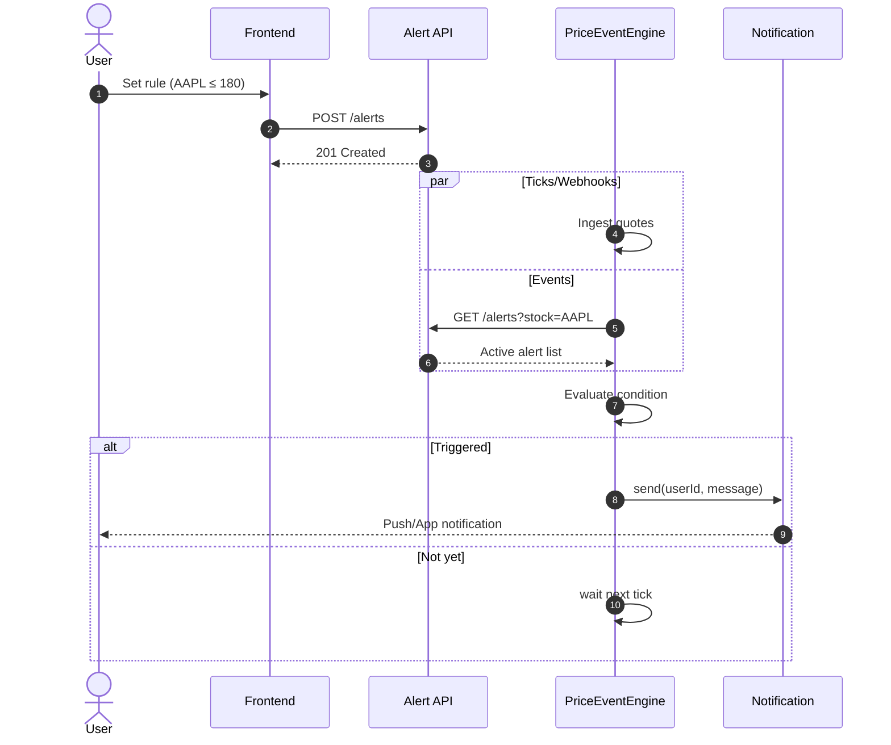

시퀀스 다이아그램 예제


## 1.1 알람 설정(예제)

### 1.1.1 알람 설정 흐름(예제)


사용자가 회원가입을 누르면 이메일 인증 → 닉네임 중복확인 → 비밀번호 확인 → 개인정보 입력 → 서버에 가입 요청 후 응답이 오면 로그인 화면으로 전환된다. (예제)


## 3. 검색 기록

### 3.1 검색 기록 조회
```mermaid
sequenceDiagram
    title: View search history
    participant Actor
    participant SearchScreen
    participant SearchController
    participant HistoryDatabase

    Actor->>SearchScreen: clickSearchBox
    activate SearchScreen
    SearchScreen->>SearchController: loadSearchHistory
    activate SearchController
    SearchController->>HistoryDatabase: getHistory(userId)
    activate HistoryDatabase
    HistoryDatabase-->>SearchController: return history list
    deactivate HistoryDatabase
    SearchController-->>SearchScreen: (history list)
    deactivate SearchController

    alt historyList is not empty
        SearchScreen->>SearchScreen: displayHistory(historyList)
    else historyList is empty
        SearchScreen->>SearchScreen: displayNoHistoryMessage
    end

    SearchScreen-->>Actor: Show history list or message
    deactivate SearchScreen
```

사용자가 검색창을 누르면, 검색 화면이 컨트롤러에 기록 조회를 요청 → 컨트롤러는 데이터베이스에서 기록을 조회 → 데이터베이스에서 기록 목록을 반환받으면 → 화면에 기록 목록 또는 "기록 없음" 메시지를 표시한다.

### 3.2 검색 기록 삭제
```mermaid
sequenceDiagram
    title: Delete search history
    participant Actor
    participant SearchScreen
    participant SearchController
    participant HistoryDatabase

    Actor->>SearchScreen: clickDeleteItem(itemId)
    activate SearchScreen
    SearchScreen->>SearchController: deleteHistoryItem(itemId)
    activate SearchController
    SearchController->>HistoryDatabase: deleteItem(itemId)
    activate HistoryDatabase
    HistoryDatabase-->>SearchController: success
    deactivate HistoryDatabase
    deactivate SearchController
    SearchScreen->>SearchScreen: removeItemFromList(itemId)
    SearchScreen-->>Actor: List updated
    deactivate SearchScreen
```

사용자가 특정 기록의 삭제를 누르면, 검색 화면이 컨트롤러에 삭제를 요청하고 → 컨트롤러는 데이터베이스에서 해당 항목을 삭제한다 → 데이터베이스로부터 성공 응답이 오면 → 화면에서 해당 항목을 제거하여 목록을 갱신한다.

위 형식에 맞춰서 아래에 시퀀스 다이아그램을 작성해주세요.