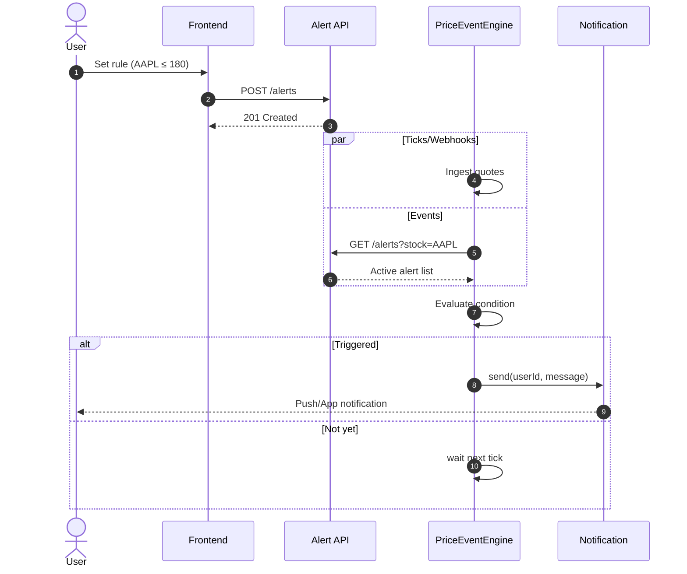

시퀀스 다이아그램 예제

```mermaid
sequenceDiagram
  autonumber
  actor U as User
  participant FE as Frontend
  participant A as Alert API
  participant E as PriceEventEngine
  participant N as Notification

  U->>FE: Set rule (AAPL ≤ 180)
  FE->>A: POST /alerts
  A-->>FE: 201 Created

  par Ticks/Webhooks
    E->>E: Ingest quotes
  and Events
    E->>A: GET /alerts?stock=AAPL
    A-->>E: Active alert list
  end

  E->>E: Evaluate condition
  alt Triggered
    E->>N: send(userId, message)
    N-->>U: Push/App notification
  else Not yet
    E->>E: wait next tick
  end
```

위 형식에 맞춰서 시퀀스 다이아그램을 작성해주세요.