## 1. 종목 분석 영역

### 1.1 종목 상세 정보 조회
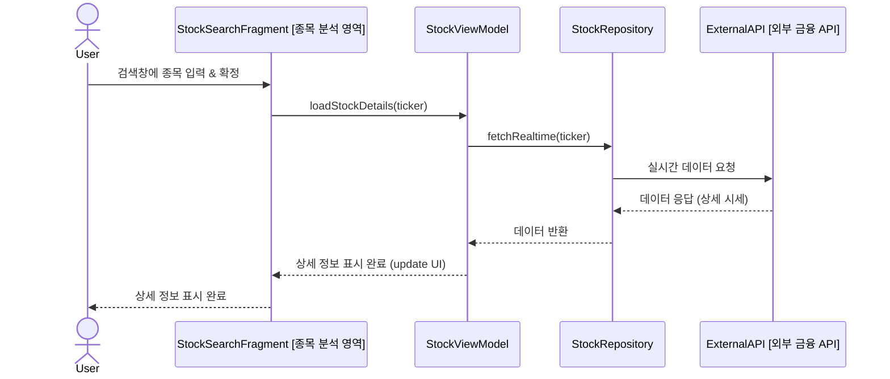
```mermaid
sequenceDiagram
    actor User
    participant StockSearchFragment as StockSearchFragment [종목 분석 영역]
    participant StockViewModel
    participant StockRepository
    participant ExternalAPI as ExternalAPI [외부 금융 API]

    User->>StockSearchFragment: 검색창에 종목 입력 & 확정
    StockSearchFragment->>StockViewModel: loadStockDetails(ticker)
    StockViewModel->>StockRepository: fetchRealtime(ticker)
    StockRepository->>ExternalAPI: 실시간 데이터 요청
    ExternalAPI-->>StockRepository: 데이터 응답 (상세 시세)
    StockRepository-->>StockViewModel: 데이터 반환
    StockViewModel-->>StockSearchFragment: 상세 정보 표시 완료 (update UI)
    StockSearchFragment-->>User: 상세 정보 표시 완료
```

사용자가 챗봇 대화창에서 종목 분석 영역을 활성화하거나 버튼을 누른다 → 분석 영역 내 검색창에서 종목명 또는 코드를 입력하고 선택한다 → 상세 정보 탭에 현재가, 등락률, 거래량 등 실시간 시세 정보가 표시된다.

### 1.2 재무제표 조회
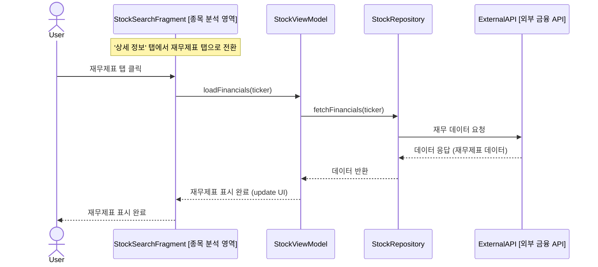
```mermaid
sequenceDiagram
    actor User
    participant StockSearchFragment as StockSearchFragment [종목 분석 영역]
    participant StockViewModel
    participant StockRepository
    participant ExternalAPI as ExternalAPI [외부 금융 API]

    Note over StockSearchFragment: '상세 정보' 탭에서 재무제표 탭으로 전환
    User->>StockSearchFragment: 재무제표 탭 클릭
    StockSearchFragment->>StockViewModel: loadFinancials(ticker)
    StockViewModel->>StockRepository: fetchFinancials(ticker)
    StockRepository->>ExternalAPI: 재무 데이터 요청
    ExternalAPI-->>StockRepository: 데이터 응답 (재무제표 데이터)
    StockRepository-->>StockViewModel: 데이터 반환
    StockViewModel-->>StockSearchFragment: 재무제표 표시 완료 (update UI)
    StockSearchFragment-->>User: 재무제표 표시 완료
```

사용자가 종목 분석 영역에서 재무제표 탭을 클릭한다 → 시스템은 해당 종목의 최신 재무제표 데이터를 조회한다 → 재무 상태표, 손익계산서 등의 데이터가 표와 그래프로 화면에 출력된다.

### 1.3 휴지통 관리
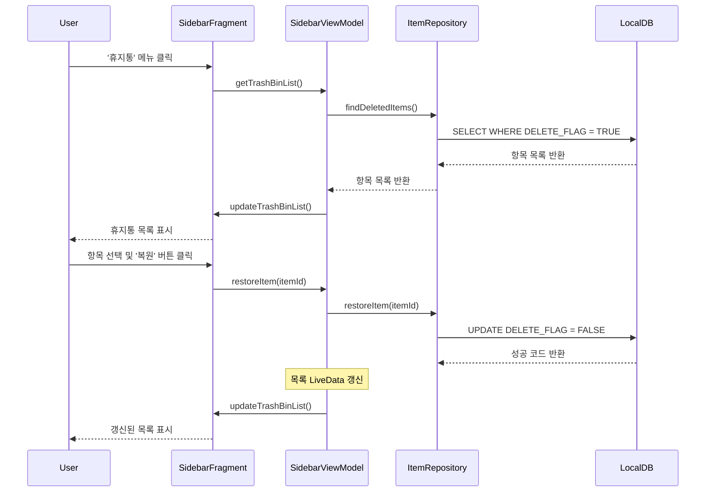
```mermaid
sequenceDiagram
    participant User
    participant SidebarFragment
    participant SidebarViewModel
    participant ItemRepository
    participant LocalDB
    User->>SidebarFragment: '휴지통' 메뉴 클릭
    SidebarFragment->>SidebarViewModel: getTrashBinList()
    SidebarViewModel->>ItemRepository: findDeletedItems()
    ItemRepository->>LocalDB: SELECT WHERE DELETE_FLAG = TRUE
    LocalDB-->>ItemRepository: 항목 목록 반환
    ItemRepository-->>SidebarViewModel: 항목 목록 반환
    SidebarViewModel->>SidebarFragment: updateTrashBinList()
    SidebarFragment-->>User: 휴지통 목록 표시
    User->>SidebarFragment: 항목 선택 및 '복원' 버튼 클릭
    SidebarFragment->>SidebarViewModel: restoreItem(itemId)
    SidebarViewModel->>ItemRepository: restoreItem(itemId)
    ItemRepository->>LocalDB: UPDATE DELETE_FLAG = FALSE
    LocalDB-->>ItemRepository: 성공 코드 반환
    Note over SidebarViewModel: 목록 LiveData 갱신
    SidebarViewModel->>SidebarFragment: updateTrashBinList()
    SidebarFragment-->>User: 갱신된 목록 표시
```

사용자가 사이드바에서 휴지통 메뉴를 클릭한다 → 삭제된 대화 기록 및 저장된 답변 목록을 확인한다 → 원하는 항목을 선택하고 복원 또는 영구 삭제 버튼을 누른다 → 목록이 갱신된다.

### 1.4 워치리스트 관리

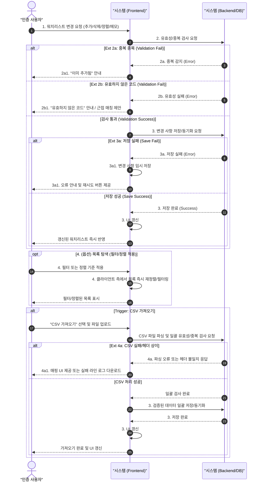
```mermaid
sequenceDiagram
    autonumber
    actor User as "인증 사용자"
    participant FE as "시스템 (Frontend)"
    participant BE as "시스템 (Backend/DB)"

    %% --- Main Flow (Add/Remove/Sort/Memo) ---
    User->>FE: 1. 워치리스트 변경 요청 (추가/삭제/정렬/메모)
    FE->>BE: 2. 유효성/중복 검사 요청
    
    alt Ext 2a: 중복 종목 (Validation Fail)
        BE-->>FE: 2a. 중복 감지 (Error)
        FE-->>User: 2a1. "이미 추가됨" 안내
    else Ext 2b: 유효하지 않은 코드 (Validation Fail)
        BE-->>FE: 2b. 유효성 실패 (Error)
        FE-->>User: 2b1. "유효하지 않은 코드" 안내 / 근접 매칭 제안
    else 검사 통과 (Validation Success)
        FE->>BE: 3. 변경 사항 저장/동기화 요청
        alt Ext 3a: 저장 실패 (Save Fail)
            BE-->>FE: 3a. 저장 실패 (Error)
            FE->>FE: 3a1. 변경 사항 임시 저장
            FE-->>User: 3a1. 오류 안내 및 재시도 버튼 제공
        else 저장 성공 (Save Success)
            BE-->>FE: 3. 저장 완료 (Success)
            FE->>FE: 3. UI 갱신
            FE-->>User: 갱신된 워치리스트 즉시 반영
        end
    end

    %% --- Optional Flow (Filter/Sort View) ---
    opt 4. (옵션) 목록 탐색 (필터/정렬 적용)
        User->>FE: 4. 필터 또는 정렬 기준 적용
        FE->>FE: 4. 클라이언트 측에서 목록 즉시 재정렬/필터링
        FE-->>User: 필터/정렬된 목록 표시
    end

    %% --- Alternative Trigger Flow (CSV Import) ---
    alt Trigger: CSV 가져오기
        User->>FE: "CSV 가져오기" 선택 및 파일 업로드
        FE->>BE: CSV 파일 파싱 및 일괄 유효성/중복 검사 요청
        alt Ext 4a: CSV 실패/헤더 상이
            BE-->>FE: 4a. 파싱 오류 또는 헤더 불일치 응답
            FE-->>User: 4a1. 매핑 UI 제공 또는 실패 라인 로그 다운로드
        else CSV 처리 성공
            BE-->>FE: 일괄 검사 완료
            FE->>BE: 3. 검증된 데이터 일괄 저장/동기화
            BE-->>FE: 3. 저장 완료
            FE->>FE: 3. UI 갱신
            FE-->>User: 가져오기 완료 및 UI 갱신
        end
    end
```

사용자가 포트폴리오 등록 및 관리를 요청한다 → 프론트엔드는 백엔드에 워치리스트 변경 요청을 보낸다 → 백엔드는 유효성/중복 검사를 수행한다 → (1. 중복 종목) 백엔드가 중복 감지 응답을 보내면, 프론트엔드는 사용자에게 "이미 추가됨" 알림을 표시한다. → (2. 유효하지 않은 코드) 백엔드가 유효성 실패 응답을 보내면, 프론트엔드는 사용자에게 "유효하지 않은 코드" 알림을 표시한다. → (3. 검사 통과) 백엔드가 저장 성공 응답을 보내면, 프론트엔드는 사용자에게 갱신된 워치리스트 즉시 반영 알림을 표시한다.  

### 1.5 포트폴리오 등록 및 관리

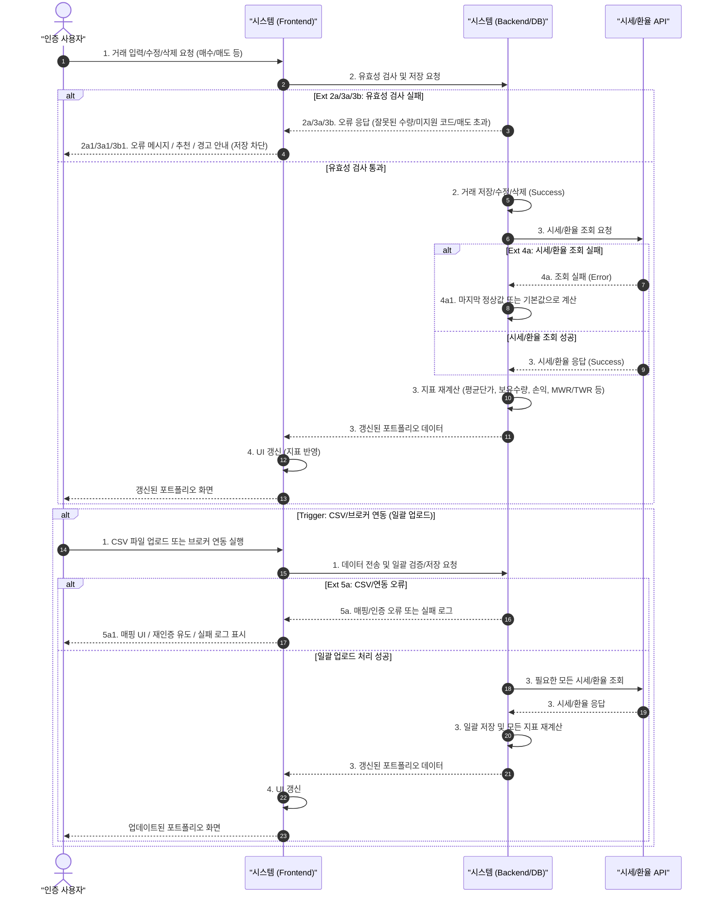
```mermaid
sequenceDiagram
    autonumber
    actor User as "인증 사용자"
    participant FE as "시스템 (Frontend)"
    participant BE as "시스템 (Backend/DB)"
    participant PriceAPI as "시세/환율 API"

    %% --- Main Flow (Manual Transaction Entry/Edit) ---
    User->>FE: 1. 거래 입력/수정/삭제 요청 (매수/매도 등)
    FE->>BE: 2. 유효성 검사 및 저장 요청
    
    alt Ext 2a/3a/3b: 유효성 검사 실패
        BE-->>FE: 2a/3a/3b. 오류 응답 (잘못된 수량/미지원 코드/매도 초과)
        FE-->>User: 2a1/3a1/3b1. 오류 메시지 / 추천 / 경고 안내 (저장 차단)
    else 유효성 검사 통과
        BE->>BE: 2. 거래 저장/수정/삭제 (Success)
        BE->>PriceAPI: 3. 시세/환율 조회 요청
        alt Ext 4a: 시세/환율 조회 실패
            PriceAPI-->>BE: 4a. 조회 실패 (Error)
            BE->>BE: 4a1. 마지막 정상값 또는 기본값으로 계산
        else 시세/환율 조회 성공
            PriceAPI-->>BE: 3. 시세/환율 응답 (Success)
        end
        BE->>BE: 3. 지표 재계산 (평균단가, 보유수량, 손익, MWR/TWR 등)
        BE-->>FE: 3. 갱신된 포트폴리오 데이터
        FE->>FE: 4. UI 갱신 (지표 반영)
        FE-->>User: 갱신된 포트폴리오 화면
    end

    %% --- Alternative Trigger Flow (CSV/Broker Upload) ---
    alt Trigger: CSV/브로커 연동 (일괄 업로드)
        User->>FE: 1. CSV 파일 업로드 또는 브로커 연동 실행
        FE->>BE: 1. 데이터 전송 및 일괄 검증/저장 요청
        alt Ext 5a: CSV/연동 오류
            BE-->>FE: 5a. 매핑/인증 오류 또는 실패 로그
            FE-->>User: 5a1. 매핑 UI / 재인증 유도 / 실패 로그 표시
        else 일괄 업로드 처리 성공
            %% (BE는 내부적으로 루프를 돌며 유효성 검사 및 저장 수행)
            BE->>PriceAPI: 3. 필요한 모든 시세/환율 조회
            PriceAPI-->>BE: 3. 시세/환율 응답
            BE->>BE: 3. 일괄 저장 및 모든 지표 재계산
            BE-->>FE: 3. 갱신된 포트폴리오 데이터
            FE->>FE: 4. UI 갱신
            FE-->>User: 업데이트된 포트폴리오 화면
        end
    end
```

사용자가 거래 입력/수정/삭제 요청을 한다 → 프론트엔드는 백엔드에 유효성 검사 및 저장 요청을 보낸다 → (1. 유효성 검사 실패) 백엔드가 오류 응답을 보내면, 프론트엔드는 사용자에게 오류 메시지를 표시한다. → (2. 유효성 검사 통과) 백엔드가 저장 성공 응답을 보내면, 프론트엔드는 시세/환율 조회를 요청한다 → 시세/환율 조회 성공 응답을 보내면, 프론트엔드는 지표 재계산을 요청한다 → 지표 재계산 성공 응답을 보내면, 프론트엔드는 사용자에게 갱신된 포트폴리오 데이터를 표시한다.  

### 1.6 알람 편집/비활성화

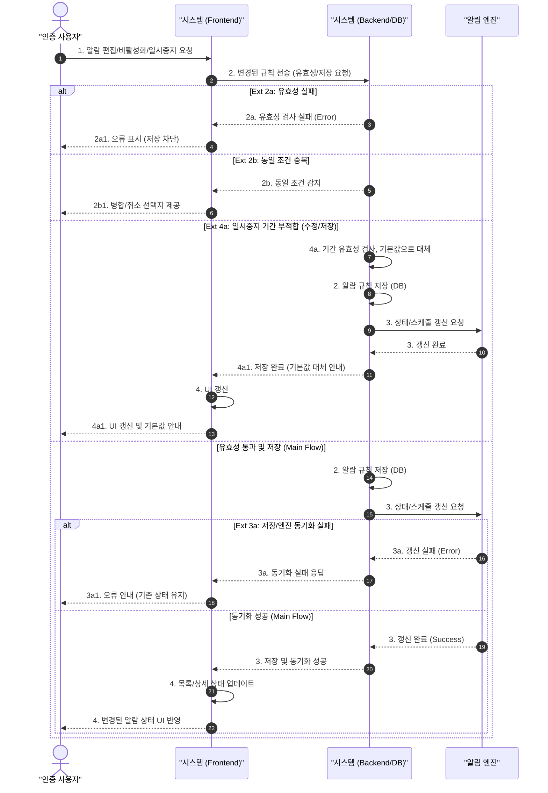
```mermaid
sequenceDiagram
    autonumber
    actor User as "인증 사용자"
    participant FE as "시스템 (Frontend)"
    participant BE as "시스템 (Backend/DB)"
    participant Engine as "알림 엔진"

    User->>FE: 1. 알람 편집/비활성화/일시중지 요청
    FE->>BE: 2. 변경된 규칙 전송 (유효성/저장 요청)

    alt Ext 2a: 유효성 실패
        BE-->>FE: 2a. 유효성 검사 실패 (Error)
        FE-->>User: 2a1. 오류 표시 (저장 차단)

    else Ext 2b: 동일 조건 중복
        BE-->>FE: 2b. 동일 조건 감지
        FE-->>User: 2b1. 병합/취소 선택지 제공
    
    else Ext 4a: 일시중지 기간 부적합 (수정/저장)
        BE->>BE: 4a. 기간 유효성 검사, 기본값으로 대체
        BE->>BE: 2. 알람 규칙 저장 (DB)
        BE->>Engine: 3. 상태/스케줄 갱신 요청
        Engine-->>BE: 3. 갱신 완료
        BE-->>FE: 4a1. 저장 완료 (기본값 대체 안내)
        FE->>FE: 4. UI 갱신
        FE-->>User: 4a1. UI 갱신 및 기본값 안내

    else 유효성 통과 및 저장 (Main Flow)
        BE->>BE: 2. 알람 규칙 저장 (DB)
        BE->>Engine: 3. 상태/스케줄 갱신 요청

        alt Ext 3a: 저장/엔진 동기화 실패
            Engine-->>BE: 3a. 갱신 실패 (Error)
            BE-->>FE: 3a. 동기화 실패 응답
            FE-->>User: 3a1. 오류 안내 (기존 상태 유지)
        else 동기화 성공 (Main Flow)
            Engine-->>BE: 3. 갱신 완료 (Success)
            BE-->>FE: 3. 저장 및 동기화 성공
            FE->>FE: 4. 목록/상세 상태 업데이트
            FE-->>User: 4. 변경된 알람 상태 UI 반영
        end
    end
```

사용자가 알람 편집/비활성화/일시중지 요청을 한다 → 프론트엔드는 백엔드에 변경된 규칙 전송 요청을 보낸다 → (1. 유효성 실패) 백엔드가 유효성 검사 실패 응답을 보내면, 프론트엔드는 사용자에게 오류 메시지를 표시한다. → (2. 동일 조건 중복) 백엔드가 동일 조건 감지 응답을 보내면, 프론트엔드는 사용자에게 병합/취소 선택지를 제공한다. → (3. 일시중지 기간 부적합) 백엔드가 기간 유효성 검사 실패 응답을 보내면, 프론트엔드는 기본값으로 대체하고 저장을 요청한다 → 저장 성공 응답을 보내면, 프론트엔드는 사용자에게 저장 완료 및 UI 갱신 알림을 표시한다.  

### 1.7 알람 수신

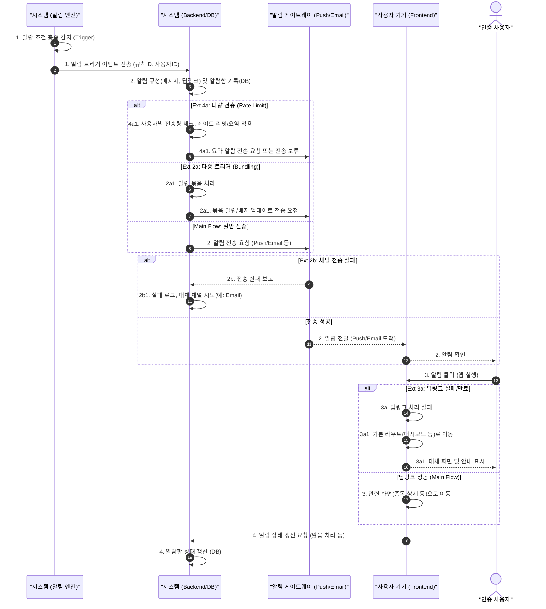
```mermaid
sequenceDiagram
    autonumber
    participant Engine as "시스템 (알림 엔진)"
    participant BE as "시스템 (Backend/DB)"
    participant Gateway as "알림 게이트웨이 (Push/Email)"
    participant FE as "사용자 기기 (Frontend)"
    actor User as "인증 사용자"

    %% --- Trigger & Main Flow (Notification Delivery) ---
    Engine->>Engine: 1. 알람 조건 충족 감지 (Trigger)
    Engine->>BE: 1. 알림 트리거 이벤트 전송 (규칙ID, 사용자ID)
    BE->>BE: 2. 알림 구성(메시지, 딥링크) 및 알람함 기록(DB)

    alt Ext 4a: 다량 전송 (Rate Limit)
        BE->>BE: 4a1. 사용자별 전송량 체크, 레이트 리밋/요약 적용
        BE->>Gateway: 4a1. 요약 알람 전송 요청 또는 전송 보류
    else Ext 2a: 다중 트리거 (Bundling)
        BE->>BE: 2a1. 알림 묶음 처리
        BE->>Gateway: 2a1. 묶음 알림/배지 업데이트 전송 요청
    else Main Flow: 일반 전송
        BE->>Gateway: 2. 알림 전송 요청 (Push/Email 등)
    end

    alt Ext 2b: 채널 전송 실패
        Gateway-->>BE: 2b. 전송 실패 보고
        BE->>BE: 2b1. 실패 로그, 대체 채널 시도(예: Email)
    else 전송 성공
        Gateway-->>FE: 2. 알림 전달 (Push/Email 도착)
        FE-->>User: 2. 알림 확인
    end

    %% --- Main Flow (User Interaction) ---
    User->>FE: 3. 알림 클릭 (앱 실행)
    alt Ext 3a: 딥링크 실패/만료
        FE->>FE: 3a. 딥링크 처리 실패
        FE->>FE: 3a1. 기본 라우트(대시보드 등)로 이동
        FE-->>User: 3a1. 대체 화면 및 안내 표시
    else 딥링크 성공 (Main Flow)
        FE->>FE: 3. 관련 화면(종목 상세 등)으로 이동
    end

    FE->>BE: 4. 알림 상태 갱신 요청 (읽음 처리 등)
    BE->>BE: 4. 알람함 상태 갱신 (DB)

```

사용자가 알람을 클릭하면, 프론트엔드는 백엔드에 알람 상태 갱신 요청을 보낸다 → 백엔드는 알람함 상태를 갱신한다 → 알람 엔진은 알람 조건 충족 감지를 수행한다 → 알람 조건 충족 시 알림 전송을 요청한다 → 알림 전송 성공 시 사용자에게 알림을 표시한다.

### 1.8 가격/이벤트 알람 설정

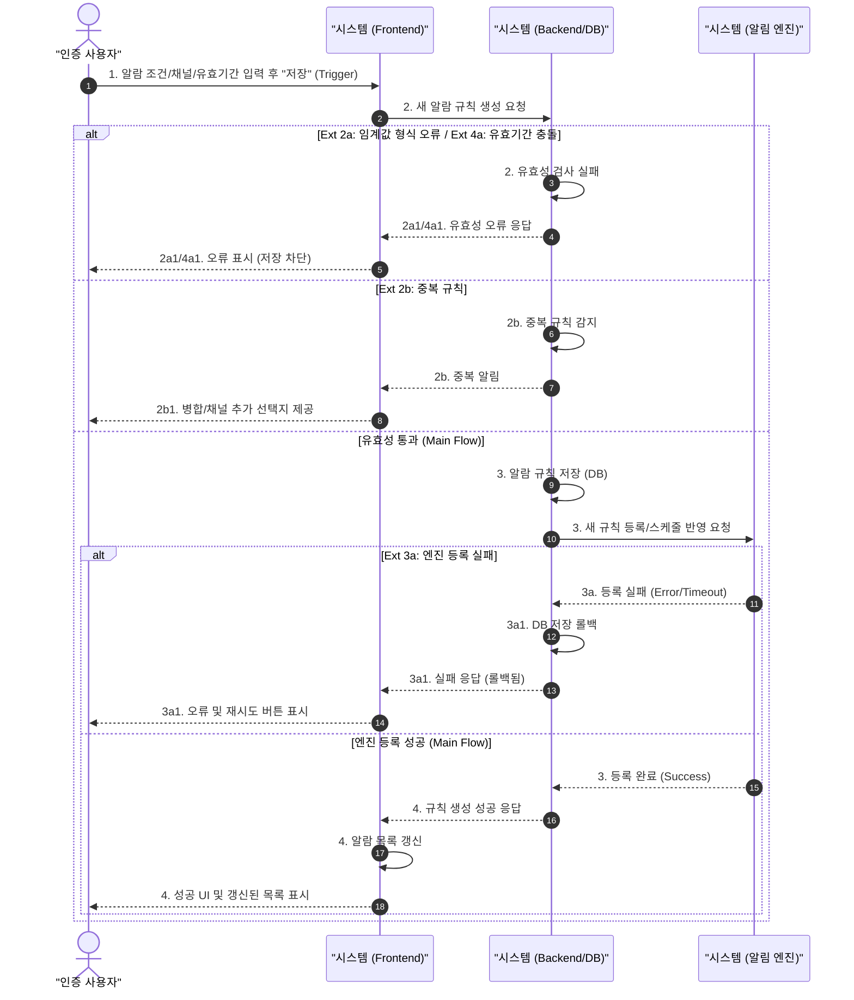
```mermaid
sequenceDiagram
    autonumber
    actor User as "인증 사용자"
    participant FE as "시스템 (Frontend)"
    participant BE as "시스템 (Backend/DB)"
    participant Engine as "시스템 (알림 엔진)"

    User->>FE: 1. 알람 조건/채널/유효기간 입력 후 "저장" (Trigger)
    FE->>BE: 2. 새 알람 규칙 생성 요청

    alt Ext 2a: 임계값 형식 오류 / Ext 4a: 유효기간 충돌
        BE->>BE: 2. 유효성 검사 실패
        BE-->>FE: 2a1/4a1. 유효성 오류 응답
        FE-->>User: 2a1/4a1. 오류 표시 (저장 차단)
    else Ext 2b: 중복 규칙
        BE->>BE: 2b. 중복 규칙 감지
        BE-->>FE: 2b. 중복 알림
        FE-->>User: 2b1. 병합/채널 추가 선택지 제공
    else 유효성 통과 (Main Flow)
        BE->>BE: 3. 알람 규칙 저장 (DB)
        BE->>Engine: 3. 새 규칙 등록/스케줄 반영 요청
        alt Ext 3a: 엔진 등록 실패
            Engine-->>BE: 3a. 등록 실패 (Error/Timeout)
            BE->>BE: 3a1. DB 저장 롤백
            BE-->>FE: 3a1. 실패 응답 (롤백됨)
            FE-->>User: 3a1. 오류 및 재시도 버튼 표시
        else 엔진 등록 성공 (Main Flow)
            Engine-->>BE: 3. 등록 완료 (Success)
            BE-->>FE: 4. 규칙 생성 성공 응답
            FE->>FE: 4. 알람 목록 갱신
            FE-->>User: 4. 성공 UI 및 갱신된 목록 표시
        end
    end
```

사용자가 가격/이벤트 알람 설정을 요청한다 → 프론트엔드는 백엔드에 알람 규칙 생성 요청을 보낸다 → (1. 임계값 형식 오류/유효기간 충돌) 백엔드가 유효성 검사 실패 응답을 보내면, 프론트엔드는 사용자에게 오류 메시지를 표시한다. → (2. 중복 규칙) 백엔드가 중복 규칙 감지 응답을 보내면, 프론트엔드는 사용자에게 병합/취소 선택지를 제공한다. → (3. 유효성 통과) 백엔드가 저장 성공 응답을 보내면, 프론트엔드는 알람 엔진에 규칙 등록/스케줄 반영 요청을 보낸다 → 알람 엔진이 등록 성공 응답을 보내면, 프론트엔드는 알람 목록을 갱신하고 사용자에게 성공 UI 및 갱신된 목록을 표시한다. 

### 1.9 종목 검색

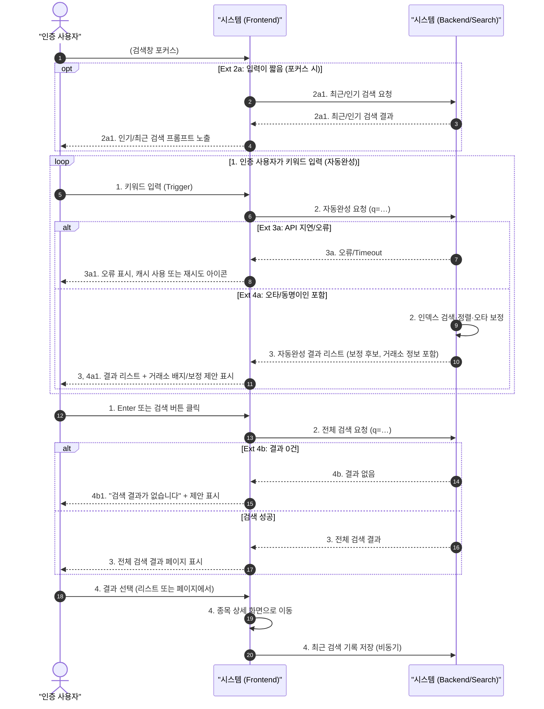
```mermaid
sequenceDiagram
    autonumber
    actor User as "인증 사용자"
    participant FE as "시스템 (Frontend)"
    participant BE as "시스템 (Backend/Search)"

    User->>FE: (검색창 포커스)
    opt Ext 2a: 입력이 짧음 (포커스 시)
        FE->>BE: 2a1. 최근/인기 검색 요청
        BE-->>FE: 2a1. 최근/인기 검색 결과
        FE-->>User: 2a1. 인기/최근 검색 프롬프트 노출
    end

    loop 1. 인증 사용자가 키워드 입력 (자동완성)
        User->>FE: 1. 키워드 입력 (Trigger)
        FE->>BE: 2. 자동완성 요청 (q=…)
        alt Ext 3a: API 지연/오류
            BE-->>FE: 3a. 오류/Timeout
            FE-->>User: 3a1. 오류 표시, 캐시 사용 또는 재시도 아이콘
        else Ext 4a: 오타/동명이인 포함
            BE->>BE: 2. 인덱스 검색·정렬·오타 보정
            BE-->>FE: 3. 자동완성 결과 리스트 (보정 후보, 거래소 정보 포함)
            FE-->>User: 3, 4a1. 결과 리스트 + 거래소 배지/보정 제안 표시
        end
    end

    User->>FE: 1. Enter 또는 검색 버튼 클릭
    FE->>BE: 2. 전체 검색 요청 (q=…)

    alt Ext 4b: 결과 0건
        BE-->>FE: 4b. 결과 없음
        FE-->>User: 4b1. "검색 결과가 없습니다" + 제안 표시
    else 검색 성공
        BE-->>FE: 3. 전체 검색 결과
        FE-->>User: 3. 전체 검색 결과 페이지 표시
    end

    User->>FE: 4. 결과 선택 (리스트 또는 페이지에서)
    FE->>FE: 4. 종목 상세 화면으로 이동
    FE->>BE: 4. 최근 검색 기록 저장 (비동기)
```

사용자가 종목 검색을 요청한다 → 프론트엔드는 백엔드에 자동완성/전체 검색 요청을 보낸다 → (1. 입력이 짧음) 백엔드가 최근/인기 검색 결과를 반환하면, 프론트엔드는 사용자에게 인기/최근 검색 프롬프트를 표시한다. → (2. API 지연/오류) 백엔드가 오류 응답을 보내면, 프론트엔드는 사용자에게 오류 메시지를 표시하고 캐시 사용 또는 재시도 아이콘을 제공한다. → (3. 오타/동명이인 포함) 백엔드가 보정 후보/거래소 정보를 포함한 검색 결과를 반환하면, 프론트엔드는 사용자에게 결과 리스트 + 거래소 배지/보정 제안을 표시한다. → (4. 결과 0건) 백엔드가 결과 없음 응답을 보내면, 프론트엔드는 사용자에게 "검색 결과가 없습니다" + 제안을 표시한다. → (5. 검색 성공) 백엔드가 전체 검색 결과를 반환하면, 프론트엔드는 사용자에게 전체 검색 결과 페이지를 표시한다.

### 1.10 종목 토론 댓글 작성

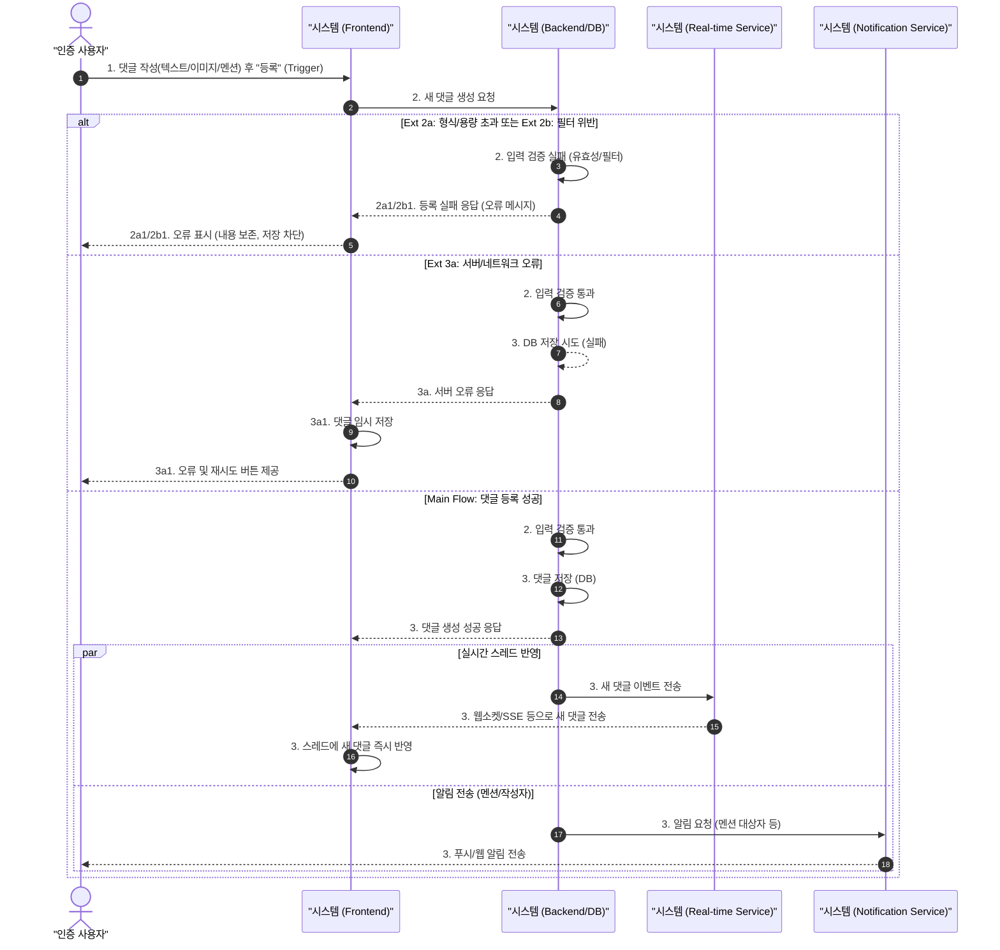
```mermaid
sequenceDiagram
    autonumber
    actor User as "인증 사용자"
    participant FE as "시스템 (Frontend)"
    participant BE as "시스템 (Backend/DB)"
    participant Realtime as "시스템 (Real-time Service)"
    participant Notif as "시스템 (Notification Service)"

    User->>FE: 1. 댓글 작성(텍스트/이미지/멘션) 후 "등록" (Trigger)
    FE->>BE: 2. 새 댓글 생성 요청

    alt Ext 2a: 형식/용량 초과 또는 Ext 2b: 필터 위반
        BE->>BE: 2. 입력 검증 실패 (유효성/필터)
        BE-->>FE: 2a1/2b1. 등록 실패 응답 (오류 메시지)
        FE-->>User: 2a1/2b1. 오류 표시 (내용 보존, 저장 차단)
    else Ext 3a: 서버/네트워크 오류
        BE->>BE: 2. 입력 검증 통과
        BE-->>BE: 3. DB 저장 시도 (실패)
        BE-->>FE: 3a. 서버 오류 응답
        FE->>FE: 3a1. 댓글 임시 저장
        FE-->>User: 3a1. 오류 및 재시도 버튼 제공
    else Main Flow: 댓글 등록 성공
        BE->>BE: 2. 입력 검증 통과
        BE->>BE: 3. 댓글 저장 (DB)
        BE-->>FE: 3. 댓글 생성 성공 응답

        par 실시간 스레드 반영
            BE->>Realtime: 3. 새 댓글 이벤트 전송
            Realtime-->>FE: 3. 웹소켓/SSE 등으로 새 댓글 전송
            FE->>FE: 3. 스레드에 새 댓글 즉시 반영
        and 알림 전송 (멘션/작성자)
            BE->>Notif: 3. 알림 요청 (멘션 대상자 등)
            Notif-->>User: 3. 푸시/웹 알림 전송
        end
    end
```

사용자가 종목 토론 댓글을 작성한다 → 프론트엔드는 백엔드에 새 댓글 생성 요청을 보낸다 → (1. 형식/용량 초과/필터 위반) 백엔드가 입력 검증 실패 응답을 보내면, 프론트엔드는 사용자에게 오류 메시지를 표시하고 내용을 보존한다. → (2. 서버/네트워크 오류) 백엔드가 입력 검증 통과 응답을 보내면, 백엔드는 DB에 댓글 저장을 시도한다 → 저장 실패 시 오류 응답을 보내면, 프론트엔드는 댓글을 임시 저장하고 오류 및 재시도 버튼을 제공한다. → (3. 댓글 등록 성공) 백엔드가 저장 성공 응답을 보내면, 백엔드는 실시간 스레드 반영 및 알림 전송을 요청한다 → 실시간 스레드 반영이 성공 응답을 보내면, 프론트엔드는 스레드에 새 댓글을 즉시 반영한다. → 알림 전송이 성공 응답을 보내면, 사용자에게 푸시/웹 알림을 전송한다.

### 1.11 종목 토론 댓글 조회

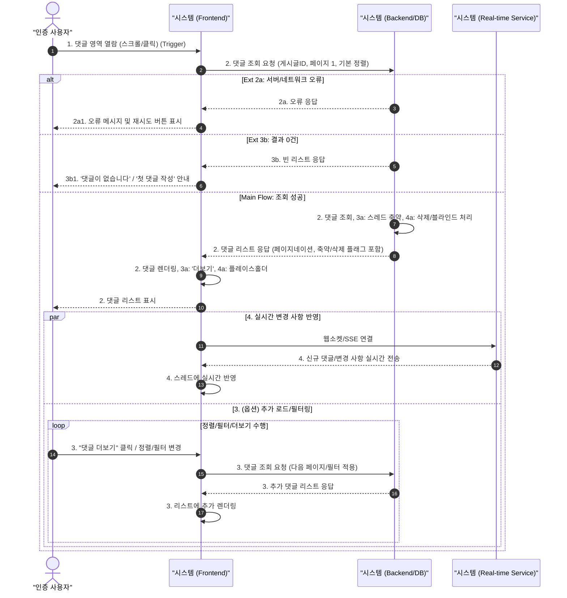
```mermaid
sequenceDiagram
    autonumber
    actor User as "인증 사용자"
    participant FE as "시스템 (Frontend)"
    participant BE as "시스템 (Backend/DB)"
    participant Realtime as "시스템 (Real-time Service)"

    User->>FE: 1. 댓글 영역 열람 (스크롤/클릭) (Trigger)
    FE->>BE: 2. 댓글 조회 요청 (게시글ID, 페이지 1, 기본 정렬)

    alt Ext 2a: 서버/네트워크 오류
        BE-->>FE: 2a. 오류 응답
        FE-->>User: 2a1. 오류 메시지 및 재시도 버튼 표시
    else Ext 3b: 결과 0건
        BE-->>FE: 3b. 빈 리스트 응답
        FE-->>User: 3b1. '댓글이 없습니다' / '첫 댓글 작성' 안내
    else Main Flow: 조회 성공
        BE->>BE: 2. 댓글 조회, 3a: 스레드 축약, 4a: 삭제/블라인드 처리
        BE-->>FE: 2. 댓글 리스트 응답 (페이지네이션, 축약/삭제 플래그 포함)
        FE->>FE: 2. 댓글 렌더링, 3a: '더보기', 4a: 플레이스홀더
        FE-->>User: 2. 댓글 리스트 표시

        %% 페이지 진입 후 실시간 반영 및 추가 로드 (병렬)
        par 4. 실시간 변경 사항 반영
            FE->>Realtime: 웹소켓/SSE 연결
            Realtime-->>FE: 4. 신규 댓글/변경 사항 실시간 전송
            FE->>FE: 4. 스레드에 실시간 반영
        and 3. (옵션) 추가 로드/필터링
            loop 정렬/필터/더보기 수행
                User->>FE: 3. "댓글 더보기" 클릭 / 정렬/필터 변경
                FE->>BE: 3. 댓글 조회 요청 (다음 페이지/필터 적용)
                BE-->>FE: 3. 추가 댓글 리스트 응답
                FE->>FE: 3. 리스트에 추가 렌더링
            end
        end
    end
```

사용자가 종목 토론 댓글 영역을 열람한다 → 프론트엔드는 백엔드에 댓글 조회 요청을 보낸다 → (1. 서버/네트워크 오류) 백엔드가 오류 응답을 보내면, 프론트엔드는 사용자에게 오류 메시지 및 재시도 버튼을 표시한다. → (2. 결과 0건) 백엔드가 빈 리스트 응답을 보내면, 프론트엔드는 사용자에게 "댓글이 없습니다" / "첫 댓글 작성" 안내를 표시한다. → (3. 조회 성공) 백엔드가 댓글 리스트 응답을 보내면, 프론트엔드는 댓글 리스트를 표시한다 → (4. 실시간 변경 사항 반영) 프론트엔드는 웹소켓/SSE 연결을 요청하고 신규 댓글/변경 사항을 실시간 전송한다 → 실시간 반영이 성공 응답을 보내면, 프론트엔드는 스레드에 실시간 반영한다. → (5. 추가 로드/필터링) 사용자가 정렬/필터/더보기를 수행하면, 프론트엔드는 추가 댓글 리스트를 조회하고 리스트에 추가 렌더링한다.

### 1.12 카테고리 관리

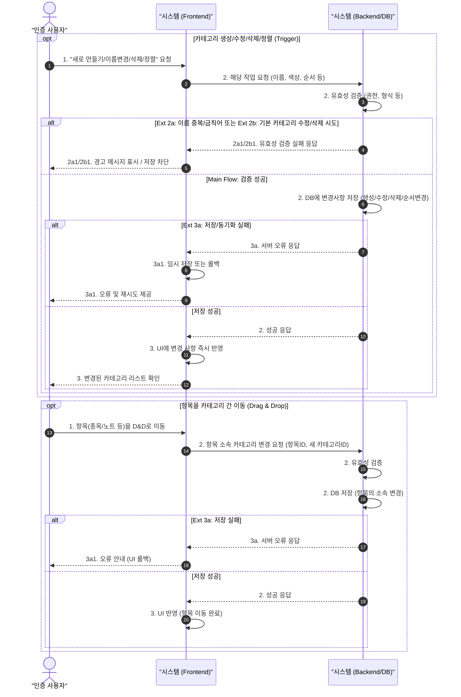
```mermaid
sequenceDiagram
    autonumber
    actor User as "인증 사용자"
    participant FE as "시스템 (Frontend)"
    participant BE as "시스템 (Backend/DB)"

    %% --- 섹션 1: 카테고리 CRUD ---
    opt 카테고리 생성/수정/삭제/정렬 (Trigger)
        User->>FE: 1. "새로 만들기/이름변경/삭제/정렬" 요청
        FE->>BE: 2. 해당 작업 요청 (이름, 색상, 순서 등)
        BE->>BE: 2. 유효성 검증 (권한, 형식 등)

        alt Ext 2a: 이름 중복/금칙어 또는 Ext 2b: 기본 카테고리 수정/삭제 시도
            BE-->>FE: 2a1/2b1. 유효성 검증 실패 응답
            FE-->>User: 2a1/2b1. 경고 메시지 표시 / 저장 차단
        else Main Flow: 검증 성공
            BE->>BE: 2. DB에 변경사항 저장 (생성/수정/삭제/순서변경)
            alt Ext 3a: 저장/동기화 실패
                BE-->>FE: 3a. 서버 오류 응답
                FE->>FE: 3a1. 임시 저장 또는 롤백
                FE-->>User: 3a1. 오류 및 재시도 제공
            else 저장 성공
                BE-->>FE: 2. 성공 응답
                FE->>FE: 3. UI에 변경 사항 즉시 반영
                FE-->>User: 3. 변경된 카테고리 리스트 확인
            end
        end
    end

    %% --- 섹션 2: 항목 Drag & Drop 이동 ---
    opt 항목을 카테고리 간 이동 (Drag & Drop)
        User->>FE: 1. 항목(종목/노트 등)을 D&D로 이동
        FE->>BE: 2. 항목 소속 카테고리 변경 요청 (항목ID, 새 카테고리ID)
        BE->>BE: 2. 유효성 검증
        BE->>BE: 2. DB 저장 (항목의 소속 변경)
        alt Ext 3a: 저장 실패
            BE-->>FE: 3a. 서버 오류 응답
            FE-->>User: 3a1. 오류 안내 (UI 롤백)
        else 저장 성공
            BE-->>FE: 2. 성공 응답
            FE->>FE: 3. UI 반영 (항목 이동 완료)
        end
    end
```

사용자가 카테고리를 생성/수정/삭제/정렬한다 → 프론트엔드는 백엔드에 해당 작업 요청을 보낸다 → (1. 이름 중복/금칙어 또는 기본 카테고리 수정/삭제 시도) 백엔드가 유효성 검증 실패 응답을 보내면, 프론트엔드는 사용자에게 경고 메시지를 표시하고 저장을 차단한다. → (2. 검증 성공) 백엔드가 유효성 검증 통과 응답을 보내면, 백엔드는 DB에 변경사항을 저장한다 → 저장 실패 시 오류 응답을 보내면, 프론트엔드는 임시 저장 또는 롤백하고 오류 및 재시도 제공한다. → (3. 저장 성공) 백엔드가 저장 성공 응답을 보내면, 백엔드는 UI에 변경 사항을 즉시 반영하고 사용자에게 변경된 카테고리 리스트를 표시한다.

## 2 채팅 메시지 저장과 채팅방 삭제

### 2.1 채팅 메시지 저장
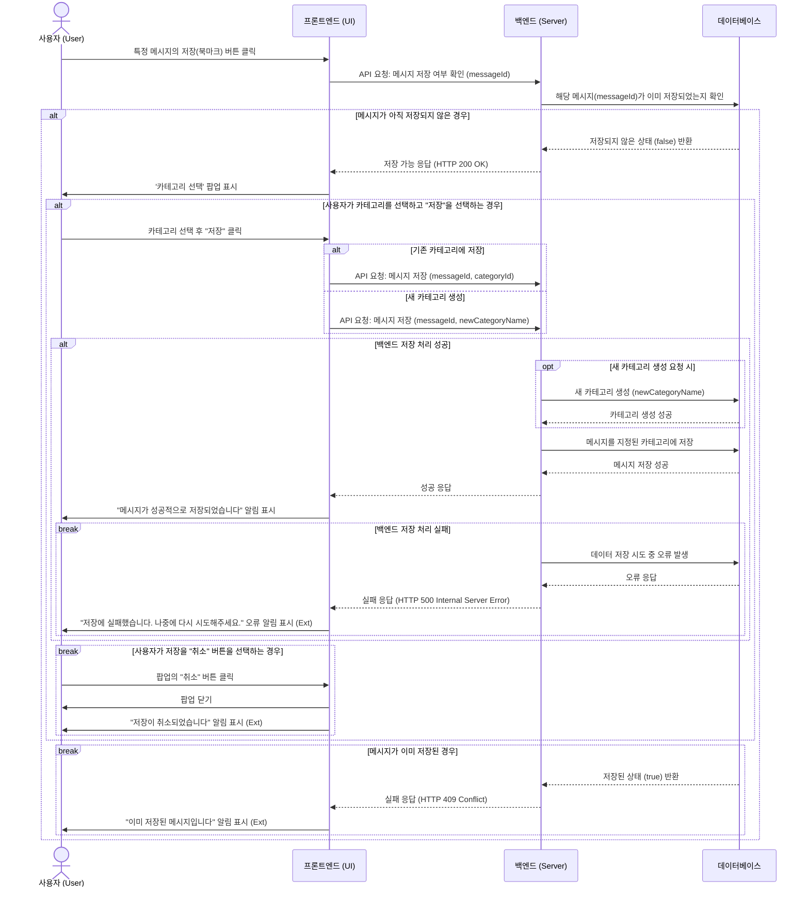
```mermaid
sequenceDiagram
    actor 사용자 as 사용자 (User)
    participant Frontend as 프론트엔드 (UI)
    participant Backend as 백엔드 (Server)
    participant DB as 데이터베이스
    사용자 ->> Frontend: 특정 메시지의 저장(북마크) 버튼 클릭
    Frontend ->> Backend: API 요청: 메시지 저장 여부 확인 (messageId)
    Backend ->> DB: 해당 메시지(messageId)가 이미 저장되었는지 확인
    alt 메시지가 아직 저장되지 않은 경우
        DB -->> Backend: 저장되지 않은 상태 (false) 반환
        Backend -->> Frontend: 저장 가능 응답 (HTTP 200 OK)
        Frontend ->> 사용자: '카테고리 선택' 팝업 표시
        alt 사용자가 카테고리를 선택하고 "저장"을 선택하는 경우
            사용자 ->> Frontend: 카테고리 선택 후 "저장" 클릭
            alt 기존 카테고리에 저장
                Frontend ->> Backend: API 요청: 메시지 저장 (messageId, categoryId)
            else 새 카테고리 생성
                Frontend ->> Backend: API 요청: 메시지 저장 (messageId, newCategoryName)
            end
            alt 백엔드 저장 처리 성공
                opt 새 카테고리 생성 요청 시
                    Backend ->> DB: 새 카테고리 생성 (newCategoryName)
                    DB -->> Backend: 카테고리 생성 성공
                end
                Backend ->> DB: 메시지를 지정된 카테고리에 저장
                DB -->> Backend: 메시지 저장 성공
                Backend -->> Frontend: 성공 응답
                Frontend ->> 사용자: "메시지가 성공적으로 저장되었습니다" 알림 표시
            break 백엔드 저장 처리 실패
                Backend ->> DB: 데이터 저장 시도 중 오류 발생
                DB -->> Backend: 오류 응답
                Backend -->> Frontend: 실패 응답 (HTTP 500 Internal Server Error)
                Frontend ->> 사용자: "저장에 실패했습니다. 나중에 다시 시도해주세요." 오류 알림 표시 (Ext)
                end
            end
        break 사용자가 저장을 "취소" 버튼을 선택하는 경우
            사용자 ->> Frontend: 팝업의 "취소" 버튼 클릭
            Frontend ->> 사용자: 팝업 닫기
            Frontend ->> 사용자: "저장이 취소되었습니다" 알림 표시 (Ext)
            end
        end
    break 메시지가 이미 저장된 경우
        DB -->> Backend: 저장된 상태 (true) 반환
        Backend -->> Frontend: 실패 응답 (HTTP 409 Conflict)
        Frontend ->> 사용자: "이미 저장된 메시지입니다" 알림 표시 (Ext)
        end
    end
```

사용자가 특정 메시지의 저장(북마크) 버튼을 클릭한다. → 프론트엔드는 백엔드에 해당 메시지가 이미 저장되었는지 확인을 요청한다. → (1. 이미 저장된 경우) 백엔드가 '저장된 상태(true)'를 반환하면, "이미 저장된 메시지입니다" 알림이 표시된다. → (2. 저장이 가능한 경우) 백엔드가 '저장되지 않은 상태(false)'를 반환하면, 사용자에게 '카테고리 선택' 팝업이 표시된다.  
→(저장 선택) 사용자가 카테고리(기존 또는 신규)를 선택하고 "저장"을 클릭하면, 백엔드에 저장을 요청한다. → (1. 저장 성공) 백엔드가 DB에 성공적으로 저장하면, "메시지가 성공적으로 저장되었습니다" 알림이 표시된다. → (2. 저장 실패) DB 저장 중 오류가 발생하면, "저장에 실패했습니다" 오류 알림이 표시된다.  
→(취소 선택) 사용자가 팝업에서 "취소" 버튼을 클릭하면, 팝업이 닫히고 "저장이 취소되었습니다" 알림이 표시된다.

### 2.2 채팅방 삭제
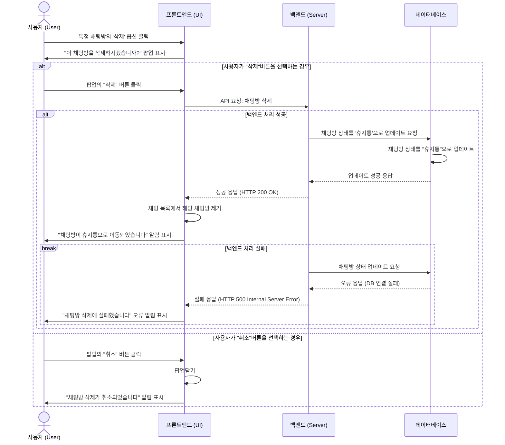
```mermaid
sequenceDiagram
  actor 사용자 as 사용자 (User)
  participant Frontend as 프론트엔드 (UI)
  participant Backend as 백엔드 (Server)
  participant DB as 데이터베이스
  사용자 ->> Frontend: 특정 채팅방의 '삭제' 옵션 클릭
  Frontend ->> 사용자: "이 채팅방을 삭제하시겠습니까?" 팝업 표시
  alt 사용자가 "삭제"버튼을 선택하는 경우
    사용자 ->> Frontend: 팝업의 "삭제" 버튼 클릭
    Frontend ->> Backend: API 요청: 채팅방 삭제
    alt 백엔드 처리 성공
      Backend ->> DB: 채팅방 상태를 '휴지통'으로 업데이트 요청
      DB ->> DB: 채팅방 상태를 "휴지통"으로 업데이트
      DB -->> Backend: 업데이트 성공 응답
      Backend -->> Frontend: 성공 응답 (HTTP 200 OK)
      Frontend ->> Frontend: 채팅 목록에서 해당 채팅방 제거
      Frontend ->> 사용자: "채팅방이 휴지통으로 이동되었습니다" 알림 표시
    break 백엔드 처리 실패
      Backend ->> DB: 채팅방 상태 업데이트 요청
      DB -->> Backend: 오류 응답 (DB 연결 실패)
      Backend -->> Frontend: 실패 응답 (HTTP 500 Internal Server Error)
      Frontend ->> 사용자: "채팅방 삭제에 실패했습니다" 오류 알림 표시
      end
    end
  else 사용자가 "취소"버튼을 선택하는 경우
    사용자 ->> Frontend: 팝업의 "취소" 버튼 클릭
    Frontend ->> Frontend: 팝업닫기
    Frontend ->> 사용자: "채팅방 삭제가 취소되었습니다" 알림 표시
  end
```

사용자가 특정 채팅방의 '삭제' 옵션을 클릭한다. → 프론트엔드가 "이 채팅방을 삭제하시겠습니까?" 팝업을 표시한다.  
→ (삭제 선택) 사용자가 팝업의 "삭제" 버튼을 클릭하면, 프론트엔드는 백엔드에 채팅방 삭제를 요청한다. → (1. 삭제 성공) 백엔드가 DB 상태를 '휴지통'으로 성공적으로 업데이트하면, 프론트엔드는 목록에서 채팅방을 제거하고 "채팅방이 휴지통으로 이동되었습니다" 알림을 표시한다. → (2. 삭제 실패) DB 오류 등으로 백엔드 처리가 실패하면, "채팅방 삭제에 실패했습니다" 오류 알림이 표시된다.  
→ (취소 선택) 사용자가 팝업의 "취소" 버튼을 클릭하면, 팝업이 닫히고 "채팅방 삭제가 취소되었습니다" 알림이 표시된다.

### 2.3 채팅기록 조회

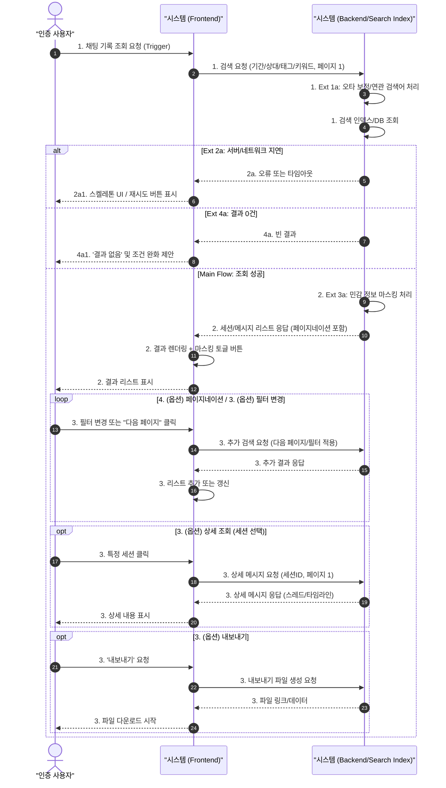
```mermaid
sequenceDiagram
    autonumber
    actor User as "인증 사용자"
    participant FE as "시스템 (Frontend)"
    participant BE as "시스템 (Backend/Search Index)"

    User->>FE: 1. 채팅 기록 조회 요청 (Trigger)
    FE->>BE: 1. 검색 요청 (기간/상대/태그/키워드, 페이지 1)
    
    BE->>BE: 1. Ext 1a: 오타 보정/연관 검색어 처리
    BE->>BE: 1. 검색 인덱스/DB 조회

    alt Ext 2a: 서버/네트워크 지연
        BE-->>FE: 2a. 오류 또는 타임아웃
        FE-->>User: 2a1. 스켈레톤 UI / 재시도 버튼 표시
    else Ext 4a: 결과 0건
        BE-->>FE: 4a. 빈 결과
        FE-->>User: 4a1. '결과 없음' 및 조건 완화 제안
    else Main Flow: 조회 성공
        BE->>BE: 2. Ext 3a: 민감 정보 마스킹 처리
        BE-->>FE: 2. 세션/메시지 리스트 응답 (페이지네이션 포함)
        FE->>FE: 2. 결과 렌더링 + 마스킹 토글 버튼
        FE-->>User: 2. 결과 리스트 표시

        loop 4. (옵션) 페이지네이션 / 3. (옵션) 필터 변경
            User->>FE: 3. 필터 변경 또는 "다음 페이지" 클릭
            FE->>BE: 3. 추가 검색 요청 (다음 페이지/필터 적용)
            BE-->>FE: 3. 추가 결과 응답
            FE->>FE: 3. 리스트 추가 또는 갱신
        end

        opt 3. (옵션) 상세 조회 (세션 선택)
            User->>FE: 3. 특정 세션 클릭
            FE->>BE: 3. 상세 메시지 요청 (세션ID, 페이지 1)
            BE-->>FE: 3. 상세 메시지 응답 (스레드/타임라인)
            FE-->>User: 3. 상세 내용 표시
        end
        
        opt 3. (옵션) 내보내기
            User->>FE: 3. '내보내기' 요청
            FE->>BE: 3. 내보내기 파일 생성 요청
            BE-->>FE: 3. 파일 링크/데이터
            FE-->>User: 3. 파일 다운로드 시작
        end
    end
```

사용자가 채팅 기록을 조회한다 → 프론트엔드는 백엔드에 채팅 기록 조회 요청을 보낸다 → (1. 서버/네트워크 지연) 백엔드가 오류 또는 타임아웃 응답을 보내면, 프론트엔드는 스켈레톤 UI 또는 재시도 버튼을 표시한다. → (2. 결과 0건) 백엔드가 빈 결과 응답을 보내면, 프론트엔드는 '결과 없음' 및 조건 완화 제안을 안내한다. → (3. 조회 성공) 백엔드가 세션/메시지 리스트 응답을 보내면, 프론트엔드는 결과를 렌더링하고 마스킹 토글 버튼을 제공한다.  

## 3. 검색 기록

### 3.1 검색 기록 조회
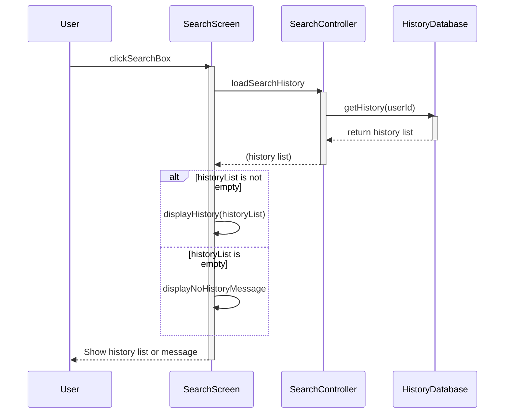
```mermaid
sequenceDiagram
participant User
participant SearchScreen
participant SearchController
participant HistoryDatabase

User->>SearchScreen: clickSearchBox
activate SearchScreen
SearchScreen->>SearchController: loadSearchHistory
activate SearchController
SearchController->>HistoryDatabase: getHistory(userId)
activate HistoryDatabase
HistoryDatabase-->>SearchController: return history list
deactivate HistoryDatabase
SearchController-->>SearchScreen: (history list)
deactivate SearchController
alt historyList is not empty
SearchScreen->>SearchScreen: displayHistory(historyList)
else historyList is empty
SearchScreen->>SearchScreen: displayNoHistoryMessage
end
SearchScreen-->>User: Show history list or message
deactivate SearchScreen
```

사용자가 검색창을 누르면, 검색 화면이 컨트롤러에 기록 조회를 요청 → 컨트롤러는 데이터베이스에서 기록을 조회 → 데이터베이스에서 기록 목록을 반환받으면 → 화면에 기록 목록 또는 "기록 없음" 메시지를 표시한다.

### 3.2 검색 기록 삭제
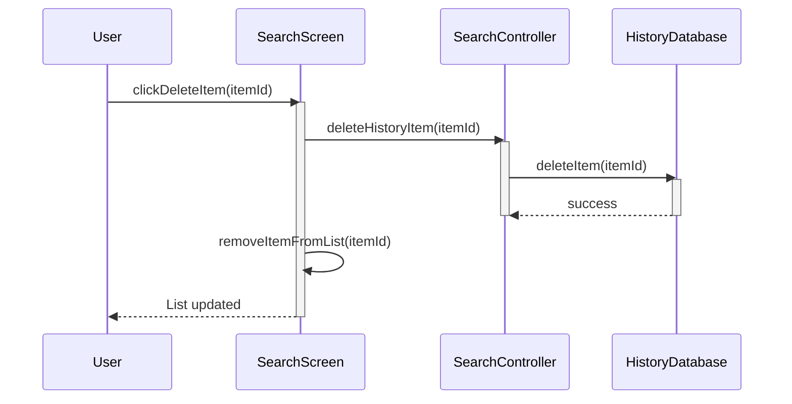
```mermaid
sequenceDiagram
participant User
participant SearchScreen
participant SearchController
participant HistoryDatabase

User->>SearchScreen: clickDeleteItem(itemId)
activate SearchScreen
SearchScreen->>SearchController: deleteHistoryItem(itemId)
activate SearchController
SearchController->>HistoryDatabase: deleteItem(itemId)
activate HistoryDatabase
HistoryDatabase-->>SearchController: success
deactivate HistoryDatabase
deactivate SearchController
SearchScreen->>SearchScreen: removeItemFromList(itemId)
SearchScreen-->>User: List updated
deactivate SearchScreen
```

사용자가 특정 기록의 삭제를 누르면, 검색 화면이 컨트롤러에 삭제를 요청하고 → 컨트롤러는 데이터베이스에서 해당 항목을 삭제한다 → 데이터베이스로부터 성공 응답이 오면 → 화면에서 해당 항목을 제거하여 목록을 갱신한다.

## 4 채팅

### 4.1 채팅 및 질의 응답
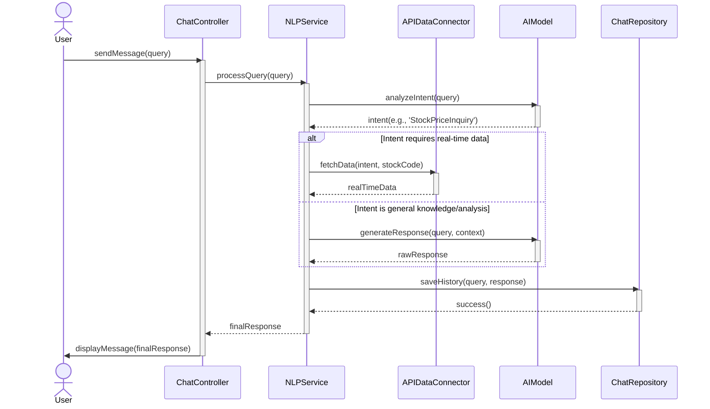
```mermaid
sequenceDiagram
    actor User
    participant ChatController
    participant NLPService
    participant APIDataConnector
    participant AIModel
    participant ChatRepository
    
    User->>ChatController: sendMessage(query)
    activate ChatController
    
    ChatController->>NLPService: processQuery(query)
    activate NLPService
    NLPService->>AIModel: analyzeIntent(query)
    activate AIModel
    AIModel-->>NLPService: intent(e.g., 'StockPriceInquiry')
    deactivate AIModel
    
    alt Intent requires real-time data
        NLPService->>APIDataConnector: fetchData(intent, stockCode)
        activate APIDataConnector
        APIDataConnector-->>NLPService: realTimeData
        deactivate APIDataConnector
    else Intent is general knowledge/analysis
        NLPService->>AIModel: generateResponse(query, context)
        activate AIModel
        AIModel-->>NLPService: rawResponse
        deactivate AIModel
    end
    
    NLPService->>ChatRepository: saveHistory(query, response)
    activate ChatRepository
    ChatRepository-->>NLPService: success()
    deactivate ChatRepository
    
    NLPService-->>ChatController: finalResponse
    deactivate NLPService
    
    ChatController->>User: displayMessage(finalResponse)
    deactivate ChatController
```
### 4.2 도움말, 사용 가이드
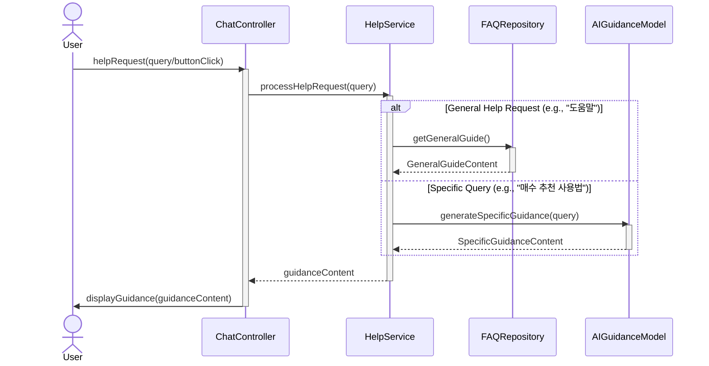
```mermaid
sequenceDiagram
    actor User
    participant ChatController
    participant HelpService
    participant FAQRepository
    participant AIGuidanceModel
    
    User->>ChatController: helpRequest(query/buttonClick)
    activate ChatController
    
    ChatController->>HelpService: processHelpRequest(query)
    activate HelpService
    
    alt General Help Request (e.g., "도움말")
        HelpService->>FAQRepository: getGeneralGuide()
        activate FAQRepository
        FAQRepository-->>HelpService: GeneralGuideContent
        deactivate FAQRepository
    else Specific Query (e.g., "매수 추천 사용법")
        HelpService->>AIGuidanceModel: generateSpecificGuidance(query)
        activate AIGuidanceModel
        AIGuidanceModel-->>HelpService: SpecificGuidanceContent
        deactivate AIGuidanceModel
    end
    
    HelpService-->>ChatController: guidanceContent
    deactivate HelpService
    
    ChatController->>User: displayGuidance(guidanceContent)
    deactivate ChatController
```
### 4.3 채팅 공유
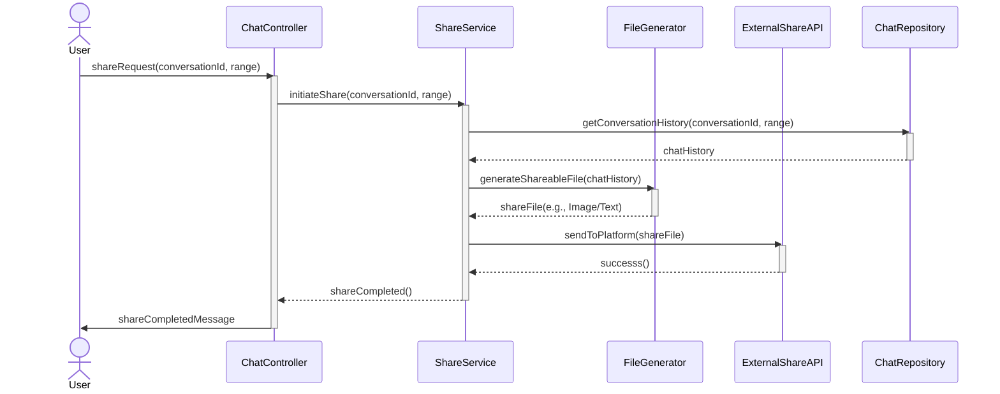
```mermaid
sequenceDiagram
    actor User
    participant ChatController
    participant ShareService
    participant FileGenerator
    participant ExternalShareAPI
    participant ChatRepository
    
    User->>ChatController: shareRequest(conversationId, range)
    activate ChatController
    
    ChatController->>ShareService: initiateShare(conversationId, range)
    activate ShareService
    
    ShareService->>ChatRepository: getConversationHistory(conversationId, range)
    activate ChatRepository
    ChatRepository-->>ShareService: chatHistory
    deactivate ChatRepository
    
    ShareService->>FileGenerator: generateShareableFile(chatHistory)
    activate FileGenerator
    FileGenerator-->>ShareService: shareFile(e.g., Image/Text)
    deactivate FileGenerator
    
    ShareService->>ExternalShareAPI: sendToPlatform(shareFile)
    activate ExternalShareAPI
    ExternalShareAPI-->>ShareService: successs()
    deactivate ExternalShareAPI
    
    ShareService-->>ChatController: shareCompleted()
    deactivate ShareService
    
    ChatController->>User: shareCompletedMessage
    deactivate ChatController 

```

## 5 계정관리

### 5.1 로그인
```mermaid
sequenceDiagram
    actor 사용자 as 사용자 (User)
    participant Frontend as 프론트엔드 (UI)
    participant Backend as 백엔드 (Server)
    participant DB as 데이터베이스

    사용자 ->> Frontend: 아이디, 비밀번호 입력 후 '로그인' 버튼 클릭
    Frontend ->> Backend: API 요청: 로그인 (credentials)
    Backend ->> DB: 사용자 정보 확인 (userId, hashedPassword)

    alt 인증 성공
        DB -->> Backend: 사용자 정보 반환
        Backend ->> Backend: 세션(토큰) 생성
        Backend -->> Frontend: 성공 응답 (200 OK, token)
        Frontend ->> Frontend: 세션(토큰) 저장 및 메인 화면으로 전환
        Frontend -->> 사용자: 메인 화면 표시
    else 인증 실패
        DB -->> Backend: 사용자 정보 없음 (null)
        Backend -->> Frontend: 실패 응답 (401 Unauthorized)
        Frontend -->> 사용자: "아이디 또는 비밀번호가 올바르지 않습니다" 알림 표시
    end
```

사용자가 아이디와 비밀번호를 입력하고 로그인 버튼을 클릭한다 → 프론트엔드는 백엔드로 로그인 API를 요청한다 → 백엔드는 데이터베이스에서 사용자 정보를 검증한다 → (1. 인증 성공) 백엔드는 세션(토큰)을 생성하여 프론트엔드에 전달하고, 프론트엔드는 사용자를 메인 화면으로 이동시킨다 → (2. 인증 실패) 백엔드가 실패 응답을 보내면, 프론트엔드는 사용자에게 오류 알림을 표시한다.

### 5.2 회원가입

```mermaid
sequenceDiagram
    actor 사용자 as 사용자 (User)
    participant Frontend as 프론트엔드 (UI)
    participant Backend as 백엔드 (Server)
    participant DB as 데이터베이스

    사용자 ->> Frontend: 회원가입 정보 입력 후 '가입하기' 버튼 클릭
    Frontend ->> Backend: API 요청: 회원가입 (userData)
    Backend ->> DB: 아이디(또는 이메일) 중복 확인

    alt 아이디 사용 가능
        DB -->> Backend: 중복 없음
        Backend ->> Backend: 비밀번호 암호화
        Backend ->> DB: 신규 사용자 정보 저장
        DB -->> Backend: 저장 성공
        Backend -->> Frontend: 성공 응답 (201 Created)
        Frontend ->> Frontend: 로그인 화면으로 전환
        Frontend -->> 사용자: "회원가입이 완료되었습니다" 알림 표시
    else 아이디 중복
        DB -->> Backend: 중복된 아이디 존재
        Backend -->> Frontend: 실패 응답 (409 Conflict)
        Frontend -->> 사용자: "이미 사용 중인 아이디입니다" 알림 표시
    end
```

사용자가 회원가입 양식에 정보를 모두 입력하고 '가입하기' 버튼을 클릭한다 → 프론트엔드는 백엔드로 회원가입 API를 요청한다 → 백엔드는 먼저 데이터베이스에서 아이디 중복 여부를 확인한다 → (1. 가입 가능) 중복된 아이디가 없으면, 비밀번호를 암호화하여 DB에 저장하고 성공 응답을 보낸다. 프론트엔드는 로그인 화면으로 전환하며 성공 알림을 표시한다 → (2. 가입 불가) 이미 사용 중인 아이디일 경우, 백엔드가 실패 응답을 보내고 프론트엔드는 사용자에게 중복 알림을 표시한다.

### 5.3 로그아웃

```mermaid
sequenceDiagram
    actor 사용자 as 사용자 (User)
    participant Frontend as 프론트엔드 (UI)
    participant Backend as 백엔드 (Server)

    사용자 ->> Frontend: '로그아웃' 버튼 클릭
    Frontend ->> Backend: API 요청: 로그아웃
    
    alt 로그아웃 성공
        Backend -->> Frontend: 성공 응답 (200 OK)
        Frontend ->> Frontend: 로컬 저장소의 세션(토큰) 삭제
        Frontend ->> Frontend: 로그인 화면으로 전환
        Frontend -->> 사용자: 로그인 화면 표시
    else 로그아웃 실패
        Backend -->> Frontend: 실패 응답 (500 Internal Server Error)
        Frontend -->> 사용자: "로그아웃에 실패했습니다" 오류 알림 표시
    end
```
로그인된 사용자가 '로그아웃' 버튼을 클릭한다 → 프론트엔드는 백엔드에 로그아웃 API를 요청한다 → (1. 성공 시) 백엔드가 세션을 무효화하고 성공 응답을 보내면, 프론트엔드는 로컬에 저장된 사용자 인증 정보를 삭제하고 로그인 화면으로 이동한다 → (2. 실패 시) 서버 오류 등으로 실패 응답을 받으면, 사용자에게 오류 알림을 표시한다.

### 5.4 프로필 수정

```mermaid
sequenceDiagram
    actor 사용자 as 사용자 (User)
    participant Frontend as 프론트엔드 (UI)
    participant Backend as 백엔드 (Server)
    participant DB as 데이터베이스
    
    사용자 ->> Frontend: 프로필 정보(닉네임 등) 변경 후 '저장' 버튼 클릭
    Frontend ->> Backend: API 요청: 프로필 업데이트 (updatedData)

    alt 업데이트 성공
        Backend ->> DB: 사용자 정보 업데이트
        DB -->> Backend: 업데이트 성공
        Backend -->> Frontend: 성공 응답 (200 OK)
        Frontend ->> Frontend: UI에 변경된 정보 반영
        Frontend -->> 사용자: "프로필 정보가 성공적으로 변경되었습니다" 알림 표시
    else 업데이트 실패
        Backend -->> Frontend: 실패 응답 (500 Internal Server Error)
        Frontend -->> 사용자: "정보 수정에 실패했습니다" 오류 알림 표시
    end
```

사용자가 마이페이지 등에서 자신의 프로필 정보를 수정한 후 '저장' 버튼을 클릭한다 → 프론트엔드는 변경된 정보를 백엔드에 업데이트 요청한다 → (1. 성공 시) 백엔드가 데이터베이스의 사용자 정보를 성공적으로 업데이트하면, 프론트엔드는 화면을 갱신하고 사용자에게 성공 알림을 표시한다 → (2. 실패 시) 데이터베이스 오류 등으로 실패하면, 사용자에게 오류 알림을 표시한다.

### 5.5 비밀번호 변경

```mermaid
sequenceDiagram
    actor 사용자 as 사용자 (User)
    participant Frontend as 프론트엔드 (UI)
    participant Backend as 백엔드 (Server)
    participant DB as 데이터베이스

    사용자 ->> Frontend: 현재 비밀번호, 새 비밀번호 입력 후 '변경' 버튼 클릭
    Frontend ->> Backend: API 요청: 비밀번호 변경 (passwordData)
    Backend ->> DB: 현재 비밀번호 일치 여부 확인

    alt 현재 비밀번호 일치
        DB -->> Backend: 비밀번호 일치
        Backend ->> Backend: 새 비밀번호 암호화
        Backend ->> DB: 새 비밀번호로 업데이트
        DB -->> Backend: 업데이트 성공
        Backend -->> Frontend: 성공 응답 (200 OK)
        Frontend -->> 사용자: "비밀번호가 성공적으로 변경되었습니다" 알림 표시
    else 현재 비밀번호 불일치
        DB -->> Backend: 비밀번호 불일치
        Backend -->> Frontend: 실패 응답 (400 Bad Request)
        Frontend -->> 사용자: "현재 비밀번호가 일치하지 않습니다" 오류 알림 표시
    end
```

사용자가 현재 비밀번호와 새로 사용할 비밀번호를 입력하고 '변경' 버튼을 클릭한다 → 프론트엔드는 백엔드에 비밀번호 변경을 요청한다 → 백엔드는 먼저 데이터베이스에서 사용자가 입력한 현재 비밀번호가 올바른지 검증한다 → (1. 일치 시) 현재 비밀번호가 맞으면 새 비밀번호를 암호화하여 DB에 업데이트하고, 프론트엔드는 사용자에게 성공 알림을 표시한다 → (2. 불일치 시) 현재 비밀번호가 틀리면 백엔드가 실패 응답을 보내고, 프론트엔드는 사용자에게 오류 알림을 표시한다

위 형식에 맞춰서 아래에 시퀀스 다이아그램을 작성해주세요.

## 6. 종목 분석

### 6.1 뉴스/공시 요약 및 감성 분석

```mermaid
sequenceDiagram
    participant User as 인증 사용자
    participant System as 시스템
    participant ExternalSources as 외부 소스

    %% === 1. Main Flow: 최초 조회 ===
    User->>System: "조회" 실행 (키워드/필터 포함)
    activate System

    alt 2a. 외부 API 실패/지연
        System->>ExternalSources: 1. 뉴스/공시 수집 요청
        activate ExternalSources
        ExternalSources-->>System: [2a] API 실패/타임아웃
        deactivate ExternalSources
        System-->>User: [2a1] 부분 결과 표시 / 재시도 버튼 제공
    else 2. 외부 API 정상 호출
        System->>ExternalSources: 1. 뉴스/공시 수집 요청
        activate ExternalSources
        ExternalSources-->>System: 2. 데이터 반환
        deactivate ExternalSources

        loop 3. 내부 처리 (정규화, 중복 제거)
            System->>System: 표준 스키마 정규화
            opt 3a. 정규화 실패/다국어
                System->>System: [3a1] 원문 카드로 대체 (요약/감성 숨김)
            end
            System->>System: 중복/유사 문서 정리
        end

        System->>System: 4. 필터 및 정렬 적용

        alt 4a. 결과 0건
            System-->>User: [4a1] "관련 소식이 없습니다" (필터 완화 제안)
        else 5. Success (결과 1건 이상)
            System-->>User: [5] 필터 적용된 카드 리스트 표시 (매체/시간/링크)
        end
    end
    deactivate System

    %% --- 5. Post Condition: 후속 상호작용 (필터/정렬 변경) ---
    User->>System: 정렬/필터 재적용
    activate System
    System->>System: (캐시된 데이터) 필터 및 정렬 재적용
    System-->>User: 갱신된 카드 리스트 표시
    deactivate System
```

사용자가 뉴스/공시 요약 및 감성 분석을 요청한다 → 시스템은 외부 소스에서 뉴스/공시를 수집한다 → 수집된 뉴스/공시를 표준 스키마로 정규화한다 → 정규화된 뉴스/공시를 중복/유사 문서를 정리한다 → 필터와 정렬 기준을 적용한다 → 카드 리스트를 표시한다.

### 6.2 출처 및 시점 확인

```mermaid
sequenceDiagram
    autonumber
    actor User as "인증 사용자"
    participant System as "시스템"
    participant OriginDB as "원본 서버/DB"
    participant Archive as "아카이브/대체 소스"

    %% Main Flow %%
    User->>System: 1. 출처/시점 세부 열람 요청
    System->>OriginDB: 2. 원본 메타데이터 및 링크 검증 요청
    
    par 시각 검증/정규화 (Verification)
        OriginDB-->>System: 원본 시각/데이터 응답
        System->>System: 2. 도메인/타임존 규칙 적용 (KST 정규화)
    and 링크 유효성 검사 (Link Check)
        OriginDB-->>System: 링크 상태 응답 (e.g., 200 OK)
    end

    System-->>User: 3. 결과 표시 (매체명, 정규화된 시각, 원문 링크)
    User->>System: 4. (Optional) 산출 근거 및 수정 여부 확인 요청
    System-->>User: 산출 근거 응답 (예: 'UTC -> KST 변환됨')

    %% Extensions (Alternatives) %%
    alt 2a. 시각 누락/형식 오류 (Timestamp Error)
        System->>OriginDB: 2. 검증 요청
        OriginDB-->>System: 시각 누락/오류 응답
        System->>System: 2a1. 본문/메타 패턴 재추출 시도
        opt 재추출 실패 시
            System->>System: 크롤링 시각으로 대체
        end
    end

    alt 2b. 서머타임/오프셋 오인식 (Timezone Error)
        System->>System: 2. 정규화 시도 (오류 감지)
        System->>System: 2b1. IANA TZ DB로 재산출
        System->>System: '불확실성' 배지 부착
    end

    alt 3a. 링크 죽음/페이월 (Dead Link/Paywall)
        System->>OriginDB: 2. 링크 검증 요청
        OriginDB-->>System: 오류 응답 (404, 403, Paywall)
        System->>Archive: 3a1. 아카이브/대체 링크 검색
        Archive-->>System: 대체 링크/발췌문 제공
        System-->>User: 3. 결과 표시 (대체 링크, 발췌문)
    end

    alt 4a. 미등록/의심 출처 (Untrusted Source)
        System->>System: 2. 출처 검증 (매체 DB 조회)
        System->>System: 4a1. '검증되지 않음' 배지 부착 및 신뢰도 낮음 처리
    end
```

사용자가 출처/시점 세부 열람을 요청한다 → 시스템은 원본 서버/DB에서 메타데이터와 링크를 검증한다 → 시각 검증/정규화를 수행한다 → 링크 유효성을 검사한다 → 결과를 표시한다.

### 6.3 평가/손실 수익률 계산

```mermaid
sequenceDiagram
    autonumber
    actor User as "인증 사용자"
    participant FE as "시스템 (Frontend)"
    participant BE as "시스템 (Backend/DB)"
    participant PriceAPI as "시세/환율 API"

    User->>FE: 1. 대시보드/상세 화면 조회 (Trigger)
    FE->>BE: 2. 지표 계산 요청
    BE->>BE: 2. 보유/거래 데이터 수집
    BE->>PriceAPI: 2. 시세/환율 조회

    alt Ext 2a: 시세/환율 조회 실패
        PriceAPI-->>BE: 2a. 조회 실패 (Error)
        BE->>BE: 2a1. 마지막 정상값으로 대체
        BE-->>FE: 2a1. 데이터 + 재시도 필요 안내
    else 시세/환율 조회 성공
        PriceAPI-->>BE: 2. 시세/환율 응답 (Success)
    end
    
    alt Ext 4a: 대용량 데이터 (비동기 처리)
        BE->>BE: 4a1. 증분/배치 계산 시작
        BE-->>FE: 4a1. 계산 진행률 표시 요청
        FE-->>User: 4a1. 진행률 UI 표시
        BE->>BE: 3. 계산 완료
        BE-->>FE: 3. 계산 완료된 지표 (TWR/MWR 등)
    else 일반 계산 (Main Flow)
        BE->>BE: 3. 손익 및 수익률(TWR/MWR) 계산
        BE-->>FE: 3. 계산 완료된 지표
    end

    FE->>FE: 4. 위젯/표/차트 렌더링
    FE-->>User: 4. 계산 결과 표시

    loop 5. 기준 변경 (재계산)
        User->>FE: 5. 기준/통화 변경 요청
        FE->>BE: 5. 재계산 요청 (변경된 기준)
        %% (BE는 다시 시세/환율 조회 및 재계산 수행)
        alt Ext 5a: 미지원 항목 경고
            BE->>BE: 5a. 재계산 중 미지원 항목 발견
            BE-->>FE: 5a1. 계산 결과 + 경고 메시지
            FE-->>User: 5a1. 갱신된 결과 및 경고 표시
        else 정상 재계산
            BE->>BE: 5. 재계산 완료
            BE-->>FE: 5. 새로운 계산 결과
            FE-->>User: 5. 갱신된 결과 표시
        end
    end

```

사용자가 평가/손실 수익률 계산을 요청한다 → 프론트엔드는 백엔드에 지표 계산 요청을 보낸다 → 백엔드는 보유/거래 데이터를 수집한다 → 백엔드는 시세/환율 API를 호출하여 시세/환율을 조회한다 → (1. 시세/환율 조회 실패 시) 백엔드는 마지막 정상값으로 대체하고 재시도 필요 안내를 보낸다 → (2. 시세/환율 조회 성공 시) 백엔드는 시세/환율 응답을 보낸다 → 백엔드는 손익 및 수익률(TWR/MWR)을 계산한다 → 프론트엔드는 계산 결과를 표시한다.
