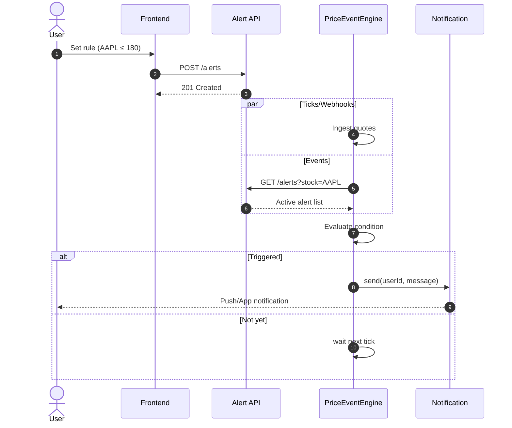

시퀀스 다이아그램 예제

## 1.1 알람 설정(예제)

### 1.1.1 알람 설정 흐름(예제)

```mermaid
sequenceDiagram
  autonumber
  actor U as User
  participant FE as Frontend
  participant A as Alert API
  participant E as PriceEventEngine
  participant N as Notification

  U->>FE: Set rule (AAPL ≤ 180)
  FE->>A: POST /alerts
  A-->>FE: 201 Created

  par Ticks/Webhooks
    E->>E: Ingest quotes
  and Events
    E->>A: GET /alerts?stock=AAPL
    A-->>E: Active alert list
  end

  E->>E: Evaluate condition
  alt Triggered
    E->>N: send(userId, message)
    N-->>U: Push/App notification
  else Not yet
    E->>E: wait next tick
  end
```

사용자가 회원가입을 누르면 이메일 인증 → 닉네임 중복확인 → 비밀번호 확인 → 개인정보 입력 → 서버에 가입 요청 후 응답이 오면 로그인 화면으로 전환된다. (예제)

위 형식에 맞춰서 아래에 시퀀스 다이아그램을 작성해주세요.