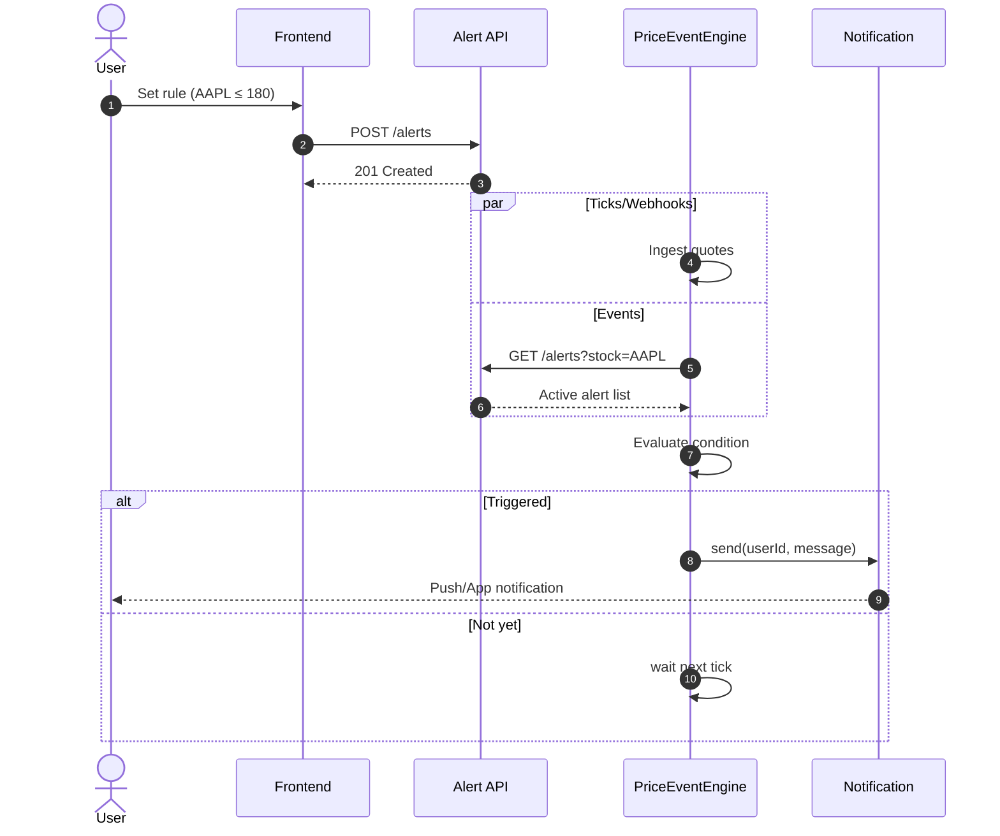
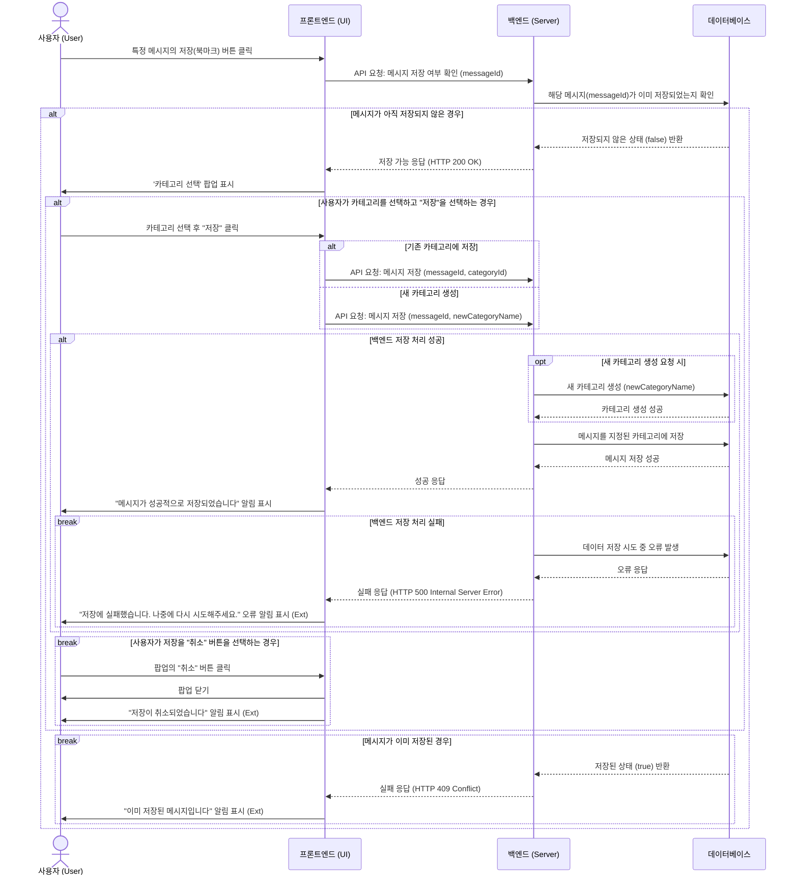
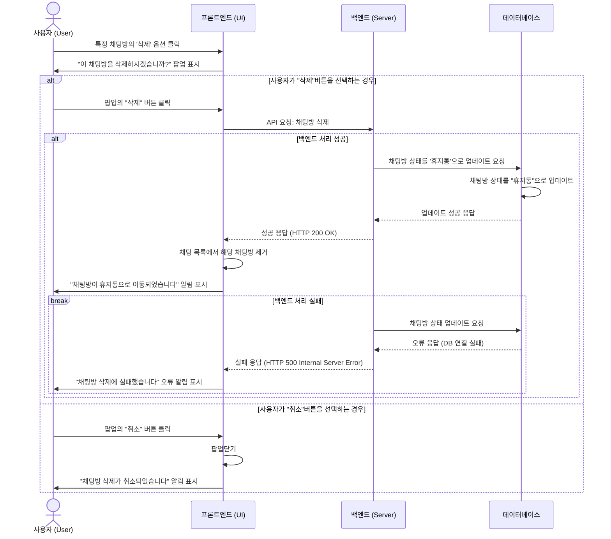

시퀀스 다이아그램 예제

## 1.1 알람 설정(예제)

### 1.1.1 알람 설정 흐름(예제)

사용자가 회원가입을 누르면 이메일 인증 → 닉네임 중복확인 → 비밀번호 확인 → 개인정보 입력 → 서버에 가입 요청 후 응답이 오면 로그인 화면으로 전환된다. (예제)

위 형식에 맞춰서 아래에 시퀀스 다이아그램을 작성해주세요.

## 2

### 2.1 채팅 메시지 저장

사용자가 특정 메시지의 저장(북마크) 버튼을 클릭한다. → 프론트엔드는 백엔드에 해당 메시지가 이미 저장되었는지 확인을 요청한다. → (1. 이미 저장된 경우) 백엔드가 '저장된 상태(true)'를 반환하면, "이미 저장된 메시지입니다" 알림이 표시된다. → (2. 저장이 가능한 경우) 백엔드가 '저장되지 않은 상태(false)'를 반환하면, 사용자에게 '카테고리 선택' 팝업이 표시된다.  
→(저장 선택) 사용자가 카테고리(기존 또는 신규)를 선택하고 "저장"을 클릭하면, 백엔드에 저장을 요청한다. → (1. 저장 성공) 백엔드가 DB에 성공적으로 저장하면, "메시지가 성공적으로 저장되었습니다" 알림이 표시된다. → (2. 저장 실패) DB 저장 중 오류가 발생하면, "저장에 실패했습니다" 오류 알림이 표시된다.  
→(취소 선택) 사용자가 팝업에서 "취소" 버튼을 클릭하면, 팝업이 닫히고 "저장이 취소되었습니다" 알림이 표시된다.

### 2.2 채팅방 삭제

사용자가 특정 채팅방의 '삭제' 옵션을 클릭한다. → 프론트엔드가 "이 채팅방을 삭제하시겠습니까?" 팝업을 표시한다.  
→ (삭제 선택) 사용자가 팝업의 "삭제" 버튼을 클릭하면, 프론트엔드는 백엔드에 채팅방 삭제를 요청한다. → (1. 삭제 성공) 백엔드가 DB 상태를 '휴지통'으로 성공적으로 업데이트하면, 프론트엔드는 목록에서 채팅방을 제거하고 "채팅방이 휴지통으로 이동되었습니다" 알림을 표시한다. → (2. 삭제 실패) DB 오류 등으로 백엔드 처리가 실패하면, "채팅방 삭제에 실패했습니다" 오류 알림이 표시된다.  
→ (취소 선택) 사용자가 팝업의 "취소" 버튼을 클릭하면, 팝업이 닫히고 "채팅방 삭제가 취소되었습니다" 알림이 표시된다.