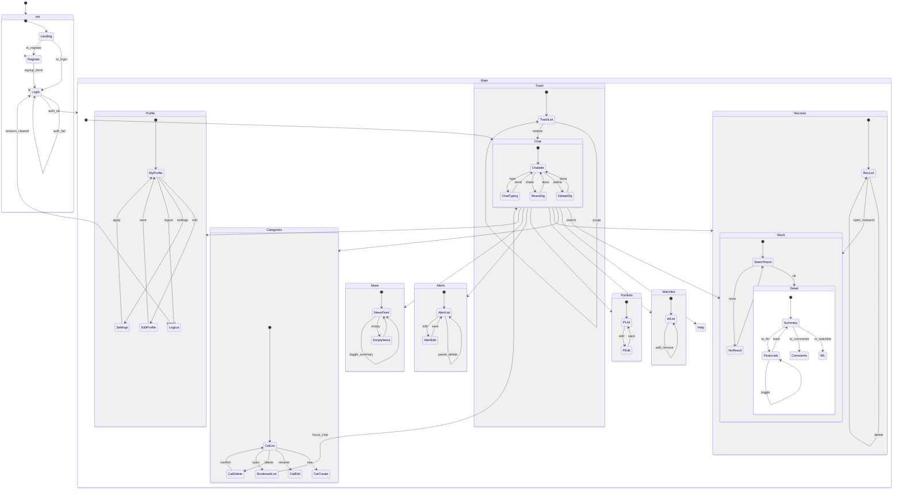

# 5. State Machine Diagram

본 장은 시스템의 상태 전이를 기술하는 **State Machine Diagram(SMD)**의 목적과 해석 방법을 설명한다.  
[그림 5-1]은 클라이언트 UI 흐름(전면 SMD), [그림 5-2]는 네트워크/세션 흐름(배경 SMD)을 나타낸다. 두 다이어그램은 서로 다른 라이프사이클을 가지지만, **배경 SMD의 결과가 전면 SMD의 상태 갱신을 유도**한다.

---

## 5.1 어플리케이션 SMD(전면) — [그림 5-1]

### 5.1.1 모델링 원칙
- **화면=State 1:1 매핑**: `Chat`, `Stock`, `Categories`, `Records`, `Trash`, `Watchlist`, `Portfolio`, `Alerts`, `News`, `Profile` 등은 **복합(Composite) 상태**로 정의하고, 각 내부에 하위 화면/탭을 **서브 상태**로 둔다.
- **이벤트=전이(Transition)**: 사용자 액션(버튼/탭/검색/뒤로가기) 또는 시스템 이벤트(인증 성공/세션 파기)로 상태 전이가 발생한다.
- **종료 규칙**: 편집/상세 등 **하위 상태가 정상 종료**되면 **직전 상위 상태**로 복귀한다(예: `PEditor → PList`, `DetailPanel.Summary → SearchInput`).

### 5.1.2 주요 전면 상태 설명(요약)
- **Init**: 초기 진입 영역. `Landing`에서 `Login`/`Register`로 분기.
- **Login/Register**: 인증 플로우. 성공 시 `Main`으로, 실패 시 자기 상태 유지.
- **Main(Composite)**: 앱의 주요 내비게이션 허브.
  - **Chat**: `ChatIdle ↔ ChatTyping`, 공유/삭제 다이얼로그로의 단발성 분기 후 복귀.
  - **Stock**: `SearchInput → (NoResult | DetailPanel)`; `DetailPanel`은 `Summary`, `Financials`(분기/연간 토글), `Comments`, `Watchlist`로 구성.
  - **Categories/Records/Trash**: 목록 중심. 생성/수정/삭제/복원 등의 단순 전이.
  - **Watchlist/Portfolio/Alerts**: 사용자 자산/알림 관리. 편집 후 목록 복귀가 기본 규칙.
  - **News**: 피드 기반. 결과 없을 때 `EmptyNews`로 분기 후 재시도 시 피드 복귀.
  - **Profile**: 프로필/설정/통계/로그아웃의 허브.

### 5.1.3 내비게이션 규칙
- **허용 전이**: 메인 내비게이션(탭/사이드바/라우터)에서 **상호 간 이동 허용**. 다이얼로그/편집 상태는 **진입–종료–복귀** 3단 고정 패턴.
- **뒤로가기**: 현재 서브 상태가 있으면 **상위 상태로 Pop**, 최상위면 이전 화면으로 이동. 인증 파기 시에는 `Logout → Login`으로 강제 이동.

---

## 5.2 네트워크/세션 SMD(배경) — [그림 5-2]

### 5.2.1 목적
UI에 보이지 않는 **요청–응답–재시도–오류 표면화**를 표준화한다. 전면 SMD는 “요청을 요구하는 이벤트”만 유발하고, **배경 SMD가 성공 조건을 충족**했을 때에만 결과가 전면 SMD에 반영된다.

### 5.2.2 공통 패턴
1. **Idle → Fetching**: 검색/재무/뉴스/알림/댓글/프로필/옵션 등 API 트리거 발생 시.
2. **Fetching → Success/Failure**: 서버 응답 수신. 성공이면 데이터 유효성 검증 포함.
3. **Success → ApplyUI → Idle**: 스토어/뷰모델 갱신 후 UI에 반영.
4. **Failure → RetryDecision**: 재시도 가능/잔여 횟수/백오프 정책 판단.
   - 가능: **Fetching**으로 재진입
   - 불가: **SurfaceError**로 전파(토스트/모달/에러 뷰), 이후 **Idle**
5. **SessionTimeout → ForceLogout**: 무활동 타임아웃 또는 토큰 만료 시 세션 파기 후 `Login`으로 유도.

### 5.2.3 오류 등급(권장)
- **User-fixable**: 입력 오류, 권한 부족 → 명확한 가이드 메시지 표면화.
- **Transient**: 네트워크 단절, 타임아웃 → 지수 백오프 재시도.
- **Fatal**: 스키마/버전 불일치 → 필수 업데이트 유도 또는 제한 모드 진입.

---

## 5.3 다이어그램 간 일관성

- **Use Case/Sequence/Class/SMD/UI 명명 통일**: 기능명·엔티티명·액션 라벨을 통일한다.
- **트리거 근거화**: SMD의 전이는 **시퀀스 다이어그램의 메시지**에서 기원한다(예: `SearchInput`에서 “검색 전송” → 배경 SMD `Fetching`).
- **상태 최소화**: 화면 단위가 아닌 **상태 의미 변화가 있는 지점**만 상태로 올린다(뷰 내부 스크롤, 필터 드롭다운 열림 등은 이벤트로만 처리).

---

## 5.4 독해 가이드

- **Composite State(굵은 박스)**: 하나의 주요 화면 영역. 내부 **서브 상태**는 탭/모드/단계.
- **Transition 라벨**: 사용자 액션 또는 시스템 이벤트. 가능하면 **동사+목적어**의 짧은 영어 라벨 사용(예: `auth_ok`, `toggle`, `save`).
- **예외 흐름 표기**: 삭제/복원/확인 다이얼로그처럼 **진입–확인–복귀** 패턴은 단방향 전이와 “원위치 복귀”를 명확히 표기.
- **세션/보안 이벤트**: 배경 SMD의 `ForceLogout`은 전면 SMD의 `Logout → Login`을 **강제 유발**한다.

---

## 5.5 부록: 전이 요약 테이블(발췌)

| From                  | Event/Guard            | To                     | Note                         |
|-----------------------|------------------------|------------------------|------------------------------|
| `Init.Landing`        | to_login               | `Login`                | 초기 진입 분기               |
| `Login`               | auth_ok                | `Main`                 | 세션 생성                    |
| `Login`               | auth_fail              | `Login`                | 에러 표시, 입력 유지         |
| `Main.Chat`           | search                 | `Main.Stock`           | 검색 전송 시 전환            |
| `Stock.SearchInput`   | ok                     | `Stock.Detail`         | 결과 존재                    |
| `Stock.SearchInput`   | none                   | `Stock.NoResult`       | 결과 없음                    |
| `Detail.Summary`      | to_fin                 | `Detail.Financials`    | 탭 전환                      |
| `Portfolio.PList`     | edit                   | `Portfolio.PEdit`      | 편집 진입                    |
| `Portfolio.PEdit`     | save                   | `Portfolio.PList`      | 저장 후 목록 복귀            |
| `Main`                | logout                 | `Logout → Login`       | 세션 파기 후 인증화면        |
| `BG.Idle`             | api_trigger            | `BG.Fetching`          | 배경 요청 시작               |
| `BG.Fetching`         | success                | `BG.ApplyUI → BG.Idle` | UI 반영 후 대기              |
| `BG.Fetching`         | failure(retryable)     | `BG.RetryDecision`     | 백오프/잔여 횟수 판단        |
| `BG.RetryDecision`    | can_retry              | `BG.Fetching`          | 재시도                       |
| `BG.RetryDecision`    | cannot_retry           | `BG.SurfaceError`      | 사용자에게 오류 전달         |
| `BG.SessionTimeout`   | —                      | `BG.ForceLogout`       | 무활동 타임아웃              |

> 주: `BG.*`는 배경 SMD 상태를 축약 표기.

---
