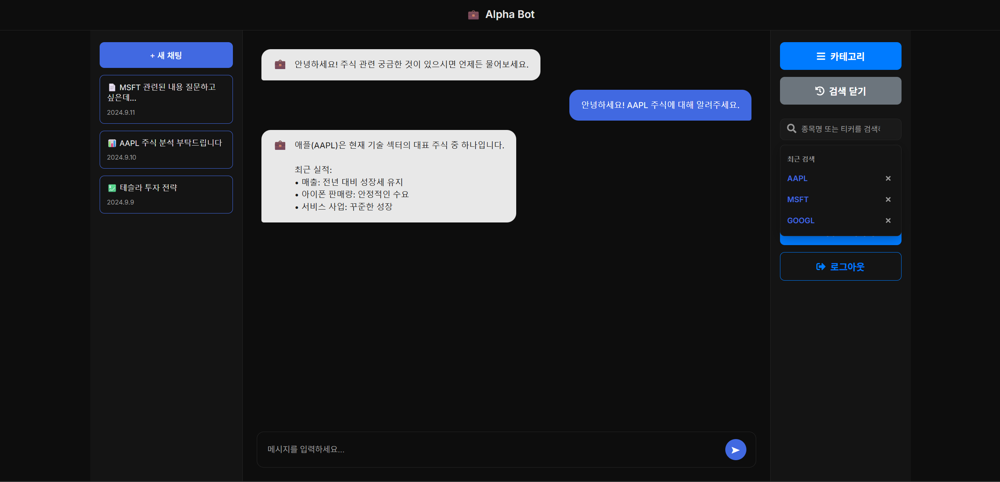

# 사이드바

## 우측 사이드바

### 우측 사이드바 초기 화면

우측 사이드바의 초기 상태에는 [종목 검색] 버튼이 표시되어 있음.

또한, 북마크한 메세지를 카테고리 별로 모아놓은 카테고리 버튼과 북마크한 메세지를 삭제하기 위해 모아놓은 휴지통 버튼, 그리고 자신의 개인정보를 수정할 수 있는 페이지로 이동가능한 마이페이지 버튼, 북마크한 메세지를 볼 수 있는 저장된 메세지 버튼, 마지막으로 로그아웃 버튼이 있음.

### 우측 사이드바 메뉴 종목 검색 클릭 후 검색기록

사용자가 초기 화면의 [종목 검색] 버튼을 클릭함.

버튼이 [검색 닫기]로 변경되며, 그 아래에 검색바가 나타남.

이어서 사용자가 [종목명 또는 티커를 검색]이라고 표시된 검색바를 클릭하면,

'최근 검색' 목록(예: AAPL, MSFT, GOOGL)이 검색바 아래에 표시됨.

또한 검색 기록들 옆 'x'표시를 누를 시 검색 기록들이 삭제 되며, [검색 닫기]를 다시 클릭하면 원래 초기 화면으로 돌아감.

## 좌측 사이드바

### 좌측 사이드바 초기 화면

새 채팅 생성: 상단의 파란색 [+ 새 채팅] 버튼을 누르면, 현재 대화 내용이 저장되고 새로운 채팅 세션을 시작할 수 있음.

채팅 목록: [+ 새 채팅] 버튼 아래에는 사용자가 이전에 나눴던 대화의 목록이 시간순으로 표시 됨. 각 항목은 채팅의 제목과 마지막 채팅 날짜(예: 2024.9.11, 2024.9.10)를 보여주며, 클릭 시 해당 대화 내용을 다시 불러올 수 있음.