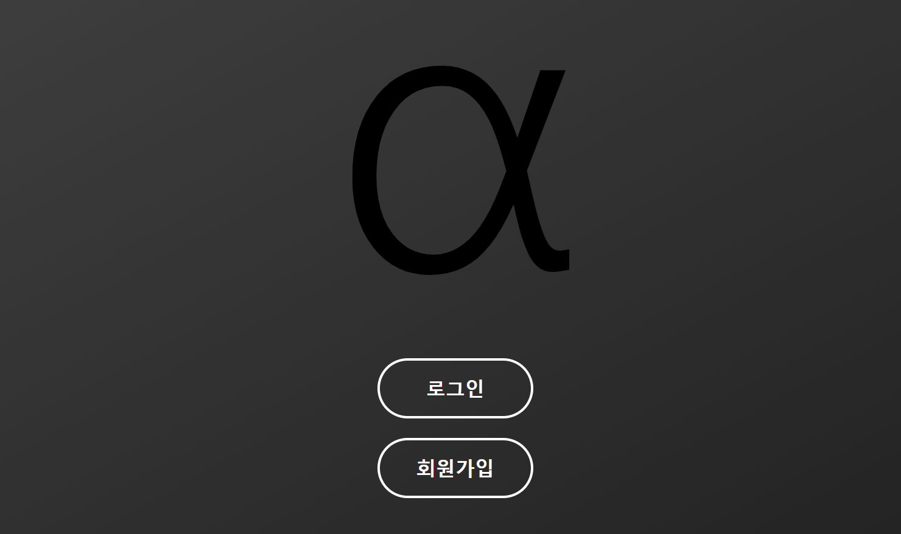
### [그림 1] 시작 화면

위 그림은 사용자가 애플리케이션에 처음 진입했을 때 마주하는 시작 화면입니다. 화면 중앙에는 서비스를 상징하는 α 로고가 표시되어 사용자들이 알파 수익을 얻어낼 수 있도록 돕겠다는 의미를 담았습니다. 사용자는 하단의 '로그인' 버튼을 통해 기존 계정으로 서비스를 이용하거나, '회원가입' 버튼을 눌러 새로운 계정을 생성하는 화면으로 이동할 수 있습니다. 이 시작화면에서 반드시 로그인을 해야만 서비스 화면으로 이동할 수 있습니다.

---
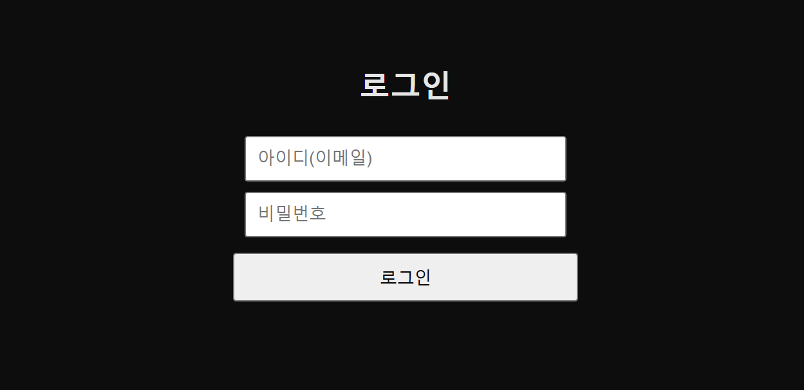
### [그림 2] 로그인 화면

위 그림은 로그인 화면입니다. 사용자는 가입 시 등록했던 아이디와 비밀번호를 각 입력창에 입력한 후, 하단의 '로그인' 버튼을 눌러 서비스에 접속할 수 있습니다.

---
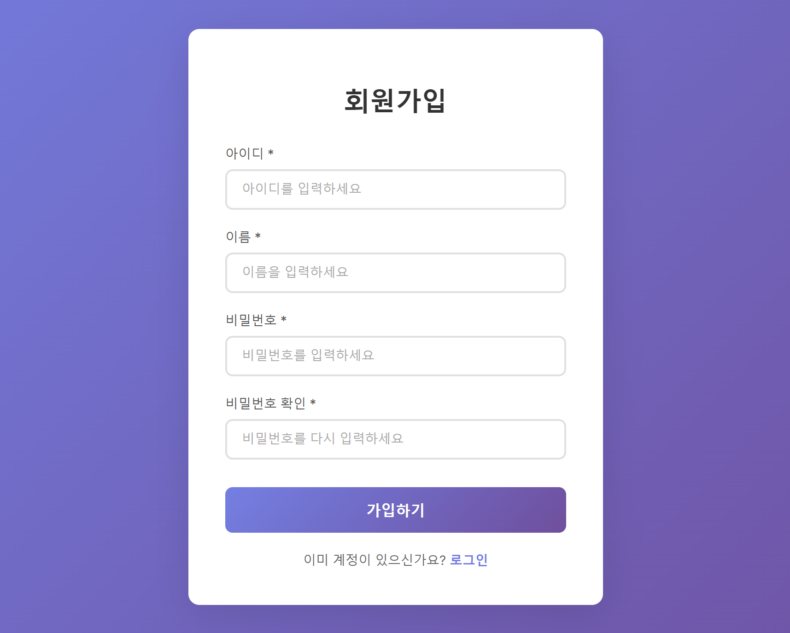
### [그림 3] 회원가입 화면

위 그림은 회원가입 화면입니다. 새로운 사용자는 아이디, 이름, 비밀번호, 비밀번호 확인까지 총 4개의 필수 정보를 입력해야 합니다. 모든 정보를 올바르게 입력한 후 '가입하기' 버튼을 누르면 계정 생성이 완료됩니다. 만약 이미 계정을 보유한 사용자일 경우, 하단의 '로그인' 링크를 통해 로그인 화면으로 즉시 이동할 수 있습니다.

---
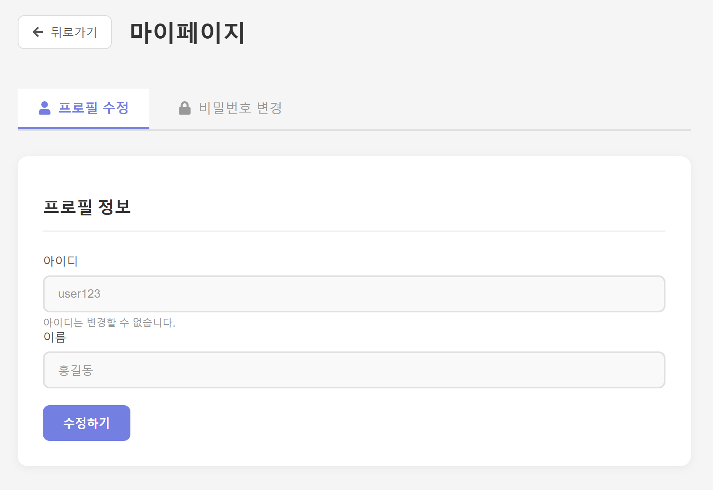
### [그림 4] 마이페이지 - 프로필 수정 화면

위 그림은 마이페이지의 프로필 수정 화면입니다. 이 화면에서는 사용자의 프로필 정보를 확인하고 수정할 수 있습니다. 아이디는 고유 값이므로 변경이 불가능하도록 비활성화되어 있습니다. 사용자는 '이름'을 수정한 후 '수정하기' 버튼을 눌러 변경사항을 저장할 수 있습니다.

---
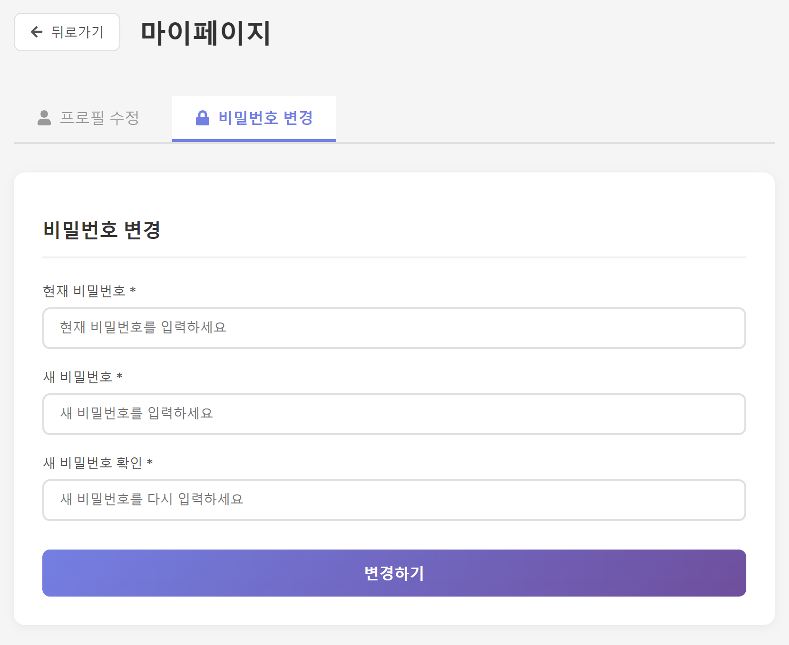
### [그림 5] 마이페이지 - 비밀번호 변경 화면

위 그림은 마이페이지 내 비밀번호 변경 화면입니다. 계정 보안을 위해 사용자는 먼저 '현재 비밀번호'를 입력하여 본인 인증을 거칩니다. 이후 '새 비밀번호'와 '새 비밀번호 확인'을 순서대로 입력하고 '변경하기' 버튼을 누르면 계정의 비밀번호가 안전하게 변경됩니다. 새 비밀번호와 새 비밀번호 확인이 일치하지 않으면 불일치 메세지가 출력됩니다.

---
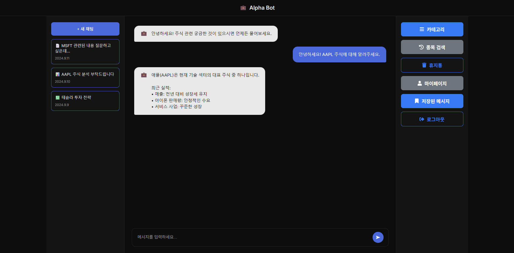
### [그림 6] 사이드바 초기 화면

오른쪽 사이드 바의 버튼 6개는 각각 카테고리, 종목 검색, 휴지통, 마이페이지, 저장된 메시지, 로그아웃을 할 수 있는 버튼이다.

---
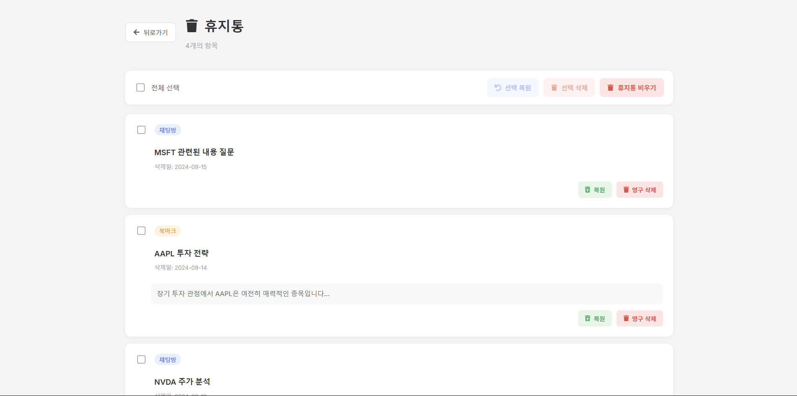
### [그림 7] 휴지통 화면

오른쪽 사이드 바의 휴지통 버튼을 누르면 이동하는 화면이다. 전체 선택의 왼쪽 체크박스를 클릭하여 휴지통에 있는 항목 전체를 선택할 수 있다. 또는 각 항목 왼쪽 위에 위치한 체크박스를 클릭하여 개별 선택을 할 수 있다. 항목이 하나 이상 선택되어 있는 경우 선택 복원, 선택 삭제를 실행할 수 있다. 선택 복원을 누르면 선택된 항목은 채팅으로 다시 복원되고 휴지통 목록에서는 사라지게 된다. 선택 삭제를 누르면 선택된 항목을 휴지통에서 완전히 삭제되어 휴지통 목록에서 삭제되고 더 이상 복원할 수 없다. 각 항목 별로 오른쪽 아래에 위치한 복원 버튼과 영구 삭제 버튼도 해당 항목에 대하여 각각 같은 기능을 한다. 휴지통 비우기를 누르면 전체 항목이 휴지통에서 삭제된다. 각 버튼은 해당 기능을 실행하기 전 확인 메시지를 띄운다. 확인 또는 취소 버튼을 클릭하여 기능을 계속 진행하거나 중단할 수 있다.

---
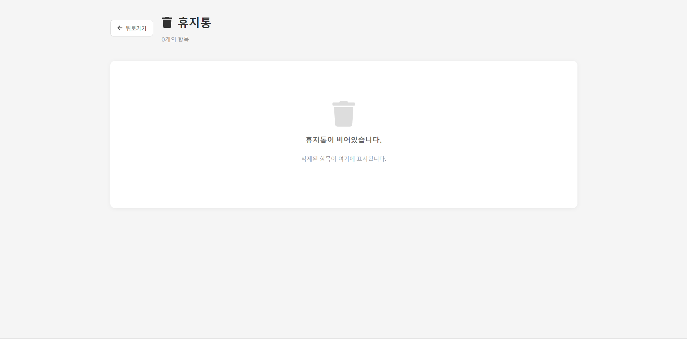
### [그림 8] 빈 휴지통 화면

휴지통에 항목이 없을때 표시되는 화면이다.

---
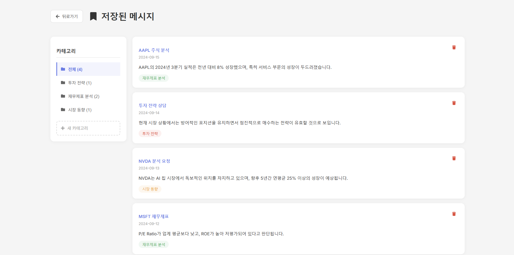
### [그림 9] 저장된 메시지 화면

저장된 메시지는 카테고리 별로 나누어 저장된다. 기본화면은 전체 카테고리이고, 왼쪽 폴더를 클릭하여 카테고리를 변경할 수 있다. 각 메시지는 오른쪽 위 쓰레기통 버튼을 눌러 삭제할 수 있다. 

---

### [그림 10] 카테고리 추가 화면

왼쪽 아래 새 카테고리 버튼을 눌러 카테고리를 추가할 수 있다. 카테고리의 이름을 입력하고 추가를 누르면 카테고리가 추가된다. 

---
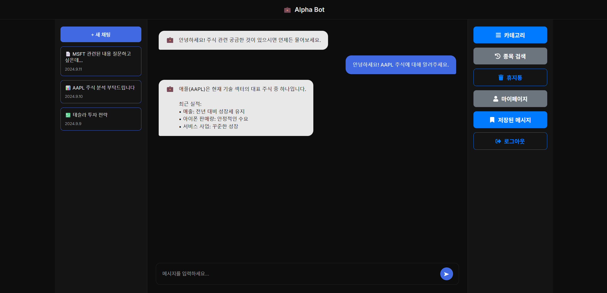
### [그림 11] 우측 사이드바 초기 화면

우측 사이드바의 초기 상태에는 [종목 검색] 버튼이 표시되어 있음.

또한, 북마크한 메세지를 카테고리 별로 모아놓은 카테고리 버튼과 북마크한 메세지를 삭제하기 위해 모아놓은 휴지통 버튼, 그리고 자신의 개인정보를 수정할 수 있는 페이지로 이동가능한 마이페이지 버튼, 북마크한 메세지를 볼 수 있는 저장된 메세지 버튼, 마지막으로 로그아웃 버튼이 있음.

---

### [그림 12] 우측 사이드바 메뉴 종목 검색 클릭 후 검색기록 조회

사용자가 초기 화면의 [종목 검색] 버튼을 클릭함.

버튼이 [검색 닫기]로 변경되며, 그 아래에 검색바가 나타남.

이어서 사용자가 [종목명 또는 티커를 검색]이라고 표시된 검색바를 클릭하면,

'최근 검색' 목록(예: AAPL, MSFT, GOOGL)이 검색바 아래에 표시됨.

또한 검색 기록들 옆 'x'표시를 누를 시 검색 기록들이 삭제 되며, [검색 닫기]를 다시 클릭하면 원래 초기 화면으로 돌아감.

---

### [그림 14] 좌측 사이드바 초기 화면

새 채팅 생성: 상단의 파란색 [+ 새 채팅] 버튼을 누르면, 현재 대화 내용이 저장되고 새로운 채팅 세션을 시작할 수 있음.

채팅 목록: [+ 새 채팅] 버튼 아래에는 사용자가 이전에 나눴던 대화의 목록이 시간순으로 표시 됨. 각 항목은 채팅의 제목과 마지막 채팅 날짜(예: 2024.9.11, 2024.9.10)를 보여주며, 클릭 시 해당 대화 내용을 다시 불러올 수 있음.

---

### 로그인 후 메인화면

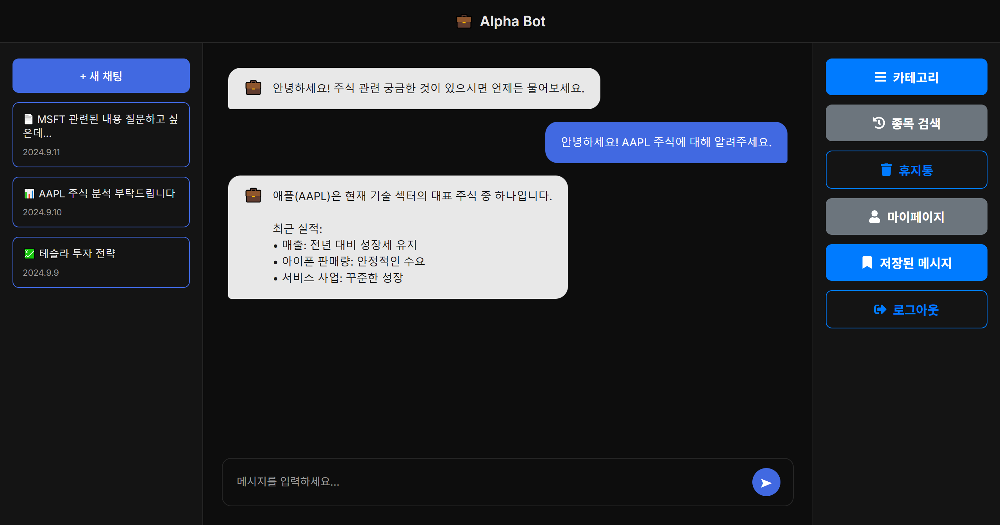  

로그인 후 진입하는 메인 화면으로, 주식 정보를 제공하는 'Alpha Bot'과의 채팅 인터페이스를 보여준다. 좌측 사이드바에는 기존 채팅 기록이 목록으로 표시되며, 상단의 '+ 새 채팅' 버튼을 누르면 새로운 대화를 시작할 수 있다. 중앙의 메인 채팅창에는 봇의 환영 메시지와 사용자가 주고받은 대화 내용의 예시가 표시된다. 사용자가 하단의 입력란에 텍스트 형식으로 질문을 입력하고 전송 버튼을 누르면, 봇이 관련 주식 정보를 분석하여 답변을 제공한다. 우측 사이드바에는 '카테고리', '종목 검색', '휴지통', '마이페이지', '저장된 메시지', '로그아웃' 기능으로 이동할 수 있는 버튼들이 위치한다.