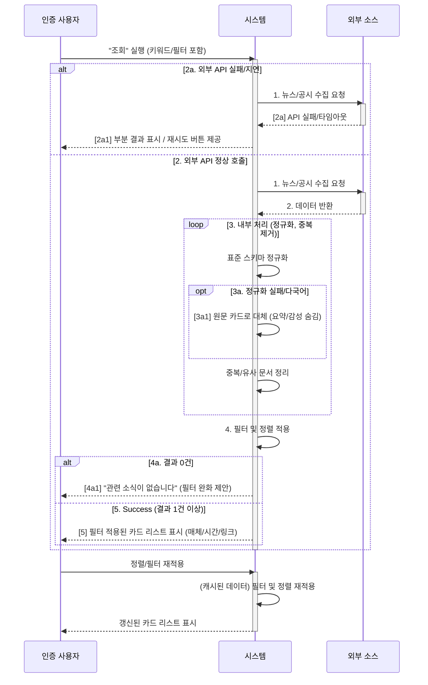

```mermaid
sequenceDiagram
    participant User as 인증 사용자
    participant System as 시스템
    participant ExternalSources as 외부 소스

    %% === 1. Main Flow: 최초 조회 ===
    User->>System: "조회" 실행 (키워드/필터 포함)
    activate System

    alt 2a. 외부 API 실패/지연
        System->>ExternalSources: 1. 뉴스/공시 수집 요청
        activate ExternalSources
        ExternalSources-->>System: [2a] API 실패/타임아웃
        deactivate ExternalSources
        System-->>User: [2a1] 부분 결과 표시 / 재시도 버튼 제공
    else 2. 외부 API 정상 호출
        System->>ExternalSources: 1. 뉴스/공시 수집 요청
        activate ExternalSources
        ExternalSources-->>System: 2. 데이터 반환
        deactivate ExternalSources

        loop 3. 내부 처리 (정규화, 중복 제거)
            System->>System: 표준 스키마 정규화
            opt 3a. 정규화 실패/다국어
                System->>System: [3a1] 원문 카드로 대체 (요약/감성 숨김)
            end
            System->>System: 중복/유사 문서 정리
        end

        System->>System: 4. 필터 및 정렬 적용

        alt 4a. 결과 0건
            System-->>User: [4a1] "관련 소식이 없습니다" (필터 완화 제안)
        else 5. Success (결과 1건 이상)
            System-->>User: [5] 필터 적용된 카드 리스트 표시 (매체/시간/링크)
        end
    end
    deactivate System

    %% --- 5. Post Condition: 후속 상호작용 (필터/정렬 변경) ---
    User->>System: 정렬/필터 재적용
    activate System
    System->>System: (캐시된 데이터) 필터 및 정렬 재적용
    System-->>User: 갱신된 카드 리스트 표시
    deactivate System

```